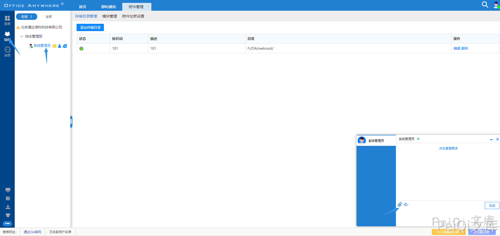
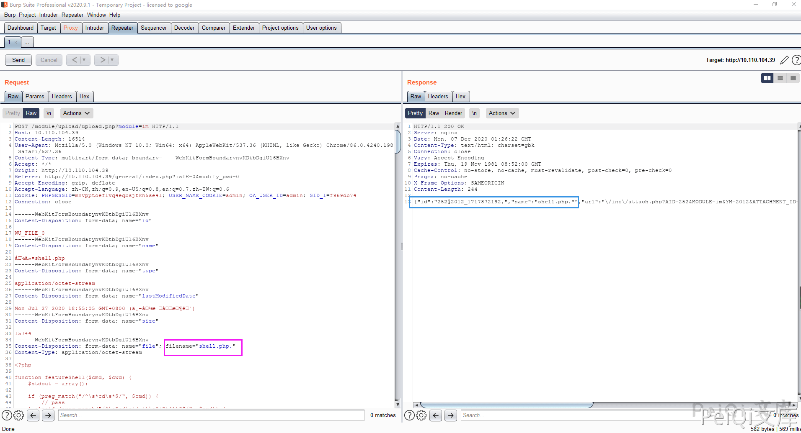

# 通达OA v11.2 upload.php 后台任意文件上传漏洞

## 漏洞描述

通达OA v11.2后台存在文件上传漏洞，允许通过绕过黑名单的方法来上传恶意文件，导致服务器被攻击

## 影响版本

<a-checkbox checked>通达OA v11.2</a-checkbox> 

## 环境搭建

<a-checkbox checked>通达OA v11.2下载链接:https://cdndown.tongda2000.com/oa/2019/TDOA11.2.exe</a-checkbox> 

<a-checkbox checked>下载后按步骤安装即可</a-checkbox> 

## 漏洞复现

该漏洞存在于后台，需要通过登录后才能进行使用

登录后点击 `菜单 -> 系统管理 -> 附件管理`

点击添加附录存储管理添加如下(存储目录为 webroot 目录，默认为 `D:/MYOA/webroot/`)

点击 `组织 -> 系统管理员 -> 上传附件`

抓包使用 windows 的绕过方法 `shell.php -> shell.php.`

- ✅2012 为目录
- ✅1717872192 为拼接的文件名
- ✅最后的shell名字为 1717872192.shell.php

访问木马文件

