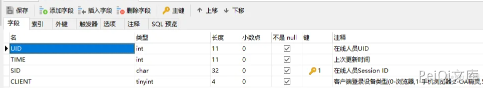

# 通达OA v11.7 auth_mobi.php 在线用户登录漏洞

## 漏洞描述

通达OA v11.7 中存在某接口查询在线用户，当用户在线时会返回 PHPSESSION使其可登录后台系统

## 漏洞影响

<a-checkbox checked>通达OA < v11.7</a-checkbox></br>

## 环境搭建

<a-checkbox checked>通达OA v11.7下载链接]:https://cdndown.tongda2000.com/oa/2019/TDOA11.7.exe</a-checkbox></br>

## 漏洞复现

漏洞有关文件 `MYOA\webroot\mobile\auth_mobi.php`

```php
<?php

function relogin()
{
    echo _('RELOGIN');
    exit;
}
ob_start();
include_once 'inc/session.php';
include_once 'inc/conn.php';
include_once 'inc/utility.php';
if ($isAvatar == '1' && $uid != '' && $P_VER != '') {
    $sql = 'SELECT SID FROM user_online WHERE UID = \'' . $uid . '\' and CLIENT = \'' . $P_VER . '\'';
    $cursor = exequery(TD::conn(), $sql);
    if ($row = mysql_fetch_array($cursor)) {
        $P = $row['SID'];
    }
}
if ($P == '') {
    $P = $_COOKIE['PHPSESSID'];
    if ($P == '') {
        relogin();
        exit;
    }
}
if (preg_match('/[^a-z0-9;]+/i', $P)) {
    echo _('非法参数');
    exit;
}
if (strpos($P, ';') !== false) {
    $MY_ARRAY = explode(';', $P);
    $P = trim($MY_ARRAY[1]);
}
session_id($P);
session_start();
session_write_close();
if ($_SESSION['LOGIN_USER_ID'] == '' || $_SESSION['LOGIN_UID'] == '') {
    relogin();
}
```


在执行的 SQL语句中


```sql
$sql = 'SELECT SID FROM user_online WHERE UID = \'' . $uid . '\' and CLIENT = \'' . $P_VER . '\'';
```





简单阅读PHP源码可以知道 此SQL语句会查询用户是否在线，如在线返回此用户 Session ID


将返回的 Set-Cookie 中的Cookie参数值使用于登录Cookie

访问目标后台 http://xxx.xxx.xxx.xxx/general/


当目标离线时则访问漏洞页面则会出现如下图

遍历uid也可以获取其他用户权限，可能权限较低

