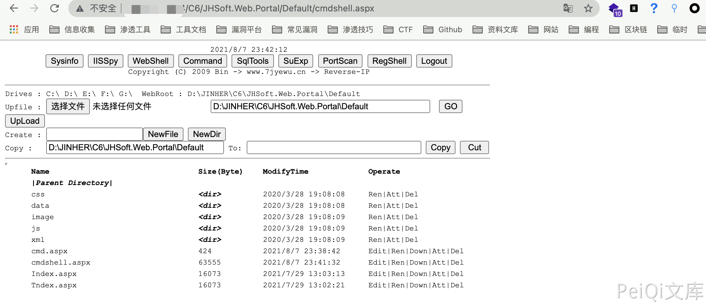

# 金和OA C6 EditMain.aspx 后台文件写入漏洞

## 漏洞描述

金和OA C6 EditMain.aspx 存在任意文件写入漏洞，通过漏洞可以写入恶意文件获取服务器权限

## 漏洞影响

<a-checkbox checked>金和OA C6</a-checkbox> 

## 网络测绘

<a-checkbox checked>app="金和网络-金和OA"</a-checkbox> 

## 漏洞复现

漏洞触发需要后台权限

访问漏洞点 `/C6/JHSoft.Web.Portal/EditMain.aspx?id=cmdshell.aspx`

写入webshell代码保存

再访问 `/C6/JHSoft.Web.Portal/Default/cmdshell.aspx` 

