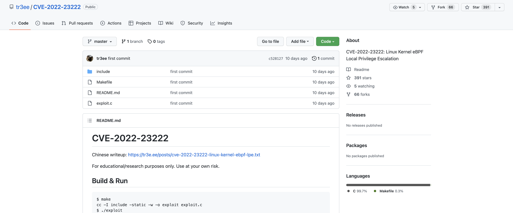

# Linux eBPF权限提升漏洞 CVE-2022-23222

## 漏洞描述

Linux Kernel 是美国 Linux 基金会发布的开源操作系统 Linux 所使用的内核。Linux 内核是一种开源的类Unix 操作系统宏内核。整个 Linux 操作系统家族基于该内核部署在传统计算机平台（如个人计算机和服务器）。该漏洞是由于 Linux 内核的 BPF 验证器存在一个空指针漏洞，没有对 *_OR_NULL 指针类型进行限制，允许这些类型进行指针运算。攻击者可利用该漏洞在获得低权限的情况下，构造恶意数据执行空指针引用攻击，最终获取服务器 root 权限

## 漏洞影响

<a-checkbox checked>Linux 5.8 - 5.16</a-checkbox> 

## 漏洞复现

运行编译好的EXP

## 漏洞POC

<a-alert type="success" message="https://github.com/tr3ee/CVE-2022-23222" description="" showIcon>
</a-alert>

 

