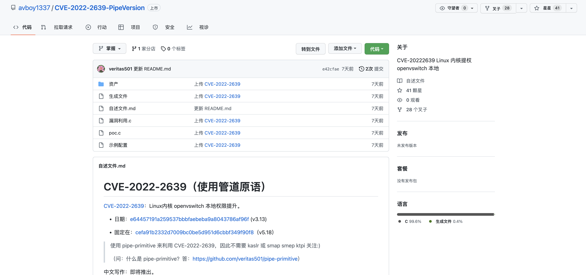

# Linux openvswitch权限提升漏洞 CVE-2022-2639

## 漏洞描述

由于 openvswitch 模块在处理大量actions的情况下，可能存在越界写入漏洞，本地经过身份认证的攻击者可利用此漏洞获取root权限

## 漏洞影响

<a-checkbox checked>3.13 ≤ Linux Kernel < 5.18</a-checkbox> 

## 漏洞复现

编译POC并运行获取Root权限

## 漏洞POC

<a-alert type="success" message="https://github.com/avboy1337/CVE-2022-2639-PipeVersion" description="" showIcon>
</a-alert>

 

