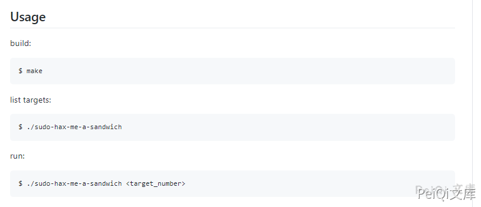

# Linux sudo权限提升漏洞 CVE-2021-3156

## 漏洞描述
2021年1月26日，Linux安全工具sudo被发现严重的基于堆缓冲区溢出漏洞。利用这一漏洞，攻击者无需知道用户密码，一样可以获得root权限，并且是在默认配置下。此漏洞已分配为CVE-2021-3156，危险等级评分为7分。
当sudo通过-s或-i命令行选项在shell模式下运行命令时，它将在命令参数中使用反斜杠转义特殊字符。但使用-s或-i标志运行sudoedit时，实际上并未进行转义，从而可能导致缓冲区溢出。因此只要存在sudoers文件（通常是/etc/sudoers），攻击者就可以使用本地普通用户利用sudo获得系统root权限。研究人员利用该漏洞在多个Linux发行版上成功获得了完整的root权限，包括Ubuntu 20.04（sudo 1.8.31）、Debian 10（sudo 1.8.27）和Fedora 33（sudo 1.9.2），并且sudo支持的其他操作系统和Linux发行版也很容易受到攻击。

## 漏洞影响
<a-checkbox checked>Sudo 1.8.2 - 1.8.31p2</a-checkbox> 
<a-checkbox checked>Sudo 1.9.0 - 1.9.5p1</a-checkbox>

## 漏洞复现
目前POC已经在Github公开

 
<a-alert type="success" message="POC来源: https://github.com/blasty/CVE-2021-3156" description="" showIcon>
</a-alert>
 

当前可以验证的Linux环境为, 这里使用腾讯云中的Ubuntu镜像进行复现

 
<a-alert type="success" message=" Ubuntu 20.04.1 (Focal Fossa) - sudo 1.8.31, libc-2.31  Debian 10.0 (Buster) - sudo 1.8.27, libc-2.28" description="" showIcon>
</a-alert>
 

## 漏洞POC
<a-alert type="success" message="另一个无交互式shell使用的脚本:https://github.com/Rvn0xsy/CVE-2021-3156-plus" description="" showIcon>
</a-alert>
 

