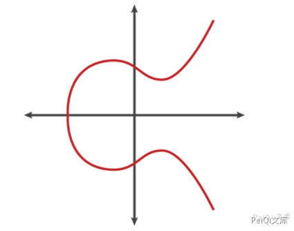
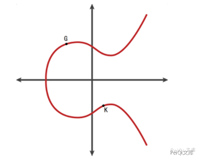
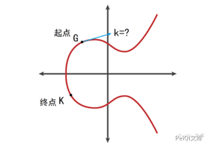
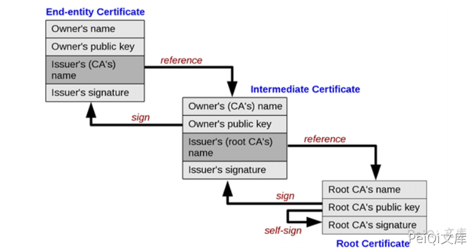

# Windows CryptoAPI欺骗漏洞 CVE-2020-0601

## 漏洞描述

1月15日，微软发布了针对CVE-2020-0601的安全补丁，该漏洞是微软在实现椭圆曲线加密算法数字证书验证时产生，可被利用于伪造来自可信任来源的签名或证书，并且因其业务特性会衍生出多种攻击向量，具有极高的可利用价值和极大的潜在破坏力，Win 10和windows server 2016 & 2019也都在其影响范围内。该漏洞由美国NSA国家安全局发现后汇报给微软公司，也被认为是第一个NSA公开披露的软件系统漏洞，当然也有可能存在其特殊的战术目的。绿盟科技M01N攻击安全研究团队对此漏洞原理进行了详细分析并复现了多种可能的攻击方法，提出了详细的检测及整改方案。

## 漏洞影响

<a-checkbox checked>带有指定参数的ECC密钥的证书的Microsoft Windows版本,依赖于Windows CryptoAPI的应用程序</a-checkbox></br>

## 漏洞复现

CVE-2020-0601的根源是微软的加密库`crypt32.dll`中椭圆曲线加密算法的实现问题，首先我们来了解一下椭圆加密算法的基本原理。

要形象地理解椭圆曲线加密算法，可以结合图形来看，以下是一个符合椭圆曲线的方程`y2 = x3 + ax + b`，图像如下：



椭圆曲线具有的一些独特的性质使它适合用于加密算法：

1. 椭圆曲线关于x轴对称
2. 任何一条非垂直的线与曲线最多有三个点相交

1. 曲线是光滑的，即曲线的所有点都没有两个或者两个以上的不同的切线

在椭圆曲线上任意两点A、B（若A、B重合则作A的切线），作直线交于椭圆曲线另一点C，过C做y轴的平行线与椭圆曲线交于C点，定义A+B=C。椭圆曲线的加法符合交换律和结合律。


如果A、B是同一个点，则过A作椭圆曲线的切线，以同样的方法得到对应的结果 C=2A 。


接下来是椭圆曲线加密相关的重点，如果对多个A进行累加,则可依次累加连线得到nA的值 。

起点为A，终点D=3A，阶为3 。


起点为A，终点G=4A，阶为4。


椭圆曲线加密




考虑K=kG，其中K、G为椭圆曲线Ep(a,b)上的点，n为G的阶。k为小于n的整数。则给定k和G，根据加法法则，计算K很容易（只要逐次求解）但反过来，给定K和G，求k就非常困难。因为实际使用中的ECC原则上把私钥k取得相当大，n也相当大，且椭圆曲线不再连续而是在实数内离散的值，要把n个解点逐一算出几乎是不可能的。这就是椭圆曲线加密算法的数学依据 。

- 点G称为基点
- k(k<n)为私有密钥

- K为公开密钥

椭圆曲线加密算法（ECC）和RSA一样是一种公开密钥加密技术，对原始数据以公钥加密，以私钥解密，即便攻击者获取密文和公钥也无法（在合理的时间或代价下）解密获取明文。

同样的，椭圆曲线加密算法（ECC）也被用于数字签名，以私钥加密生成签名，以公钥解密验证签名，如果和原文一样则签名验证成功。

公开密钥加密之所以可靠是因为它们利用了公钥密码领域的单向函数原理，正向操作非常简单，而逆向操作非常困难。

由G（基点）出发，进行k（私钥）次变换，只要按部就班地计算，就能很容易地得到终点K（公钥）的值。


已知起点G（基点）和终点K（公钥），要逆推得到移动次数k（私钥）则是一个很难的问题（最佳算法也达到了全指数复杂度）



相比传统RSA加密算法，椭圆加密算法具有着天生的优势，椭圆加密算法的逆向过程相比RSA有着更大的时间复杂度。在密钥长度相同的情况下，椭圆加密算法相比RSA具有更好的安全强度。一般认为，160比特的椭圆曲线密钥即可提供与1024比特的RSA密钥相当的安全强度。

较短的密钥也意味着更少的存储空间、更快的加解密速度和更少的带宽消耗，正因为椭圆加密算法的这些优势，它被用于Windows的签名系统、https的证书、比特币系统和中国的二代身份证系统中。

虽然椭圆曲线加密算法具有着许多优势，纯算法角度破解难度极大，微软对此算法的实现的缺漏却给漏洞利用提供了可乘之机。回到椭圆曲线加密最基本的等式 K=kG，首先需要明确的是，虽然对于给定的基点G和公钥K，要求解私钥k很困难，但是如果可以任意指定基点G，要构造一对k和G使等式成立却极其简单；最简单的情况，令基点G=K，则私钥k=1，这样一对基点和私钥可以使等式成立，也是有效的解。

在正常的标准椭圆曲线算法中，基点G并不是随意指定的，而是有固定的值（标准的作用，便是对基点G等参数的选择做出规定），例如在secp256r1版本的椭圆曲线算法中，基点G应当为标准规定的固定值，如果对参数不加验证，使得用户可以自定义传入的基点G的值（作为函数的参数），上面的私钥k=1的特殊解即可成立。

在有漏洞版本的crypt32.dll中验证使用ECC算法签名部分的函数恰恰是这个情况，原先的函数未加参数验证，参与计算的基点G的内容由被验证的证书随意指定，使未授权的证书能够构建私钥k=1的特殊解来成功通过椭圆加密算法的签名验证的过程。

让我们以CVE-2020-0601的一个POC为例来解析虚假密钥的构建过程：

```shell
require 'openssl'

raw = File.read ARGV[0]     # 读取使用ECC算法的证书文件
ca = OpenSSL::X509::Certificate.new(raw)    # 读取使用ECC算法的证书
ca_key = ca.public_key  # 从证书中提取公钥ca_key

ca_key.private_key = 1  # 设置私钥为1，使得公钥K==1*基点G的等式成立
group = ca_key.group 
group.set_generator(ca_key.public_key, group.order, group.cofactor)
group.asn1_flag = OpenSSL::PKey::EC::EXPLICIT_CURVE
ca_key.group = group        # 利用构建的假基点G和假密钥k设置新group
File.open("spoofed_ca.key", 'w') { |f| f.write ca_key.to_pem }  # 将新的group写入文件
```

修补后的Crypt32.dll中椭圆曲线加密算法的函数已加入了参数验证的部分，解决了由自由指定参数G导致的构造第二个特殊的有效密钥的问题。

一处验证机制的失误导致信任链的连锁反应。



现代的安全系统中存在着“信任链”的概念，信任链的上下级存在一种类似单向担保的关系，子级证书的可靠性由签名其的父级证书担保。签名时由根证书开始一级级向下签名，验证时则逐层溯源验证，直到找到信任的根证书文件，构成了一条信任链。位于整个“信任链”最上方的是最为重要不需要自证身份的根证书。根证书一般随系统附带或由管理员安装在系统内。

这个漏洞的存在则使得构造的无效签名通过了验证机制，使本应断裂的信任链被利用，逐级担保继续下去，最终使非法内容获得了证书所有者的合法签名身份。

## 漏洞POC

<a-alert type="success" message="https://github.com/ollypwn/CurveBall" description="" showIcon>

</a-alert>

<br/>

## 参考文章

<a-alert type="success" message="http://blog.nsfocus.net/cve-2020-0601-windows-cryptoapi%E6%AC%BA%E9%AA%97%E6%BC%8F%E6%B4%9E%E5%88%86%E6%9E%90/" description="" showIcon>

</a-alert>

<br/>

